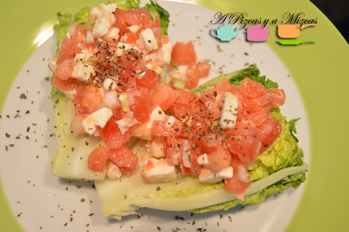
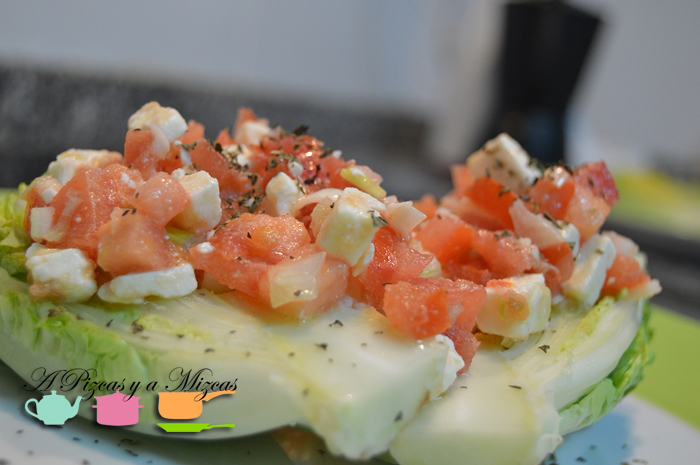

¡Qué calor que hace en verano! Para combatir las temperaturas en la mesa no hay nada mejor que platos frescos, ligeros y sanos, como la receta de cogollos rellenos de salmón, tomate y queso feta que hoy os traemos a nuestro blog. La podéis preparar para una cena rápida, o como entrante refrescante en una comida más amplia y completa. Vamos a por ella, y no valen perezas pues ¡no hace falta ni encender el fuego!

##  Ingredientes para los cogollos rellenos de salmón, tomate y queso feta

- Cogollos o corazones de lechuga
- Salmón ahumado
- Tomate maduro
- Queso feta
- Sal
- Pimienta
- Aceite de oliva virgen extra
- Eneldo (u otra hierba que prefiráis)

El primer paso para preparar los cogollos rellenos de salmón es preparar los corazones de lechuga. Para ello, cogemos cada cogollo y retiramos, si es necesario las hojas exteriores. También realizamos un corte para eliminar la parte ennegrecida del tronco. Ahora cada corazón de lechuga lo partimos por la mitad longitudinalmente y, con ayuda de una puntilla, retiramos parte de las hojas del centro para hacer "hueco" para el relleno. Reservamos los cogollos en la nevera.

Cogemos los tomates y les retiramos la gelatina y las pepitas. Cortamos su carne en dados pequeños. Reservamos.

El queso feta lo partimos en dados de tamaño similar al de los tomates. También cortamos el salmón ahumado. En un bol introducimos el tomate, el queso y el salmón. Lo aderezamos con aceite de oliva virgen extra, sal y pimienta.

Colocamos los corazones de lechuga en una fuente o plato para servir, con ayuda de una cuchara añadimos relleno sobre los cogollos de forma generosa y espolvoreamos un poco de eneldo. De este modo, en poco más de cinco minutos tendréis una cena rápida perfecta o un entrante de lo más refrescante. Además, admite bastantes variaciones, como cambiar el queso feta por queso fresco tipo burgos, el salmón por el atún, el tomate por aguacate...

