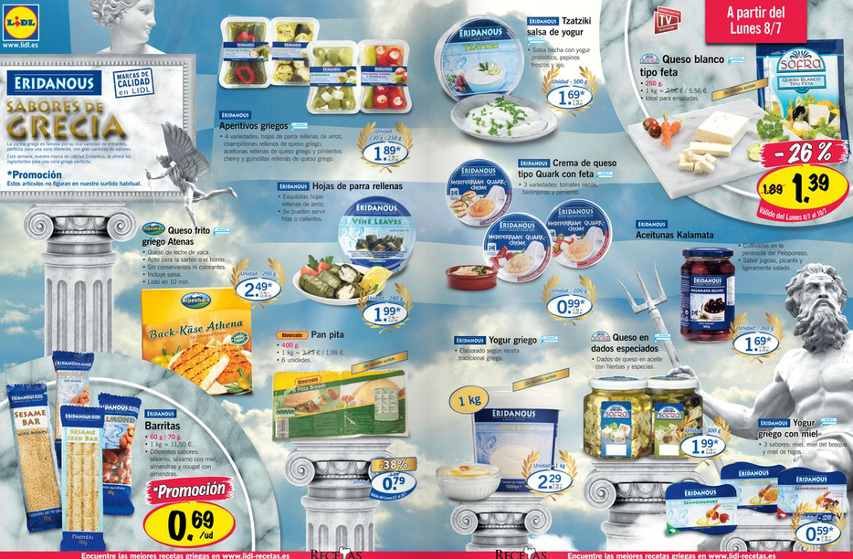

A partir de mañana (8 de julio) llega la campaña Sabores de Grecia, en los supermercados [Lidl](http://www.lidl.es/cps/rde/xchg/lidl_es). Nosotros somos fans (la suelen repetir varias veces al año), porque es una forma de estar más cerca de la comida griega y ya sabéis que nos encanta. No perdáis la oportunidad y probad estos productos.

En A Pizcas y a Mizcas hemos probado ya varios de ellos y han sido fuente de inspiración de varias recetas, como por ejemplo:

- [Nuestra cena mediterránea](/una-cena-desde-la-otra-orilla-del-mediterraneo-kebab-y-falafel-caseros/)
- [Una refrescante ensalada de yogur griego](/ensalada-de-pollo-con-yogur/)
- [El rico revuelto con queso feta](/revuelto-griego/)
- Podemos aprovechar el cremoso yogur griego para otras recetas, como el [salmón con mostaza](/salmon-a-la-mostaza/) o para preparar bizcochos

Si queréis terminar la velada al estilo griego, nada mejor que un fresquísimo [frappé!](/cafe-frappe/)
