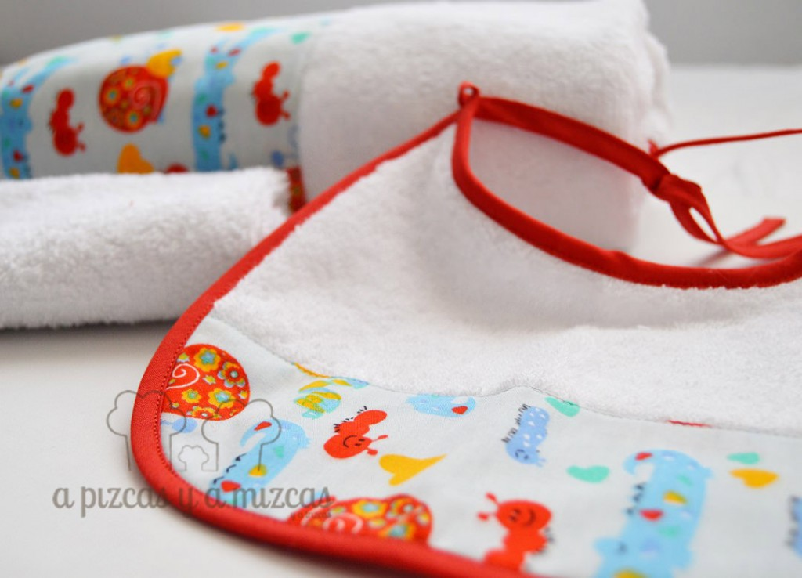
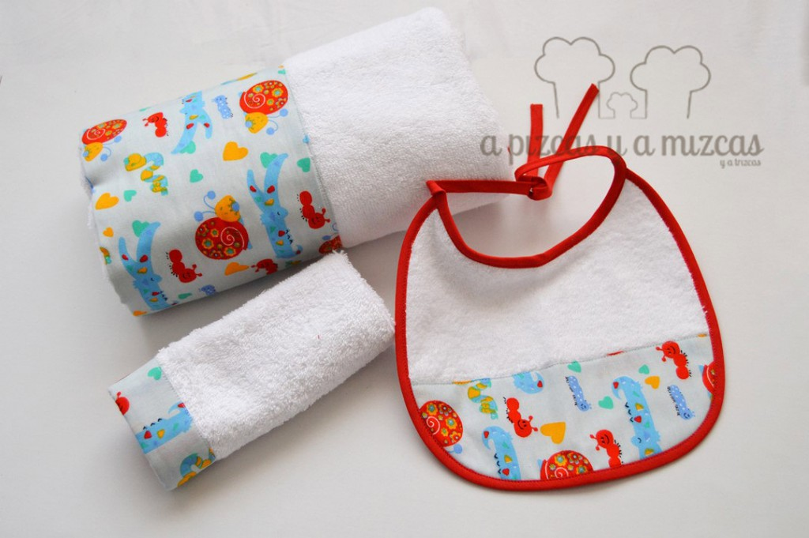
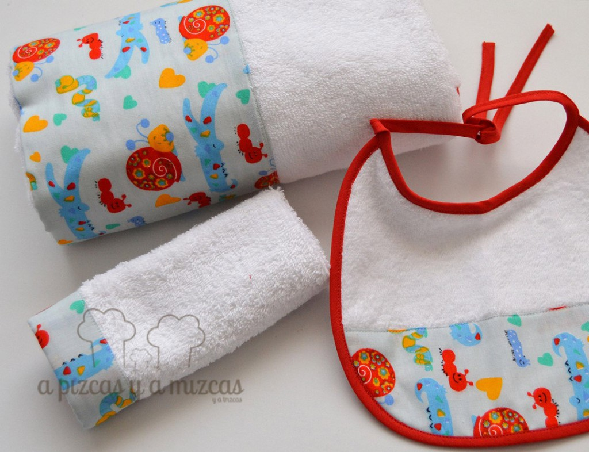

Una de las cosas que más nos recuerda a nuestros peques es el de ese momento de bebé recien salido del baño y acurrucadito en su toalla. Es uno de esos momentos que no olvidamos nunca y sobretodo ese olor a bebé.... ji ji ji... qué recuerdos. Por eso nos encanta regalar a para dar la bienvenida a los peques un conjunto de toalla de baño para bebé.

Como en otras ocasiones hemos cosido varias piezas que conforman este conjunto de toalla de baño para bebé: que consta de toalla de baño, pechito y trapito de lactancia

## Cómo preparamos el conjunto de toalla de baño para bebé

Elegimos rizo en blanco y para que animara el blanco buscamos una tela con estampados de cocodrilos, caracoles y cienpies a todo color.

Escogimos un modelo de pechito chiquitín y lo cortamos en el rizo y un trocito de nuestra tela estampada de animales y para llenar de color el pechito y para finalizar pusimos un bies en  rojo. Y para ir todo coordinado cosimos un trapito de lactancia.

Por último, cosimos una toalla grandecita para que el bebé pueda utilizarla durante (por lo menos) su primer añito. Y en una de la terminaciones de la toalla cosimos un trozo de la tela de animales a todo color. Además como es un estampado muy animado este peque podrá utilizar esta toalla incluso para los primeros baños del verano... ji ji ji

Tenemos muchas ganas de ver cómo le queda este pechito tan colorido!

Y si os ha gustado nuestro conjunto de toalla de baño para bebé pero sois de los que no os lleváis bien con la aguja o queréis preguntarnos o contarnos cualquier cosa podeís poneros en contacto con nosotros a través de nuestro [formulario de contacto.](/contacto/)
