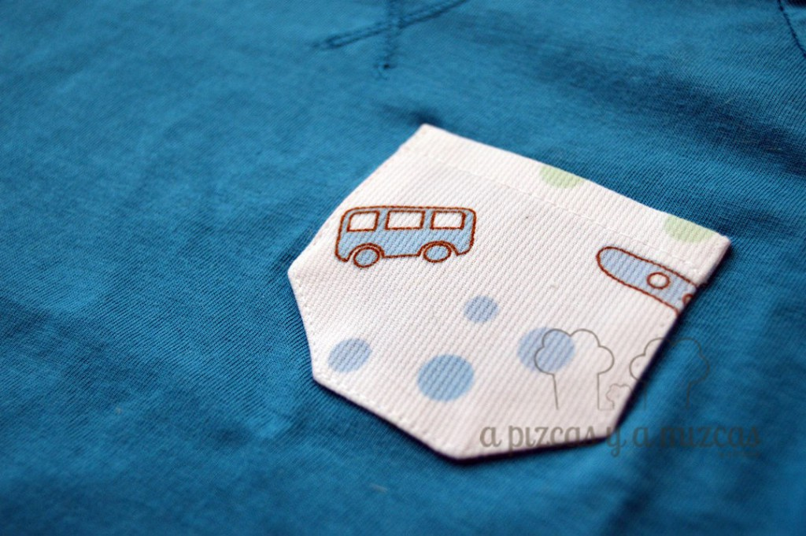
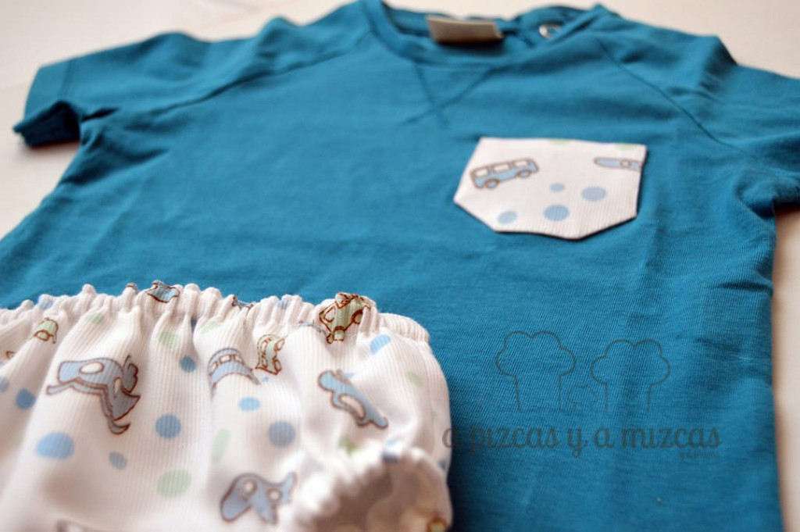
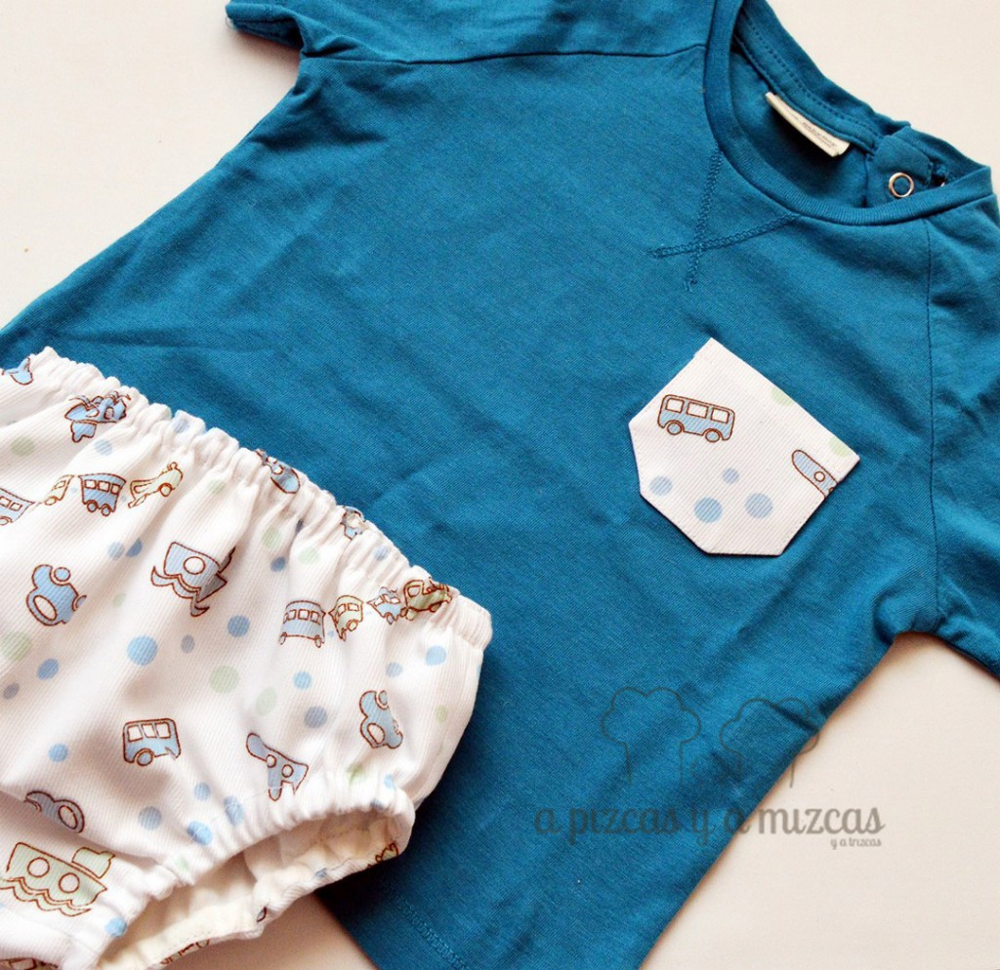

Hace unos días fuímos a visitar a unos amigos para celebrar que eran uno más. Y ya sabeís a nosotros siempre nos gusta llevar algo hecho por nosotros un regalo que tenga algo de historia detrás. Si quieres saber cómo preparamos esta vez el conjunto para bebe de verano... no te vayas y sigue leyendo!

Nos encanta preparar el regalo pensar en la persona que lo va a recibir... ir a las tiendas de telas y perdernos entre los rollos de telas y escoger la tela más adecuada.

## Te contamos cómo preparamos el conjunto para bebe de verano

Para esta ocasión dividimos el regalo en dos bloques: el primero un conjunto de toalla, pechito y trapito de lactancia (que otro día os mostraremos) y el que hoy os enseñamos un conjunto para bebe de verano compuesto por una braguita cubre pañal y una camiseta de manga corta.

Buscamos una tela con dibujitos infantiles con fondo blanco y colores suaves (azules y verdes) y para combinar una camiseta de manga corta en azul turquesa, un color que siempre es un acierto en verano. Para completar nuestro conjunto cosimos un mini bolsillito en la camiseta con un cuadradito de la tela del cubre pañal.

 Detalle mini bolsillo

Estamos deseando ver esas piernecitas al aire!

 Color para el verano!!

Y si os ha gustado nuestro conjunto para bebé de verano pero sois de los que no os lleváis bien con la aguja o queréis preguntarnos o contarnos cualquier cosa podeís poneros en contacto con nosotros a través de nuestro [formulario de contacto.](/contacto/)

