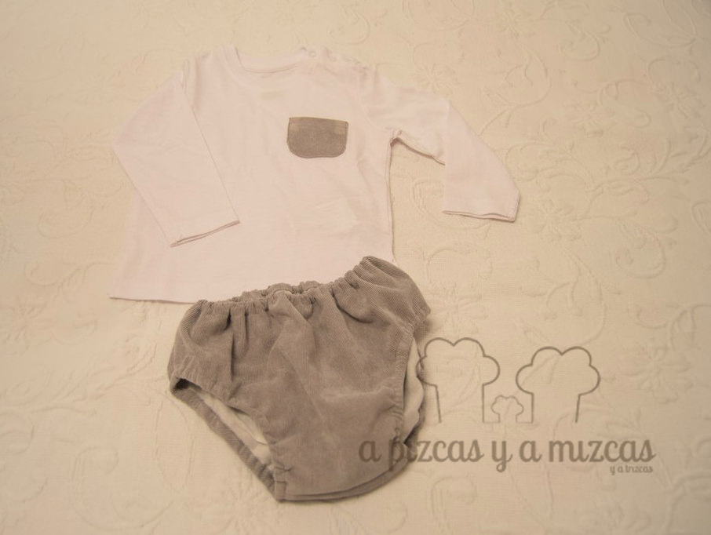

Estas navidades Papá Noel nos hizo un encargo muy especial... un conjunto para bebe. Para el bebé mas achuchable y adorable que conocemos... ji ji ji. Es que pensar en sus moflis y se nos ilumina la sonrisa. Ya sabéis que somos muy apañados (todo nos lo decimo nosotros) así que nos pusimos manos a la obra y...

A veces no se nos ocurre que podemos regalar a un baby de 6 meses... y pensamos que era buena idea que tuviera un conjunto único hecho con  nuestras manitas. Así que nos fuímos de compras y llegamos a casa cargados de:

- Tela de micropana en gris (nos encanta el gris para bebé)
- Forro de algodón en gris
- Una camiseta de las básicas

## Así preparamos el conjunto para bebe

El patrón del cubre pañal lo sacamos de la página de [Oh! Mother mine diy](http://www.ohmotherminediy.com/) (blog que os recomendamos a todos los que seais costurillas) además podeís seguir el tutorial. Marta explica paso a paso [cómo hacer el cubre pañal](http://www.ohmotherminediy.com/2012/09/tutorial-cubre-panales-para-bebes.html). Nosotros como le pusimos forro es como si hicierais dos cubrepañales. Pero es muy facilito de hacer y rápido.

Para la camiseta básica, cortamos un pequeño bolsillito de la misma tela de micropana del cubre pañal y se lo cosimos en la parte izquierda de la camiseta.

Para completar nuestro regalo compramos una chaquetita de punto en gris y unos leotardos calentitos en gris piedra.

 El conjunto quedó bonito y su dueño estaba más que guapo con él puesto! #tioscaldosos

Y no es amor de tíos... pero Querubín estaba guapísimo... que ganas tenemos de volver a verlo!!

Y si os ha gustado nuestro conjunto para bebé pero sois de los que no os lleváis bien con la aguja o queréis preguntarnos o contarnos cualquier cosa podeís poneros en contacto con nosotros a través de nuestro [formulario de contacto.](/contacto/)
