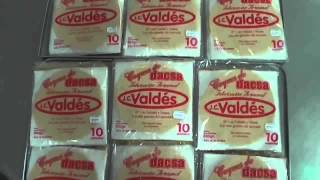
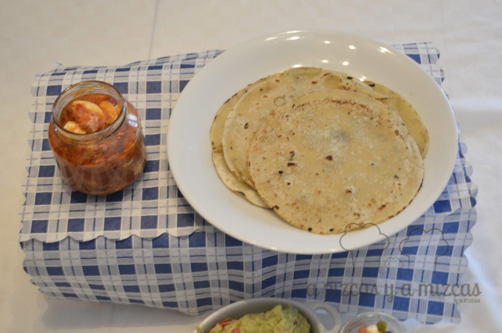
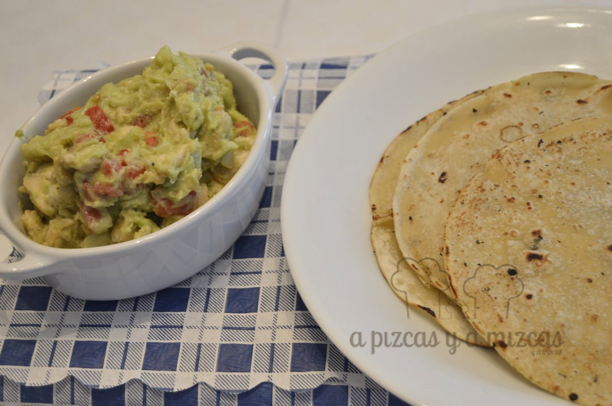
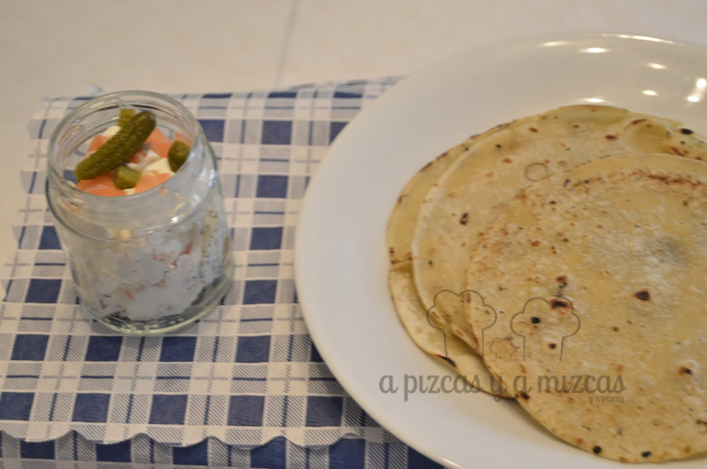
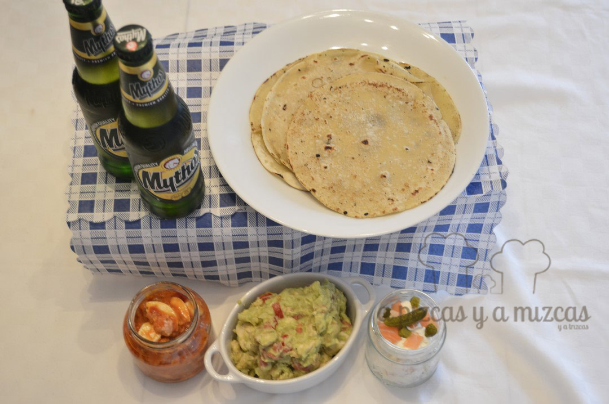

Les coques de dacsa o cocas de maíz son unas cocas redondas y planas elaboradas con harina de maíz, agua y sal. Es un plato muy típico de La Safor, especialmente de Rótova y Oliva aunque también es muy popular en la Marina Alta. Se suele acompañar de distintos "mulladors" o picadillos que pueden ser de atún, huevo duro y tomate frito o tambien de boquerones, sardinas..

Nosotros lo conocemos desde que nos lo prepararon nuestros amigos de Daimús y desde entonces siempre tenemos en el congelador coques de dacsa. Esta vez preparamos una cena veraniega con distintos acompañamientos... si quieres saber más sigue leyendo

## Ingredientes para preparar las coques de dacsa

Compramos les coques de dacsa en Carrefour en la sección de congelados donde están las pizzas podréis encontrar las [coques de dacsa Valdés](http://www.coquesdedacsa.es/). Y preparamos tres elaboraciones para acompañarlas.

Coques de dacsa Valdés

Para la primera elaboración optamos por el picadillo tradicional. Y estos son los ingredientes que utilizamos:

- dos latas de atún
- dos huevos duros
- un bote de pisto

Se prepara muy fácil hervimos los huevos y los picamos, añadimos el atún y por último el tomate y listo. Si teneis pisto casero mejor que mejor.

Primer "mullador": huevo, atún y tomate

Para la segunda elaboración preparamos un guacamole con pollo. Puedes consultar en el siguiente [enlace](/guacamole/) cómo lo preparamos y los ingredientes que necesitáis y le agregamos unos trocitos de pollo que habiamos hecho en la sartén.

Segundo acompañamiento: guacamole y pollo

Y por último una crema de queso estilo Philadelphia con salmón y pepinillos.

Tercer acompañamiento: salsa de queso, salmón y pepinillo

Justo antes de servir calentamos las coques de dacsa en la sartén hasta que estén doradas. Y a la mesa rápido y cada uno que elija su acompañamiento preferido y a disfrutar! Ay! lo que nos gusta comer con las manos!

Nos encantan las cenas de verano
