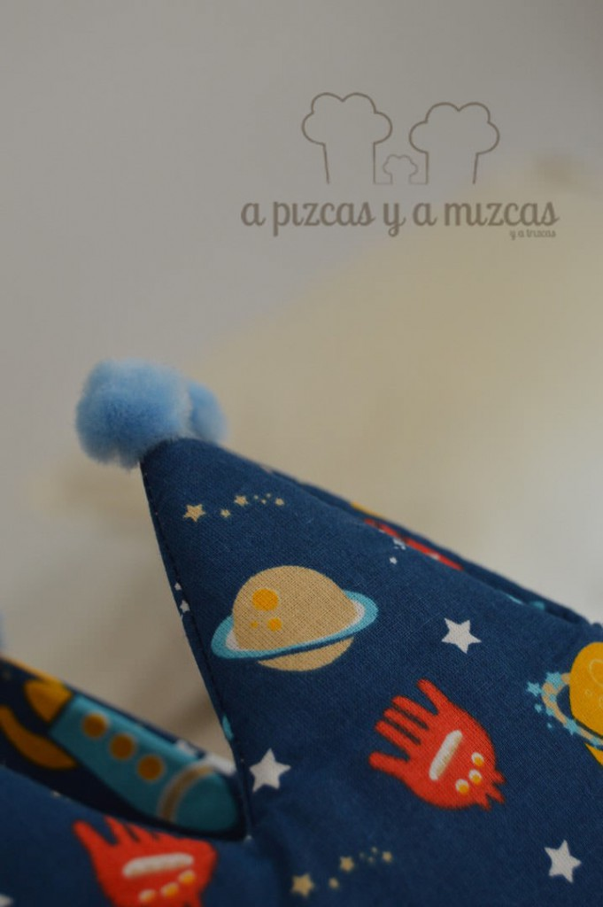
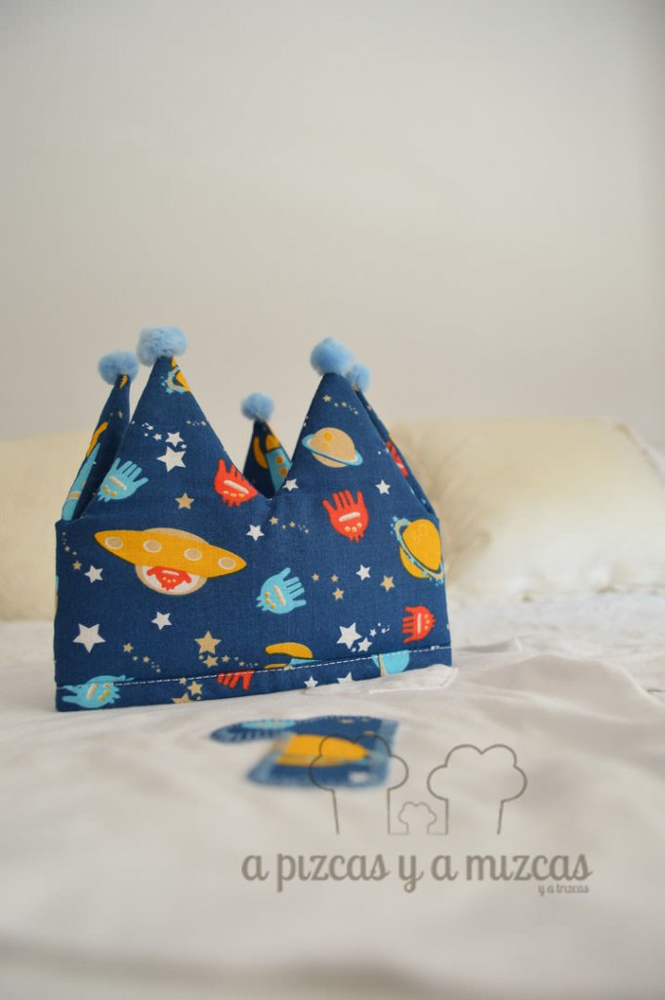
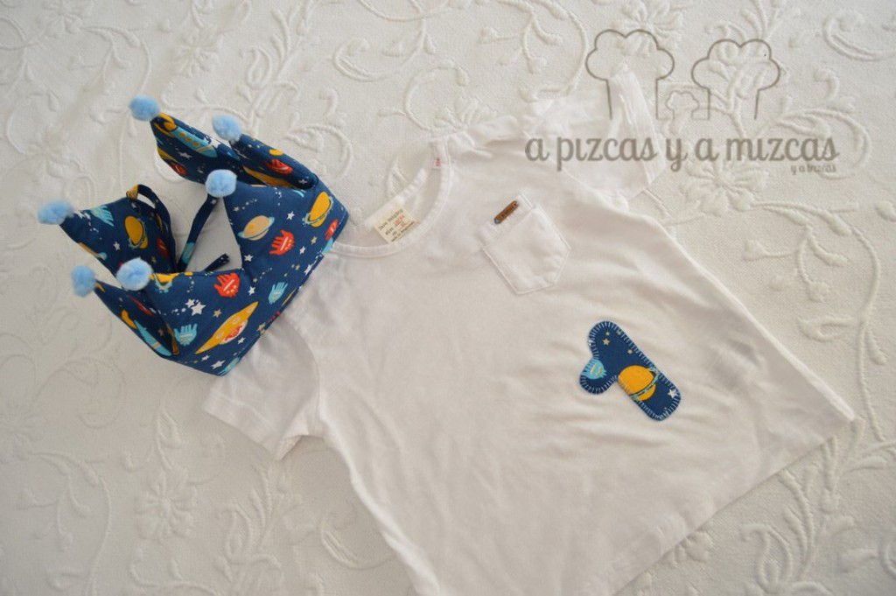
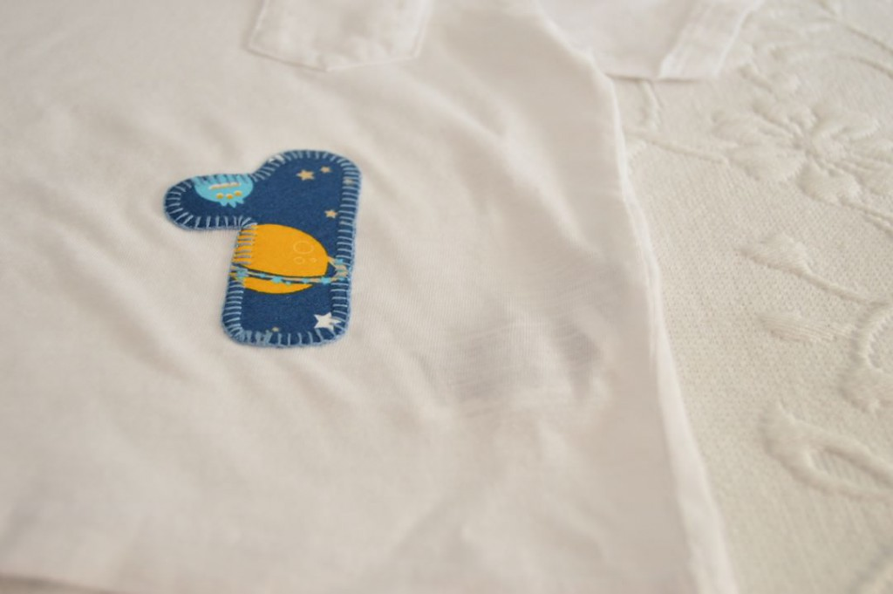

Otros años hemos hecho corona de cumpleaños para Trizcas... pero este año Trizcas cambió la corona por su sombrero de Jessie...Pero como le hemos cogido el puntillo a esto de hacer coronas y era el cumple de una personita que queremos un montón hicimos una corona de cumpleaños espacial y muy especial

Seguimos el patrón que utilizamos para hacer la la corona del [primer cumpleaños de Trizcas](/fiesta-de-primer-cumpleanos/) y buscamos una tela que nos gustara. La tela de los planetas nos pareció perfecta! Rematamos la corona con unos mini pompones azul clarito. Y es que parece que acertamos con el estampado de la tela porque la tarta del cumple tenía casi casi los mismos colores... así que fue un acierto!

Y para que el regalo fuera completo lo acompañamos con una camiseta a la que cosimos un "número 1". La fiesta del primer cumple es algo mágica... o por lo menos a nosotros nos lo parece. Y la fiesta del primer cumple de este chiquitín fue muy entrañable y fue una pena que empezara a llover y no poder pasar más ratito viendo al peque terremoto... ji ji ji

En el segundo cumpleaños de Trizcas también hicimos con la ayuda de la iaia Mizcas una [corona india](/corona-india/)... os dejamos el enlace por si os sirve de inspiración.

Y si os ha gustado nuestra corona de cumpleaños pero sois de los que no os lleváis bien con la aguja o queréis preguntarnos o contarnos cualquier cosa podeís poneros en contacto con nosotros a través de nuestro [formulario de contacto.](/contacto/)
