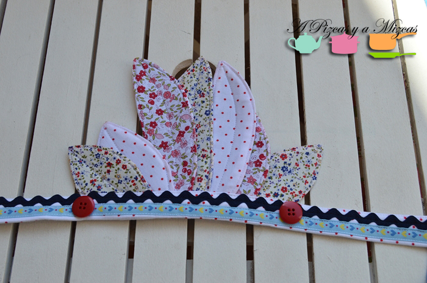
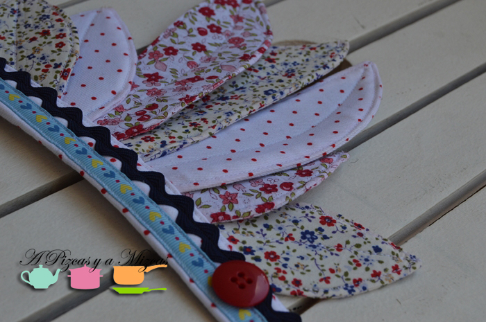
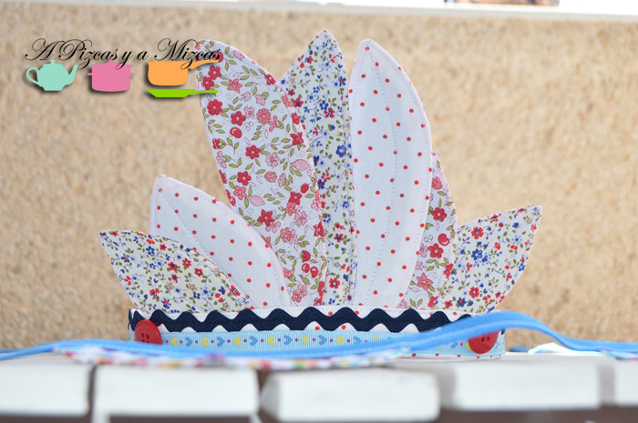

El año pasado en el primer cumpleaños de Trizcas ya le hicimos una corona.  Y este año no se iba a quedar sin ella. Así que otra vez a buscar... pero después de mirar y mirar decidimos hacer nuestra propia corona india.

Ya sabéis que nosotros no nos llevamos muy bien con la aguja... por eso "diseñamos" nuestra corona, recortamos todos los materiales y se lo dimos todo preparadito a la yaya Mizcas para que nos echara una mano con la máquina de coser.

## Materiales para hacer la corona india

- Retalitos de tela de colores
- Goma eva
- 20 cm de picunela
- 20 cm  de lazo decorado
- dos botones rojos
- Belcro

Lo que primer hicimos fue buscar varios modelos de plumas (de distintos tamaños). Estos son los modelos que utilizamos:

Cortamos en la goma eva tres plumas grandes y cuatro pequeñas. Después medimos el contorno de la cabeza de la peque Trizcas y dejamos unos 5 cm por cada lado. Cortamos una tira de goma eva de 3 cm de ancho (aproximadamente). Ya va cogiendo forma nuestra corona india con la goma eva.

Ahora vamos a cortar la tela. Nosotros utlizamos retalitos de tela que teníamos por casa ( algunas de vestiditos que le hemos hecho a Trizcas) cogimos los que mejor combinaban y la verdad es que nos quedó espectacular.

Cortamos la tela, tendréis que cortar la tela un par de centímetros más grande que la plantilla de la hojas de goma eva. Y lo mismo haremos con la tira del contorno de la cabeza.

Ahora le toca el turno a la magia de la yaya Mizcas y su máquina de coser. Que forró cada hoja de goma eva con la tela escogida así como la tira del contorno de la cabeza. Por último colocamos cada hoja formando una corona india, ponemos las plumas más grandes en el centro y las más pequeñas a los lados (dos a cada lado).

Ahora vamos con los últimos retoques de nuestra corona india. Colocamos un trocito de picunela azul marino y debajo un lazo decorado sobre la cinta del contorno de la cabeza. Y dos botones rojos en cada extremo (donde se acaban las plumas).

Para sujetar la corona india en la cabeza de Trizcas utilizamos dos trozos de belcro cosidos en cada extremo de la cinta. Ya la tenemos lista... a ver si conseguimos ponérsela a Trizcas.

Y para que el resto de indios se sintieran integrados en el poblado indio. Cortamos unas tiras de tela estampada a la que cosimos una pluma de goma eva.

Disfrutaron como auténticos indios. au au au au au! je je je
