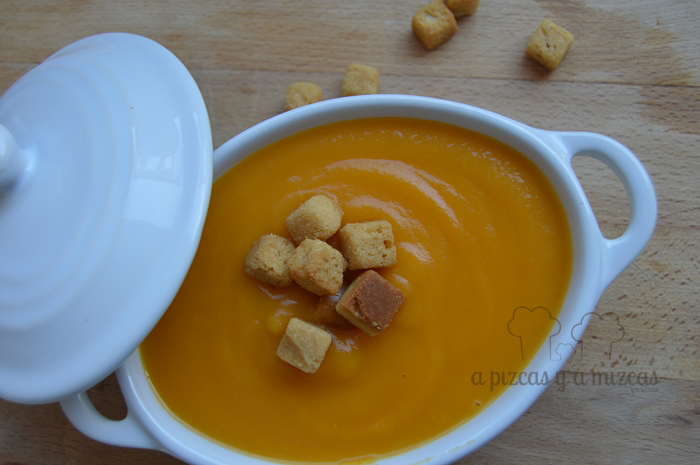
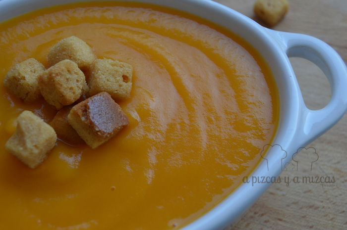

Hace un par de meses le regalaron al yayo Mizcas una súper calabaza pero le dijeron que era mejor que le diera el solecito durante un par de meses para que estuviera buena. Así que cuando llegó la calabaza a casa de los yayos, la yaya Mizcas le buscó el mejor sitio en el balcón para que le diera el sol y de vez en cuando le iba dando la vueltecita. Trizcas cada vez que iba a casa de los yayos salía al balcón a contemplar la calabaza... y así pasaron los dos meses. Y en todo este tiempo hemos ido pensando un montón de recetas para nuestro trozo de calabaza. Hoy hemos preparado crema de calabaza...

Ya os iremos enseñando porque hemos hecho muchas cosas ricas con nuestra súper calabaza

## Ingredientes para preparar crema de calabaza (para cuatro personas)

- 600 gramos de calabaza
- un puerro
- dos patatas medianas
- 2 zanahorias
- aceite de oliva virgen extra
- sal
- pan frito

Es muy sencillo y rápido de preparar. En primer lugar le quitaremos la piel a la calabaza y la partimos en trozos cuadrados, limpiamos el puerro y cortamos en juliana y limpiamos las zanahorias y las cortamos en rodajas.

En una cacerola ponemos todas las verduras y cubrimos con agua, añadimos dos cucharadas de aceite de oliva virgen extra y sal al gusto. Dejamos cocer a fuego lento al menos durante 20 o 25 minutos.

Con la ayuda de la espumadera cogemos todas las verduras y las trituramos y añadiremos el agua de la cocción según queramos la crema de calabaza más o menos espesa.

Por último, a la hora de servir añadimos unos trocitos de pan frito para acompañar nuestra crema de calabaza. Ya veis en un periquete tenéis lista una comida riquísima. Y es que en casa de A Pizcas y a Mizcas nos encantan las cremas de verduras, y a vosotros?

