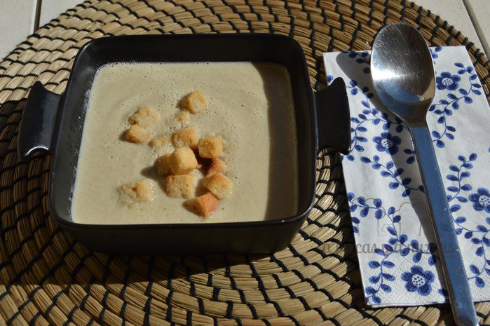
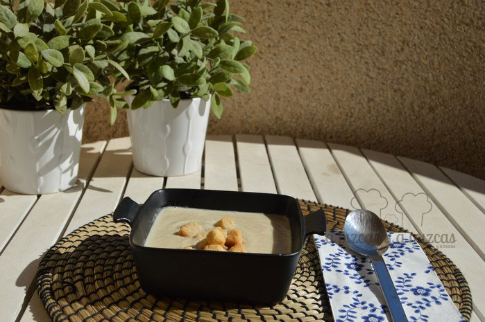

En casa somos muy fans de las cremas de verduras, purés... los que seguís nuestras recetas seguro que ya lo sabéis. Hoy os mostramos como preparamos nosotros la crema de champiñones. De todas formas os dejamos los enlaces de todas las cremas de verduras que hemos preparado en A Pizcas y a Mizcas: [depurativa](/crema-de-verduras-depurativa/ "Crema depurativa"), [crema de calabaza](/crema-de-calabaza/ "Crema de calabaza"), [crema de calabacín](/crema-de-calabacin/ "Crema de calabacín"), [vichysoisse](/vichyssoise-o-crema-de-puerros/ "Vichysoisse o crema de puerros")

No encantan porque es una forma fácil de comer verduras y cuidarse un poquito más.

## Ingredientes para preparar la crema de champiñones

- una cebolla mediana
- 250 gramos de champiñones laminados
- aceite de oliva virgen extra
- medio litro de caldo de pollo
- un vaso de leche desnatada
- sal
- pimienta

Cortamos la cebolla y la ponemos a sofreír a fuego lento en una olla. Mientras picamos el champiñón. Cuando la cebolla esté sofrita añadimos el champiñón, removed de vez en cuando hasta que comprobéis que el tamaño ha reducido.

Sino tenéis caldo de pollo podéis utilizar una pastilla de caldo. Disolvéis la pastilla de caldo en medio litro de agua y lo lleváis a ebullición.

Añadiremos el caldo de pollo y un vaso de leche desnatada a la olla con los champiñones ya reducidos y cocinaremos unos 10 minutos más a fuego fuerte. También podéis poner un chorrito de nata para cocinar en el momento de batirlo todo.

A continuación lo batimos hasta que quede todo lo más homogéneo posible. Nosotros lo hemos acompañado de unos picatostes.

A disfrutar de la crema de champiñones calentita!

