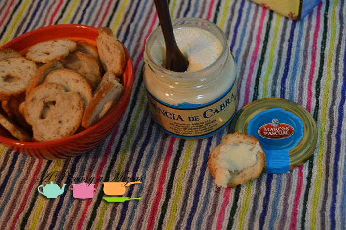

Como ya sabéis nos encanta probar cosas nuevas... la semana pasada cuando fuimos a [Charcutería Casa Rodríguez](https://www.facebook.com/CharcuteriaCasaRodriguez?fref=ts "Charcuteria Casa Rodríguez"), Pablo nos comentó que ellos habían probado la crema de queso esencia de cabra y que estaba muy buena. Asi que pensando y echo nos la llevamos a casa para probarlo y después contaroslo en #loencontramosenelsuper.

## Crema de queso esencia de cabra

Nosotros lo acompañamos con unos panecillos como aperitivo en la cena. Al principio, pensábamos que se podría untar mejor... pero al abrirlo nos dimos cuenta que era un poquito complicado para untar como todos los quesos de cabra. Tiene un fuerte sabor a queso de cabra... si os gusta el sabor fuerte de queso os encantará.

Ahora estamos pensando utilizarlo en otros platos... seguro que con pasta o un poquito en una pizza está buenísimo. Aunque con una tosta de pan con mermelada de tomate o melocotón tiene que ser una combinación perfecta. Ummm ya estamos deseando probarla con todo lo que os hemos contado.... :)

