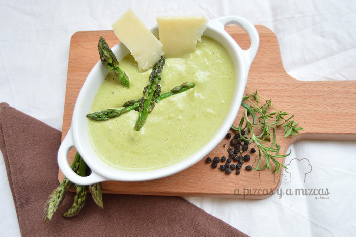
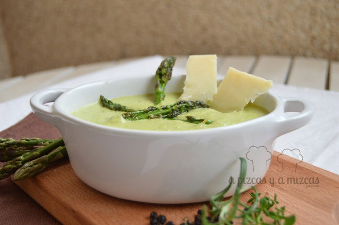

Ha empezado la temporada de espárragos y aprovechando que están muy bien de precio cargamos con dos paquetitos. De camino a casa pensamos en varias recetas para nuestros espárragos verdes y elegimos esta receta de crema de espárragos verdes.Ahora que se acerca el buen tiempo otra receta que nos gusta preparar con espárragos verdes es [flanes de espárragos y queso](/flanes-de-esparragos-y-queso/ "Flanes de espárragos y queso"), echarle un vistazo que seguro que os gusta.

Podéis preparar la cerma de espárragos el día anterior, incluso congelarla y la tenéis lista para cualquier momento.

## Ingredientes para preparar la crema de espárragos verdes

- dos manojos de espárragos verdes
- dos cebollas
- perejil, tomillo y orégano
- 200 ml nata
- medio litro de caldo de ave
- 50 ml aceite de oliva virgen extra
- sal y pimienta
- queso curado manchego

Empezamos... lavamos los espárragos. Reservaremos algunas puntas de espárragos verdes para decorar cuando el plato esté listo. Cortamos en trozos pequeños. Picamos la cebolla en juliana. En una sartén vertemos un poco de aceite de oliva virgen extra y sofreímos la cebolla a fuego medio. Agregamos un poquito de sal, perejil, tomillo y orégano

A continuación añadimos el espárrago verde troceado, mezclamos y rehogamos todo junto para que se cocine y ablande antes de la cocción. Echamos la nata y el caldo de ave en la sartén de forma que los ingredientes queden cubiertos y coceremos durante unos diez minutos a fuego alto.

Lo trituramos todo y después lo pasaremos por el colador para eliminar las hebras de los espárragos y que quede más fino.

Para decorar el plato lo acompañamos con las puntas de espárragos sofritas y unas lascas de queso curado manchego. Un plato perfecto para la operación biquini que ya la tenemos aquí, es un plato muy sano perfecto para las cenas rápidas o para comer en el trabajo.

