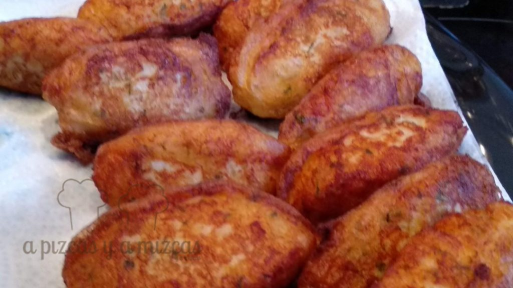
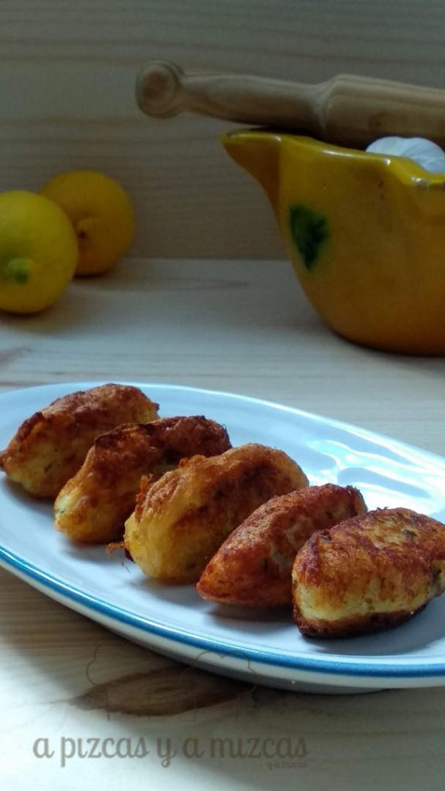
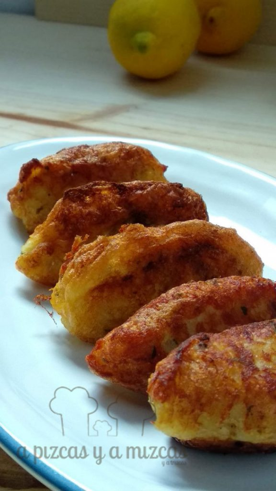
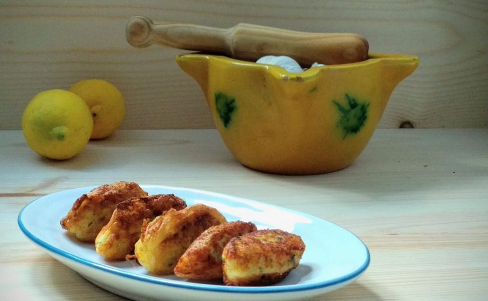

Hoy os traemos la auténtica receta de las croquetas de bacalao o mandonguilles d'abadejo. Así las preparaba la iaia de Mizcas desde el pueblito bueno en la Ribera Alta. Y con un poco de paciencia nos salieron mandonguilles para toda la familia. Nosotros las congelamos ya fritas y las tenemos casi listas para cualquier cena. Y a Trizcas y Chispas les encantan... atentos si quereis saber el secreto

## Ingredientes para preparar las croquetas de bacalao

- dos dientes de ajo
- dos huevos
- aceite de oliva virgen extra
- 250 gramos de bacalao desalado a trocitos
- 500 gramos de patata
- canela
- nuez moscada
- piñones
- perejil

Primero tendremos que desalar el bacalao. Pondremos a remojo el bacalao durante 12 horas cambiándole el agua dos veces. Otra forma de desalar, poner el bacalao en una cazuela con agua y coceremos durante unos 15 minutos y tiraremos el agua.

Pondremos a hervir las patatas (unos 20 minutos aproximadamente) cuando queden 10 minutos agregamos el bacalao. En un bol rallaremos las patatas y en otro bol desmenuzamos el bacalao para que no quede ninguna espina. Agregamos el bacalao a las patatas y removemos con un tenedor.

En una sarten tostaremos los piñones hasta que estén doraditos.

Picaremos el ajo, el perejil, agregamos los piñones, una cucharada (de las de postre) de canela, una pizca de nuez moscada y un huevo entero y la yema de otro (reservaremos la clara). Lo mezclamos todo junto a la patata y el bacalao hasta que tengamos una pasta homogénea. Probar de sal por si hiciera falta añadirle.

Ahora vamos con las manualidades. Para darle forma nos ayudaremos con dos cucharas soperas. Con una de ellas cogemos la cantidad para hacer una croqueta y ayudándonos con las dos cucharas (pasando la masa de una a otra cuchara) le daremos forma de croqueta.

Batimos la clara que habíamos reservado, añadimos un poco de leche y batimos bien. Pasaremos las croquetas por la clara y las freíremos hasta que estén bien doraditas.

