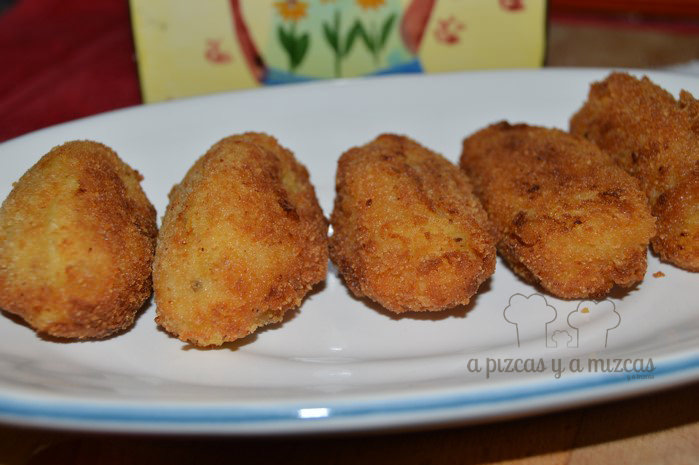
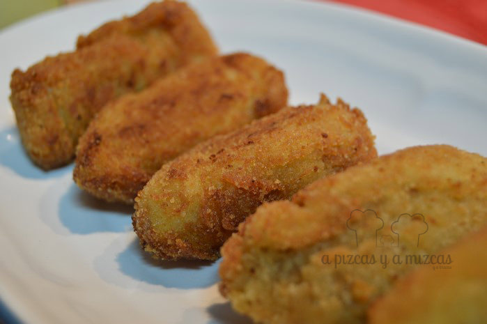
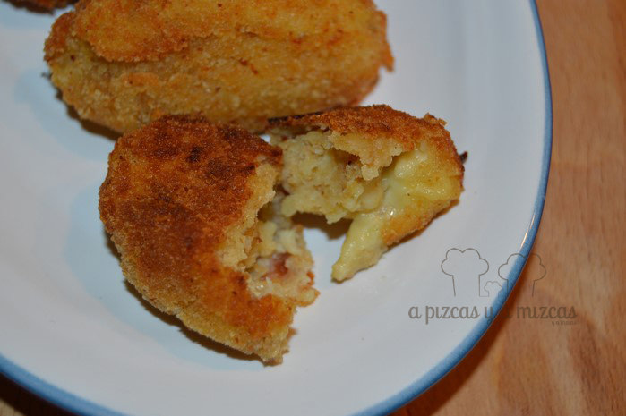

Lo admitimos: somos muy fans de las croquetas. La iaia Pizcas las hace de rechupete. Desde siempre, cuando hace puchero (el cocido valenciano) pone más pollo del que corresponde para aprovechar esos "restos" y transformarlos en unas riquísimas croquetas. Hace poco, una compañera de trabajo de Pizcas le comentó que ella aprovechaba la carne que sobraba en la paella valenciana para hacer también croquetas de paella. ¡Qué idea!

A nosotros también nos sobra bastante carne cuando hacemos paella, así que rápidamente decidimos que no íbamos a tirar más carne y que íbamos a aplicar la receta de las croquetas de pollo tradicionales de la iaia Pizcas pero también con los restos de la paella. Salen deliciosas, tanto de puchero, como las croquetas de paella y son un aperitivo perfecto o una cena completa si la acompañas de un poco de ensalada.

## Ingredientes para las croquetas de paella

- Restos de pollo de cocido o pollo de la paella (también podéis incluir el conejo si queréis)
- Media cebolla grande
- Tres cucharadas soperas de harina
- Leche
- Aceite de oliva virgen extra
- Sal
- Pimienta
- Nuez moscada
- Pan rallado
- Huevo
- Aceite de girasol

Aquí las cantidades sí que son del todo orientativas y dependerá del ojo del cocinero, pero nunca hemos pesado los restos que hemos empleados para nuestras croquetas de paella. Calculamos que serán unos 200 gramos de carne o algo más, y así salen para unas 24 croquetas de buen tamaño.

El primer paso para elaborar estas croquetas de paella es limpiar bien la carne de restos de arroz y/o verdura de la paella, deshuesarla y desmigarla en trozos lo más pequeños posible (nosotros utilizamos las tijeras de cocina). Colocamos la carne desmigada en un bol.

Mientras, preparamos la bechamel para las croquetas. Nosotros seguimos el patrón de la receta de la iaia Pizcas para sus croquetas tradicionales. Picamos la cebolla bien fina. Colocamos en una sartén aceite de oliva virgen extra y pochamos la cebolla con un poco de sal (ojo, pues si las hacéis con carne de paella debéis tener presente que la carne ya está salada) hasta que esté dorada.

Cuando la cebolla esté lista, agregamos las tres cucharadas soperas de harina y la cocinamos a fuego medio/bajo durante unos dos minutos para evitar que quede luego el gusto de harina cruda. A continuación, vamos añadiendo leche poco a poco y removiendo constantemente. Al principio, con los primeros aportes de leche veréis como la masa parece apelmazarse, no os preocupéis, añadid más leche poco a poco y no dejéis de remover hasta que quede con la consistencia de una bechamel no demasiado ligera, pero tampoco "mazacote". Bajamos ahora el fuego al mínimo, añadimos la carne desmigada, espolvoreamos la pimienta y la nuez moscada, probamos de sal y rectificamos. Seguimos removiendo toda la mezca unos cinco minutos más con el fuego al mínimo.

Ya tenemos lista la masa de croquetas de paella. La retiramos de la sartén y la ponemos en un bol amplio, dejamos atemperar. Luego la tapamos con papel film y la dejamos en el frigorífico durante al menos dos horas, pero podéis dejarla tranquilamente de un día para otro en el frigo y estarán aún mejor.

Transcurrido ese tiempo ya podemos empezar a formar las croquetas, empanarlas y freírlas.

Batimos un huevo o dos (según el tamaño), en un plato hondo colocamos abundante pan rallado. Calentamos en una sartén abundante aceite de girasol para freír las croquetas.

Sacamos la masa de croquetas de la nevera y con ayuda de dos cucharas soperas formamos las croquetas, las pasamos por huevo y luego por pan rallado. Hay quien las empana pasándolas por pan, huevo y luego pan otra vez, pero a nosotros nos gustan con un empanado más ligero. Una buena idea es empanar todas las croquetas de golpe y luego congelar aquéllas que no vayamos a gastar ese día.

Luego las freímos hasta que estén doradas por todos los lados y las dejamos sobre papel absorvente. A nosotros nos gustan con una textura muy suave y están fantásticas

Muy fans de las croquetas!

Ahora, hasta la iaia Pizcas también aprovecha la carne que sobra de las riquísmas paellas que hace todos los domingos y así esperamos las croquetas tanto cuando toca puchero como cuando hay paellita!

Deseando probar estas croquetas

 

Crujiente por fuera y jugosa por dentro... mmmm
