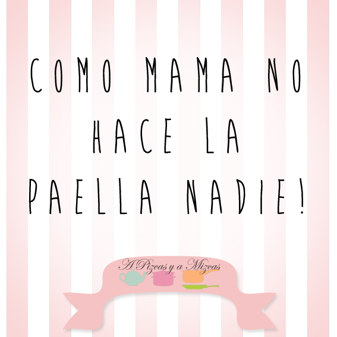
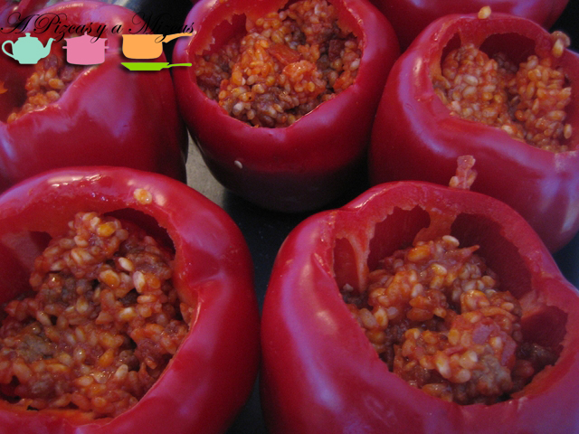
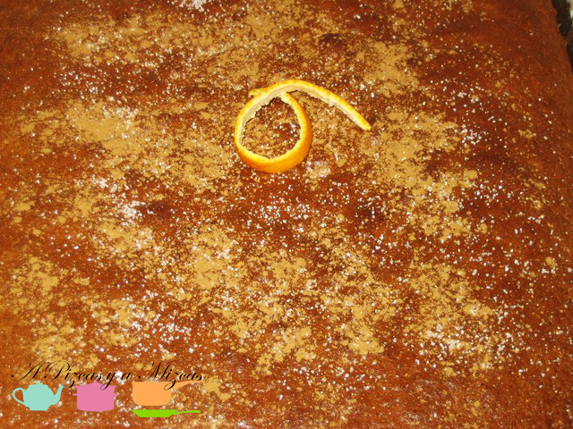

Aunque el estrés, el trabajo y la falta de tiempo tienden a popularizar la cultura del fastofood, sean en tupper o en plato caliente sobre la mesa, los sabores tradicionales de la cocina de mamá no cambian entre las preferencias de los españoles. Lo demuestra el Ranking de Platos Favoritos de Mamá, elaborado por Offerum a partir de las respuestas de los usuarios al concurso

## Ranking de Platos Favoritos de Mamá:

Paella y arroces: De pescado, a la cazuela, mar y montaña o de verduras. Los arroces son según los españoles, lo que mejor guisan sus mamás.

Canelones: Uno de los platos estrella de las celebraciones ocupa el segundo lugar. Croquetas: En la mesa del domingo o para cualquier día de la semana. Siempre oportunas, las croquetas ocupan el tercer lugar.

Tortilla de patatas: Una de nuestras tapas más famosas a nivel mundial no podía faltar en este ranking, cuarta posición para la tortilla de patatas

Macarrones / Lasaña: La lasaña pide paso y los clásicos macarrones comparten con ella el quinto lugar.

Postre: Arroz con leche: Muchos usuarios han decidido elegir un postre como plato preferido de mamá y, en este caso, el arroz con leche y un toque de canela ha sido el ganador.

Aunque los gustos son variados los usuarios coinciden en que sólo mamá consigue el sabor exacto de su receta y que el cariño es sin duda el ingrediente principal.

El año pasado os contábamos cual era nuestros platos favoritos de nuestras madres en "[Recordando la recetas de mamá](/recordando-las-recetas-de-mama/ "Recordando las recetas de mamá")". Y lo tenemos clarísimo cúal es nuestro plato favorito de mamá

Para Pizcas su platos favorito de mamá: son los  pimientos rellenos de arroz y la coca de llanda.

En cambio para Mizcas son el guisado de ternera y el arroz al horno

Los platos que prepara mamá siempre son especiales... y que quede claro mi madre hace las mejores croquetas del mundo... ja ja ja...
