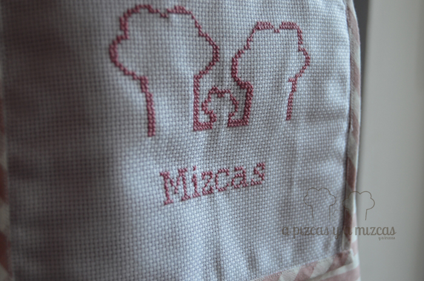
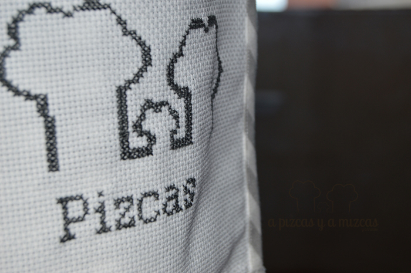
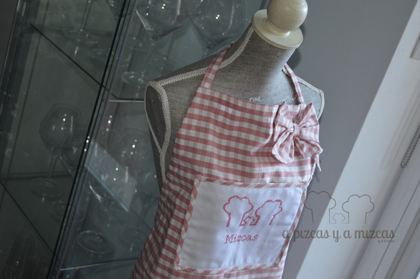
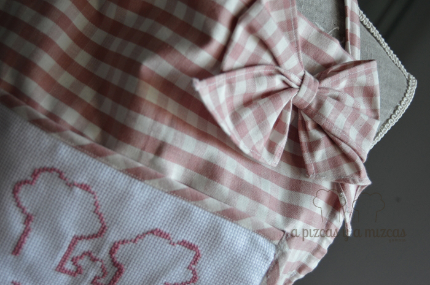
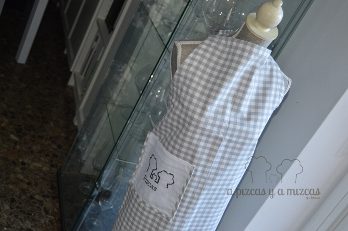

Este año Papá Noel nos pidió ayuda y le encargó a Mizcas y la yaya que hicieran unos delantales de A Pizcas y a Mizcas. Y a ver quién se atreve a decirle que no al hombrecito de rojo.

Y así que nada más recibir el encargo de Papá Noel fuimos a buscar una tela que estuviera a la altura. Al final encontramos la misma tela pero en diferentes colores. Para Mizcas en rosita y para Pizcas otra en color gris.

Mizcas y la yaya tabajaron en equipo. Mizcas se encargó de los bordados y la yaya de coser con su súper máquina los delantales. De esta forma, Mizcas eligió personalizar los delantales con el nuevo logo de A Pizcas y a Mizcas y para que no hubiera duda de quién era cada delantal también bordó el nombre de cada uno.

Diseñamos nuestro propio modelo de delantal para que nos resultara cómodo, ya que se puede ajustar tanto del cuello como de la cintura. Incluímos un amplio bolsillo que siempre viene bien para guardar cachibaches. Y para que el delantal de Mizcas fuera más cuqui le pusimos un lacito... que también en la cocina se puede ir arreglado (antes muerta que sencilla...ja ja ja)

Creo que el hombrecito de rojo quedó más que contento con su encargo... Ahora sólo nos falta un mini delantal para Trizcas.. ji ji ji

Ya sabes, sí te ha gustado y quieres algo parecido, puedes [contactar con nosotros](/contacto/ "Contacta con A Pizcas y a Mizcas")
