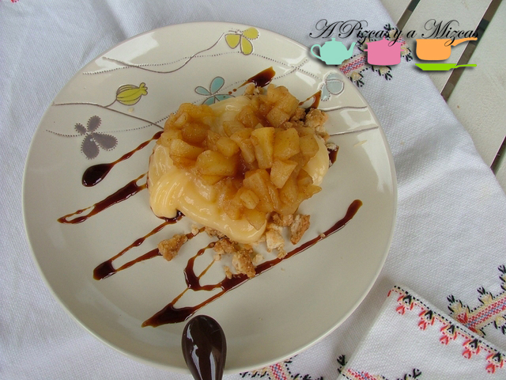
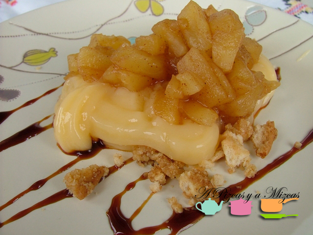

Hoy estamos muy dulces. Pero no os asustéis, también estamos muy prácticos. Y os planteamos un postre que preparamos hace unos días: una delicia de manzana en compota y crema pastelera con tierra de galleta maría. Que no os eche atrás el nombre. Casi se tarda más en recitarlo que en prepararlo.

## Ingredientes para la delicias de manzana en compota

- Dos manzanas (nosotros utilizamos en esta ocasión dos Royal Gala)
- Crema pastelera (cuatro cucharadas soperas grandes)
- Unas ocho galletas maría.
- Una cucharada de las de café de mantequilla.
- Azúcar
- Canela en polvo
- Zumo de lima o limón

Lo primero sería preparar la crema pastelera para nuestras delicias de manzana en compota, si queréis hacerla vosotros. Si vais un poco justos de tiempo, os recomendamos la crema pastelera ya preparada que vende Mercadona, de su marca de distribuidor. En caso de que os animéis a prepararla, es muy sencilla. Tened en cuenta que en esta receta solo necesitamos unas cuatro cucharadas (generosas). Para hacer la crema pastelera (os sobrará bastante) necesitaréis, las yemas de tres huevos, medio litro de leche, 50 gramos de harina refinada de maíz y cien gramos de azúcar. En un cazo, diluimos el azúcar con la leche y lo ponemos al fuego, hasta que rompa a hervir. Mientras se calienta la leche, en un bol batimos las yemas de los huevos con la harina refinada de maíz. En cuanto hierva la leche, la apartamos del fuego y dejamos templar. Una vez tibia, incorporamos los huevos con la harina y se mezcla todo. Lo ponemos a fuego suave y no paramos de remover, hasta obtener la textura deseada. Lo retiramos del fuego y dejamos enfríar y conservar en el frigorífico. Esta crema conviene gastarla pronto, la que os sobre la podéis tomar con un hojaldre, en una tarta o para rellenar, por ejemplo, cruasanes.

Pelamos las manzanas para las delicias de manzana en compota, las descorazonamos y las cortamos en dados de un centímetro de lado. Ponemos todos los daditos en un bol y espolvoreamos dos cucharadas soperas de azúcar y canela molida al gusto. Removemos bien para que quede todo "rebozado". Exprimimos unas gotas de lima (podéis emplear limón). Llevamos el bol al microondas durante tres minutos y medio a máxima potencia. Sacamos el recipiente con cuidado (alcanzará mucha temperatura), lo dejamos sobre un paño doble y con una cuchara removemos. La manzana se habrá compotado perfectamente. Dejamos que se enfría.

Vamos con la "tierra" de galleta para el postre. Cogemos las galletas y las machacamos hasta reducirlas a polvo más o menos grueso. En un bol añadimos una cucharada de las de café de matequilla, la ponemos a punto de pomada con un tenedor. Agregamos las galletas y con las manos vamos mezclando la galleta y la mantequilla, hasta que parezca una arena de playa. Si consideráis que queda demasiado húmeda, añadid alguna otra galleta más.

Para montar las delicias de manzana en compota, en un plato de postre trazamos unas líneas de caramelo líquido. Añadimos un puñadito de tierra de galleta, sobre ella, una cucharada generosa de crema pastelera (debe estar ya fría) y la manzana compotada con canela.

Bon profit!
