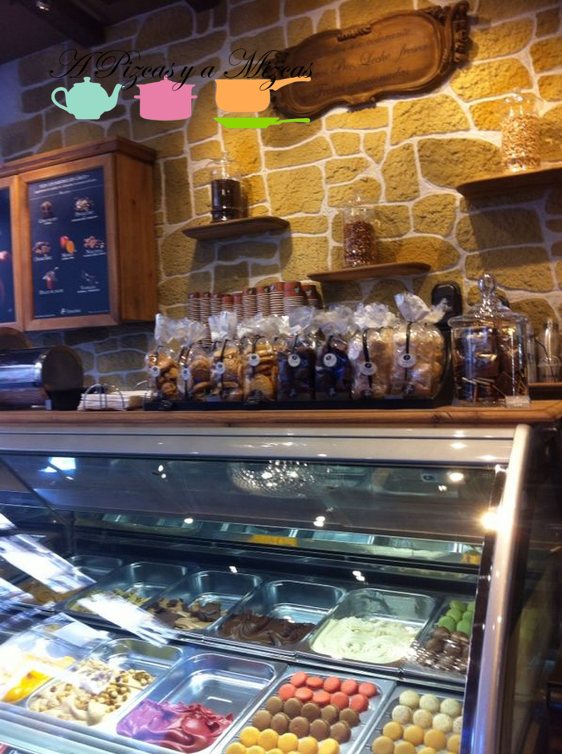
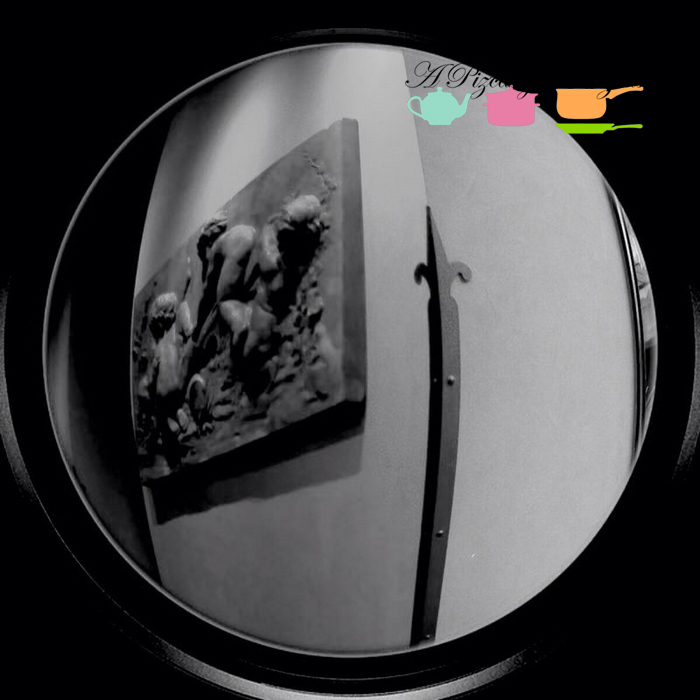
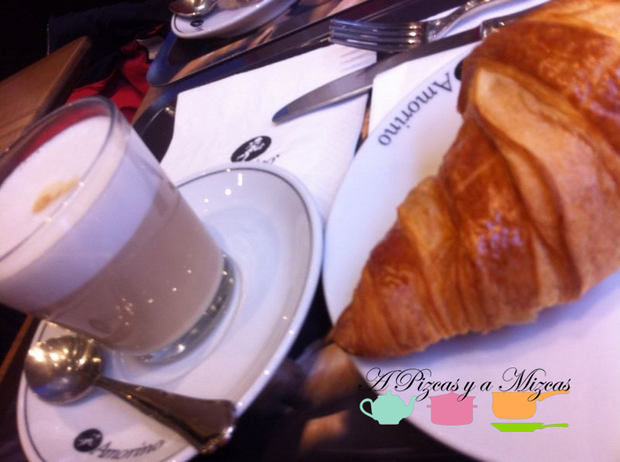

Seguimos descubriendo sitios... y nos encanta contaros todo. Después de la mudanza y de las navidades tenemos faena acumulada y tenemos aún muchos sitios por descubriros. Durante las navidades en uno de los paseos al centro desayunamos en [Amorino](http://www.amorino.com/es/ "Heladería Amorino").

Como Trizcas nos hace madrugar.... llegamos muy prontito... casi no habían abierto pero el olor de los cruasanes recién hechos se olía desde la entrada a la plaza San Lorenzo.

El local es super acogedor y todos los dulces que están en las vitrinas a cual más apetecible: macarons, bombones, chocolates, tartas de helado, waffles...

Dicen que sus helados son de los mejores del mundo... esperaremos a que haga mejor tiempo y volveremos a probarlos. Os dejamos un poco de la historia de Amorino

"Creado por dos amigos de la infancia, Cristiano Sereni y Paolo Benassi, Amorino nació en 2002. La pasión de los dos creadores se basa en unos valores fundamentales: exigir la máxima calidad, cultivar la perseverancia, el placer y el gusto, el sabor y la buena presentación. Paolo Benassi: "Nuestro objetivo es hacer los mejores helados de la forma más natural posible" Muy rápidamente el éxito les obligó a abrir en más lugares clave de la capital. Hoy, las colas delante de sus boutiques son ya parte de la escena de verano de París. Cristiano Sereni "mi mayor satisfacción es descubrir a través de Amorino, la magia de los helados italianos... parte de mi tierra natal, mi pequeño hogar"

El sabor del helado es, ante todo la cuidadosa selección de cada ingrediente, y también del trabajo paciente y la calidad de su preparación. Amorino es consciente de lo difícil que es este proceso. Cada nueva receta conlleva una exhaustiva búsqueda del sabor y del placer de la degustación. ¿Cómo? Sólo apostando por lo biológico y lo natural, profundizando en el secreto de los orígenes de cada producto y siendo meticulosos, también, en la comprobación y supervisión de los métodos de producción. Cristiano Sereni y Paolo Benassi decidieron en 2005 centralizar la producción a fin de combinar su "know how" con las modernas técnicas, desde el diseño hasta la producción. Paolo Benassi "Queremos tener un control completo de nuestro producto para garantizar la excelencia a todos nuestros clientes. Para garantizar la homogeneidad del producto, es necesario que la manipulación no se haga en la boutique donde hay muchas posibilidades de poder alterar el producto final". Cristiano Sereni "Nuestros helados y sorbetes son elaborados diariamente en el cumplimiento de la més estricta tradición italiana, bajo la supervisión de nuestros maestros heladeros. Nuestras recetas están acompañadas por un tiempo de maduración que permite el refinamiento de cada aroma y da tiempo para que cada sabor afirme su propia personalidad. Usamos huevos procedentes de granjas biológicas, leche entera de alta calidad. Ni los aromas artificiales, ni los colorantes tienen cabida en nuestros helados. Esta es una condición básica de nuestro trabajo.""

## Nuestro desayuno en Amorino

Después del olorcito de cruasanes recién hechos no pudimos resistirnos y los acompañamos con un "latte macchiato". Y tenemos que contaros que los cruasanes de mantequilla son espectaculares...tanto que Trizcas no pudo resistirse y le tuvimos que dar un trocito.

Seguro que pararemos más de un día para disfrutar de un auténtico desayuno Amorino.

A nosotros nos ha enamorado! :)
