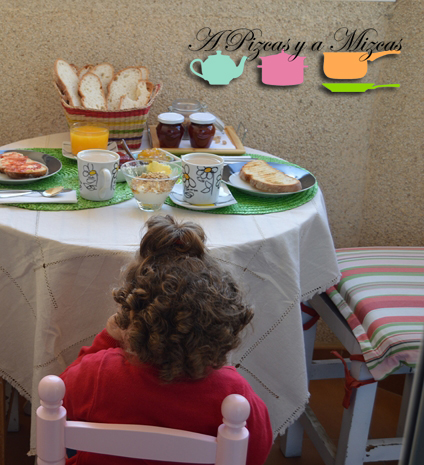

Hace ya casi cinco meses que Pizcas, Mizcas y Trizcas nos mudamos. Atrás dejamos una de las cosas que más nos gustaban de nuestra antigua casa: la terraza. Era un lugar en el que hacíamos mucha vida y los desayunos y cenas fuera eran pequeños placeres que teníamos al alcance de la mano. En estos días hemos acondicionado la pequeña terracita de nuestro nuevo hogar y la estrenamos con un completo desayuno de domingo, un placer asequible.

Los expertos afirman que un desayuno ideal es [este](http://www.elpais.com.uy/vida-actual/que-debe-tener-un-desayuno-para-ser-saludable-y-ademas-nutritivo.html "El desayuno ideal"). El desayuno, a diario, debe incluir todos los nutrientes, pero lo cierto es que es complicado, por los horarios que tenemos, dedicar más de unos pocos minutos a desayunar como es debido. Sin embargo, los domingos sí que podemos permitirnos un desayuno de domingo, todo un placer.

## El desayuno de domingo ideal debería incluir, por tanto:

- Café con leche desnatada
- Zumo de naranja recién exprimido o, en su defecto, pieza de fruta de temporada
- Yogur
- Unas buenas tostadas con aceite y sal o con mermelada de calidad
- Cereales, bien con la leche o bien con el yogur
- Si estamos espléndidos, un poco de jamón ibérico

](/wp-content/uploads/DSC_0386-pizcas.jpg)    [

Con este desayuno de domingo nos garantizamos la energía necesaria para ir todo el día detrás de Trizcas... bueno, casí toda porque peque-ser aguanta más que el conejito de Duracell.

Al margen de los alimentos, lo que realmente convierte un desayuno de domingo en un placer asequible es esto:

- Disfrutar de nuestro pequeño rincón al aire libre de un día soleado
- Haberse levantado "tarde" (esto, con Trizcas de por medio, es decir a las 8.45 horas)
- Preparar una mesa bonita, con cariño
- Estar los tres juntos, aunque eso signifique tener que tomarse demasiado rápido la tostada para ir detrás de Trizcas, a quien se le ha venido a la mente ir a coger la escoba para "barrer" el comedor
- "Arreglar el mundo" hablando de todo un poco
- Reirnos entre sorbo y sorbo de café

Éste es nuestro desayuno de domingo ideal. ¿Y el tuyo, cuál es?
