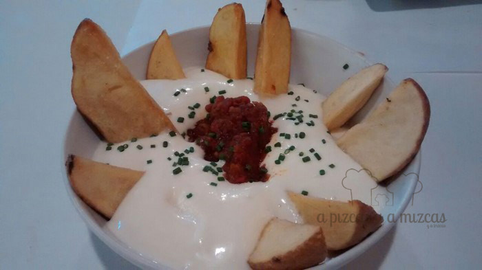
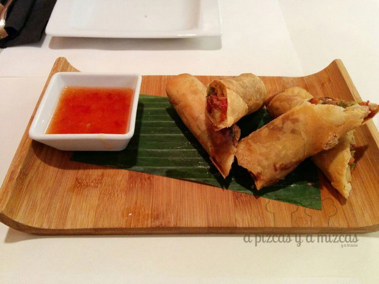
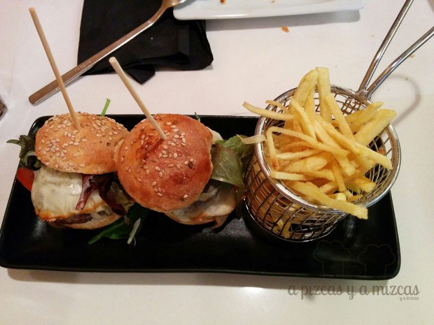
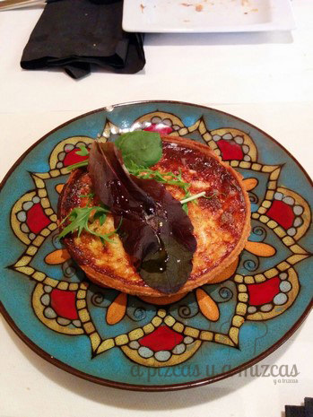

Nuestros espías no paran... y se nos acumulan todos los sitios que van descubriendo. Uno de los últimos restaurantes que han visitado es el [Rodamon de Russafa](http://elrodamon.com/ "El Rodamon de Russafa"), en pleno corazón del barrio en la calle Sueca número 47.

> El Rodamon de Russafa (barrio mestizo por antonomasia) os invita a un viaje por las múltiples gastronomías del mundo. Platos que nos han impresionado, platos que normalmente comemos, platos que quisiéramos disfrutar...

Mr. Brown y Mrs Green visitaron el Rodamon de Russafa a la hora de la comida y decidieron compartir platos. Os recomendamos que echéis un vistazo a su carta porque es muy curiosa ya que hace un recorrido por distintas partes del mundo facilmente reconocibles por su gastronomía: Tigre y Dragón (China y Japón), Allez enfants de la patrie (Francia), Pachamama (Latinoamérica), Anarchy in the U.K (Reino Unido), O sole mio (Italia), Pinches y Vaqueros (Tex mex), De Aristóteles a Avicena (cocina árabe), de la Terreta (España).

La valoración del Rodamon de Russafa

- **Comida**: ⭐⭐⭐⭐⭐
- **Local**: ⭐⭐⭐⭐⭐
- **Servicio**: ⭐⭐⭐⭐⭐

De momentos es el local mejor valorado por parte de nuestros espías.

En su visita Brown y Green dieron saltos por España, China, Estados Unidos e Italia. Nuestros espías eligieron para comer:

- Patatas bravas

Bravas de la terreta de El Rodamon de Russafa

- Rollitos de pato con salsa agridulce

Rollitos de pato con salsa agridulce

- Mini-hamburguesas de Angus

- Quiche de pera y gorgonzola

Por la diversidad de platos que ofrece es perfecto para ir con grupo de amigos con gustos dispares ya que siempre encontrarán algo que les agrade dentro de la carta.
