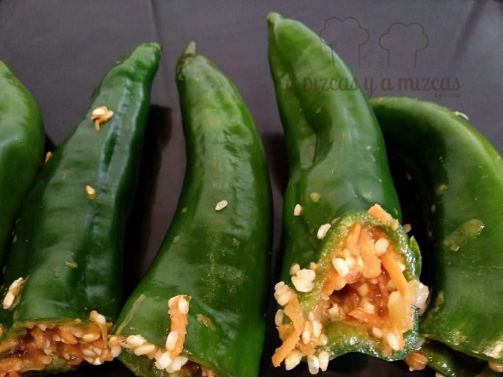
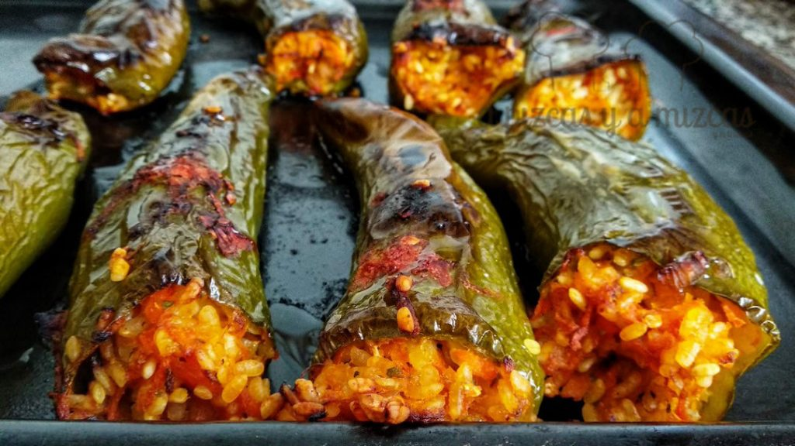
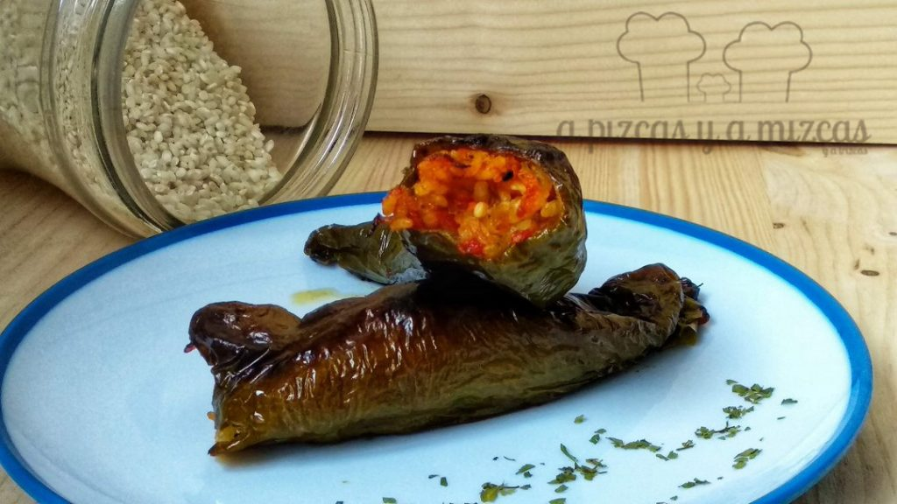
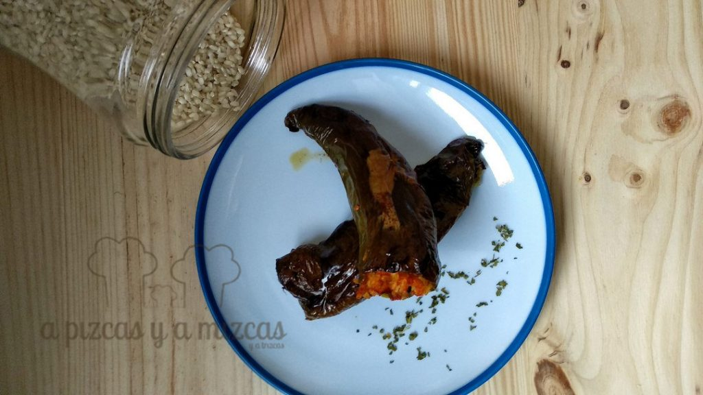

Hace un tiempo tuvimos la suerte de asistir a una masterclass en el restaurante Ma Khin Café donde nos enseñaron a elaborar algunos platos de origen mediterráneo oriental y de oriente próximo y esta semana nos hemos decidido a preparar el dolma de pimiento verde aunque hemos adaptado la receta a nuestro gusto.

Dolma significa "acción de llenarse". El dolma es un bocado popular en países del Mediterráneo Oriental aunque no se conoce su origen exacto (Grecia, Azerbaiyán, Armenia, Turquía o Irán) fue  extendido a lo largo y ancho del antiguo Imperio otomano por los turcos. Pero hoy lo hacemos un poquito nuestro, no te lo pierdas!

## Ingredientes para preparar el dolma de pimiento verde (para 5 personas)

- 4 zanahorias rayadas
- 3 tazas (de las de café) de arroz
- 4 tomates rayados
- 2 cebollas caramelizadas
- 10 pimientos italianos
- ajo en polvo
- pimienta negra molida
- perejil
- albahaca
- aceite de oliva virgen extra
- sal

En primer lugar pondremos el horno a precalentar a 200º a continuación limpiaremos los pimientos y secaremos. Cortaremos la parte de arriba de los pimientos y los vaciamos de semillas e intentamos quitar los nervios del pimiento.

En un bol ponemos el arroz, las zanahorias y los tomates y las cebollas caramelizadas (cortamos la cebolla en tiras y la pochamos en una sartén a fuego suave. Cuando esté bien, bien pochada, subimos el fuego al máximo y añadimos una cucharadita de azúcar y dejamos que se caramelice junto con los jugos propios de la cebolla). Mezclamos todos los ingredientes y añadimos ajo en polvo, perejil, albahaca, aceite de oliva virgen extra y salpimentamos. Removemos para que se mezclen todos los ingredientes.

Ahora vamos a rellenar los pimientos con la ayuda de una cuchara. Presionamos un poquito para que la mezcla entre hasta el fondo del pimiento. Colocamos los pimientos sobre una bandeja de horno (previamente habremos engrasado con un poco de aceite de oliva). Echamos un chorrito de aceite por encima del dolma de pimiento verde e introducimos en el horno unos 45 minutos a 180ºc. Una vez transcurrido ese tiempo los dejaremos con el horno apagado hasta que se atemperen.

Podeís acompañar el dolma de pimiento verde con una salsa tártara, salsa de yogur o solos.

En unos días estoy viendo vuestros dolma de pimiento verde... además hay un montón de combinaciones... Enseñadnos las vuestras!

