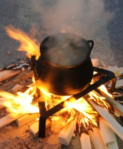

Hay veces que el árbol no nos deja ver el bosque. Esta máxima se puede aplicar a la perfección a la gastronomía valenciana, donde un plato relativamente reciente como es la paella ha acabado por fagocitar, al menos mediáticamente, a platos que están más enraizados en las entrañas del pueblo valenciano. Un caso claro de ello es el all i pebre, el guiso a base de anguilas, ajo, pimentón y patata que más identifica a El Palmar de Valencia y a las localidades limítrofes con La Albufera. Los responsables del Concurso de All i Pebre, que se celebra ininterrumpidamente en El Palmar desde el 27 de septiembre de 2010, a iniciativa de la Asociación de Hostelería, y que este año es el 1 de julio, nos han remitido la auténtica y genuina receta del all i pebre tradicional de El Palmar. Aquí os la dejamos y... no os olvidéis de aprovisionaros de pan, pues el suquet es delicioso.

## Ingredientes para el all i pebre (4 personas)

- 1kg de anguilas
- 1,5 dl de aceite de oliva virgen extra
- 50 gr pimentón dulce
- 1/2 guindilla
- 1 cabeza de ajos sal
- ½ l de agua.
- 500 gr de patatas

Para elaborar el all i pebre, primero se lavan las anguilas con agua fría y se cortan las cabezas y las puntas de las colas. Se vuelven a lavar y se secan con un paño. Una vez limpias se cortan en trozos de 6 u 8 centímetros, aproximadamente.

Por otro lado se machacan los dientes de ajo en un mortero y se ponen en una cazuela cuando el aceite esté caliente. Cuando empiecen a freírse los ajos, se añade junto con el pimentón removiendo al mismo tiempo. Se agrega también una buena cantidad de agua. Cuando hierva se añadirán las patatas cascadas.

A media cocción de las patatas se añadirán las anguilas. Después de colocar las anguilas, sólo queda la sal y la guindilla que se utilizará en mayor o menor medida dependiendo de si se quiere dar más o menos picante al guiso. Se deja que todo cueza durante 15 o 20 minutos. Se dejaremos reposar 5 minutos en el caldero y listo para degustar.

La receta del all i pebre tradicional en El Palmar no admite majado de almendras, ni pan para espesar. El pimentón que se utiliza es de 1ª calidad pero no de la Vera, porque su potente sabor ahumado desvirtúa completamente el guiso.

