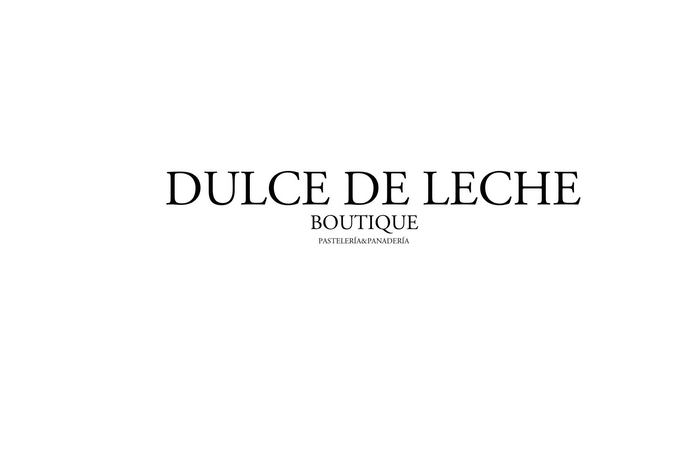
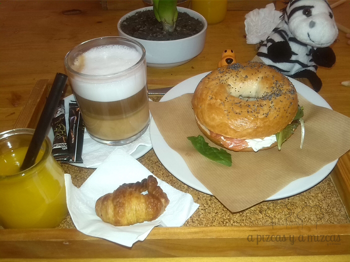
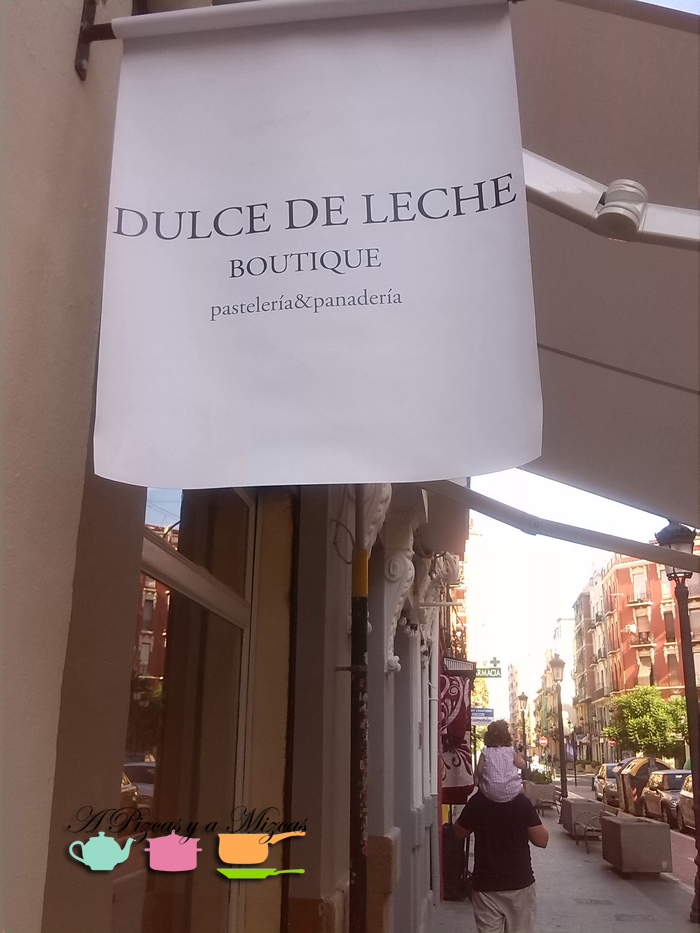
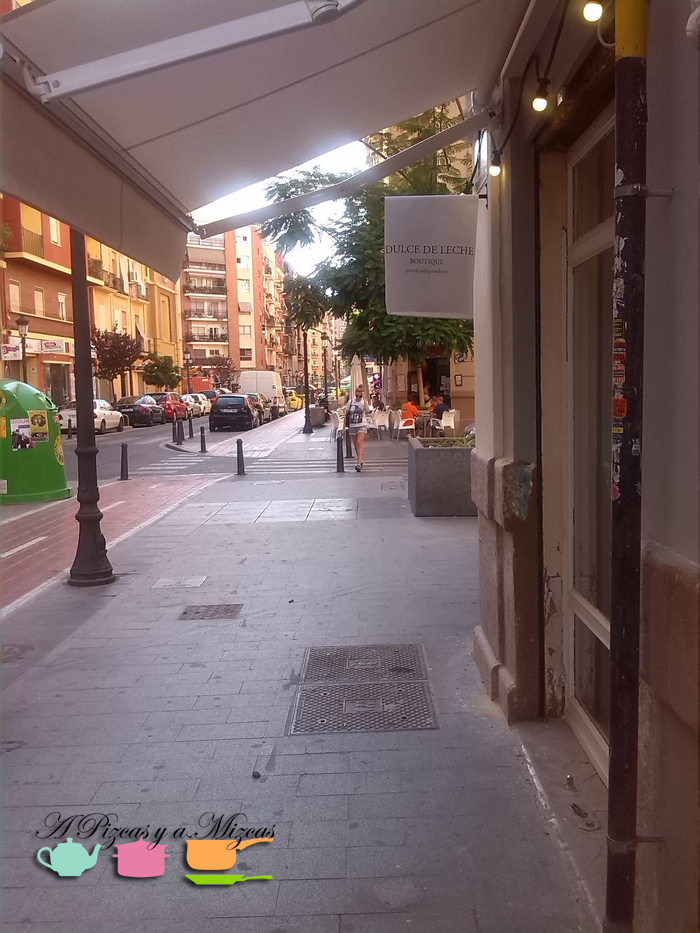
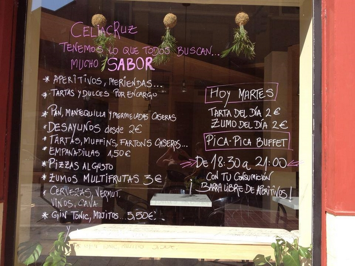
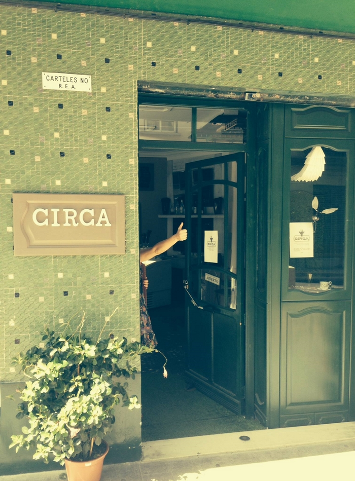

Los fines de semanas son para levantarse tarde y en vez de desayunar "brunchear". Sí tomarse un brunch eso que está tan de moda ahora y que nos encanta. Lo de levantarse tarde en nuestro caso no se da ni los fines de semana, ni entre semana. Así que damos las gracias a Trizcas por hacernos madrugar todos los días porque tenemos un montón de horas al día para aprovechar. Y eso es lo que hicimos un sábado, después del madrugón, nos fuimos a callejear por [Ruzafa](/tag/ruzafa/ "Ruzafa") a probar el brunch del [Dulce de Leche](https://www.facebook.com/DulceDeLecheRuzafa/info "Facebook Dulce de Leche Ruzafa")

## El brunch de Dulce de Leche

Nosotros estuvimos desayunando a principios de año y la verdad es que nos sorprendió que ahora había más espacio y enseguida nos dimos cuenta que habían ampliado el local. Unas instalaciones más grandes pero igual de acogedoras que anteriormente.

Nos decidimos, sin dudarlo, por el brunch que ese día estaba compuesto por:

\- Bagel de salmón, crema de Filadelphia, eneldo y brotes frescos

\- Café con leche o té verde ecológico

\- Minicroissant

\- Zumo de naranaja o yogurt con frutas frescas y muesli

Es muy difícil que los ojos no se vayan hacia el mostrador... todo tiene una pinta buenísima y dan ganas de pedir una pieza de cada y probarlo... Pudimos controlarnos, que tenemos que repetir otro día para la merienda... Mizcas echó el ojo a unos pastelitos de fresas con nata y habrá que ir a probarlos... ji ji ji ji

Después nos perdimos por las [calles de Ruzafa](/tag/ruzafa/ "Ruzafa") y ya fichamos nuevos locales para probar en un futuro como:

[CeliaCruz](http://www.celiacruz.es/ "Cafetería, pastelería Celia Cruz en Ruzafa"), en la Calle Cuba, 54. Ojeando en su [facebook](https://www.facebook.com/CeliacRuzSinGluten/info "Facebook Celia Cruz") hemos descubierto que es la primera pastelería de España en elaborar todos los productos sin gluten, y en su propio obrador.

[Circa](https://www.facebook.com/pages/Circa-Dulces-y-Helados/503639993098783?sk=photos_stream "Facebook Circa"), situado en la Calle Cuba, 30. Repostería de autor.

Sí, sí... ese día estábamos demasiado dulces... ji ji ji... Luego para rebajar un poco nos fuimos a hacer unas compras al centro. Y a la hora del aperitivo volvimos a Ruzafa y nos tomamos un vinito con amigos en [Vinos de Chile](http://www.vinosdechile.es/ "Tienda - Zona de catas Vinos de Chile") (tienda- sala de catas) un espacio muy peculiar rodeado de arte, buenos vinos y mejor compañía. Otro día os prometemos un post sobre Vinos de Chile
