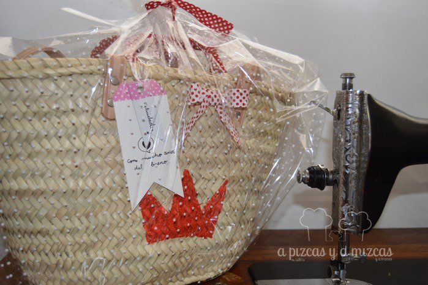

En estos días ya estamos preparando todo para las vacaciones y este año como cada verano el capazo es el bolso del verano y lo hemos customizado con nuestras manitas y a nuestro gusto para regalarlo a alguien muy especial.Compramos el capazo en una tienda del barrio, buscamos un capazo de mimbre liso de los de toda la vida que no fuera demasiado grande y que llevara asas grandes para poder colgarlo.

Buscamos una plantilla de una corona y con pintura roja y un poco de cuidado nos pusimos manos a la obra! Y pintamos la corona. Para completar nuestro capazo forramos las asas pequeñas con una cinta roja con lunares blancos y el toque final un lacito al lado de las asas blanco con lunares rojos. Dejamos que se secara bien y ya lo teníamos listo: el capazo es el bolso del verano.

un capazo para una reina

Acompañamos el regalo con unas pulseritas con la misma cinta que habíamos forrado las asas pequeñas del capazo y unas cuentas que nos encantaron de [Createsse Abalorios](http://www.createsse.es/) . Para completar el regalo hicimos un par de [camisetas](/camisetas-pizcas-para-el-verano/), una grande y otra pequeña (para la princesita de la casa), para que fueran mami y hija a juego, que ya os enseñaremos en otra entrada.

Para no olvidarnos que la vida es bella

Pulsera bonita para personas preciosas

Ya estamos pensando en preparar otro bolso porque son muy cómodos de llevar y nos caben las mil cosas que siempre llevamos encima.

Regalos hechos con mucho amor

Si os gusta lo que hacemos y queréis un capazo como este o parecido o queréis contarnos cualquier cosa podéis poneros en contacto con nosotros a través de nuestro [formulario de contacto](/contacto/ "Contacto A Pizcas y a Mizcas"). Nos gusta mucho que nos contéis cosas. A disfrutar del verano!!
