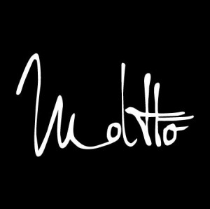
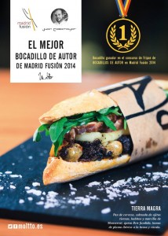

El mejor bocadillo (o bocadito??) de España se hace en Valencia, en pleno centro, en la plaza de la Reina. Al menos así lo designaron en la pasada edición de Madrid Fusión. Su responsable es Juan Casamayor, de la cafeteria? restaurante? [Moltto](http://www.moltto.es/).

## Así és el mejor bocadillo de España

Frente a otras opciones más "vanguardistas" , el bocadillo de Moltto, bautizado como Tierra Magra, es una variación de un blanc i negre amb faves. Está elaborado con un sofrito de ajos tiernos, con habas, morcila de Montserrat, queso brie gratinado y, en lugar de la longaniza, una pluma ibérica rustida, con un toque de rúcula. El soporte es un panecillo de cerveza.

Un capricho asequible, por poco más de tres euros puedes decir que has probado el mejor bocadillo de España, que es un bocadito, casi un pincho, pero que está riquísimo.

Sin duda un reconocimiento a l'esmorzar valencià.

\*Fotos tomadas de la página de Facebook de Moltto
