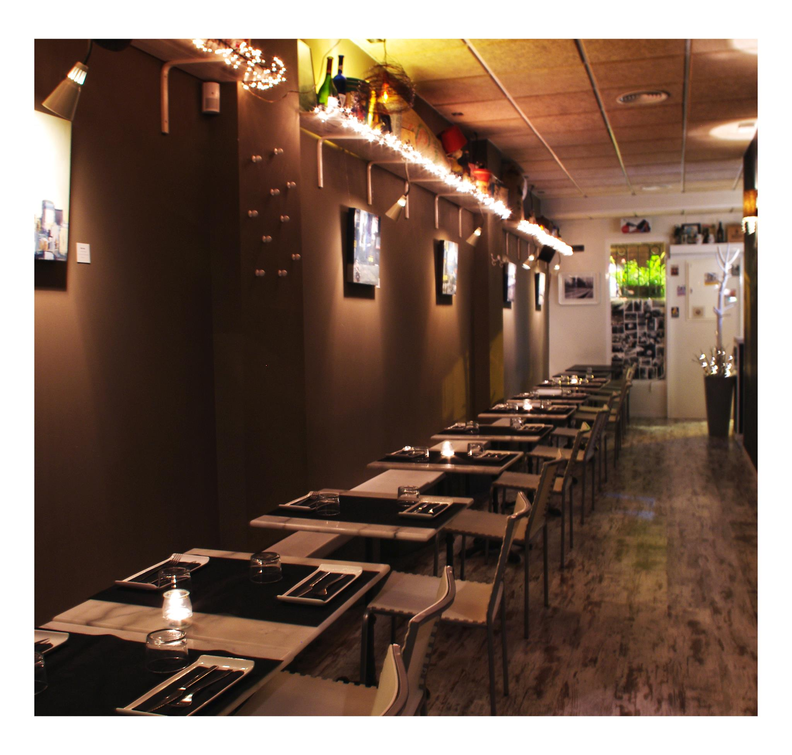
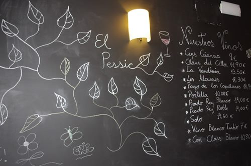
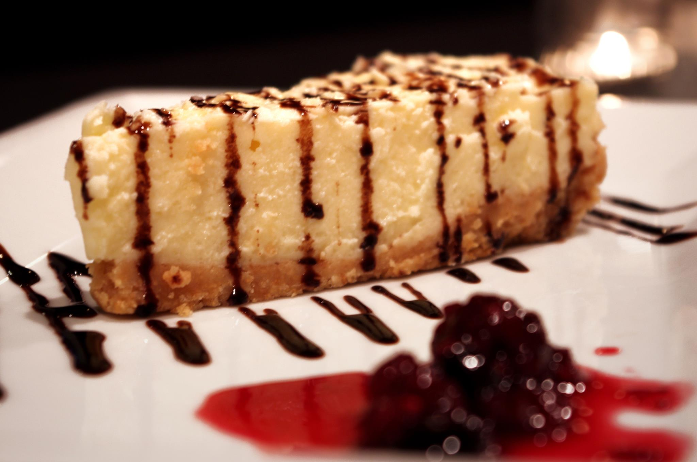
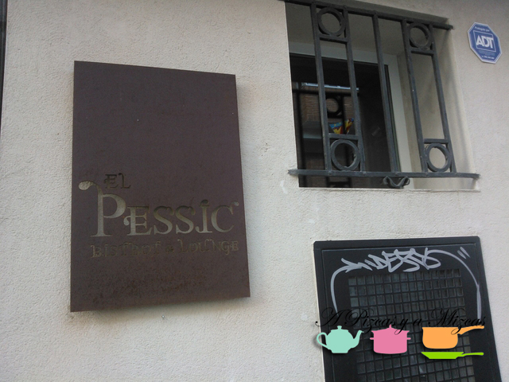

Seguimos descubriéndoos sitios con algún encanto en los que hemos disfrutado. A nuestras líneas llegan hoy las chicas de [El Pessic Restaurante Bistrot en Benimaclet](http://www.elpessic.es/ "El Pessic"). Se trata de un local ubicado en una antigua casa de pueblo de lo que hoy es el barrio de Benimaclet, en la calle Reverendo Rafael Tramoyeres, 3, muy cerquita de la parada de metro de Benimaclet. El local en sí ya tiene encanto por su ubicación, es una casa tradicional, como las de antes, alargada y con corral y todo.

## Nuestra cena en El Pessic Restaurante Bistrot en Benimaclet

Acudimos a cenar un total de cuatro personas adultas, más nuestra inseparabe Trizcas. Así que reservamos previamente por teléfono (96 332 96 59\_ 650 236 608), para avisar de que íbamos con un carro de peque-ser. Cenamos en el primer turno (21.30). Nos ubicaron en una mesa al final, casi ya en el corral (también está habilitado para cenar, incluso en invierno), con un hueco para el carro.

El equipo de El Pessic Restaurante Bistrot en Benimaclet tuvo mucha paciencia con Trizcas, que no paró de corretear de arriba a abajo mientras el local estuvo vacío (fuimos de los primeros en cenar).

En la carta ofrecen entrantes para compartir (tablas que quesos, de embutidos, patés caseros, foie) o ensaladas variadas. Como platos principales, lo más característico son las galettes, finas creppes hechas con trigo de sarraceno, típica de la bretaña francesa, rellenas de variados ingredientes; támbien fondues y pierrades de carne (piedras calentadas al horno sobre las que uno mismo asar la carne a su gusto. Como postres, su carta incluye crepes dulces y tartas caseras.

Nosotros cenamos:

Empezamos cada uno con una galette (las chicas apostaron por la ahumada y los chicos eligieron la completa y la granjera). Continuamos con una  fondue de queso casera savoyarde (con quesos emmental, gruyere y comté) acompañada  de dados de pan tostado y manzana.

Y de postre nos decidimos por las tartas caseras del día, tarta de queso y de phoskitos.

Pasamos un ratos agradable entre amigos y compartiendo la fondue en El Pessic Restaurante Bistrot. Sin duda, lo recomendamos si pasais por Benimaclet

