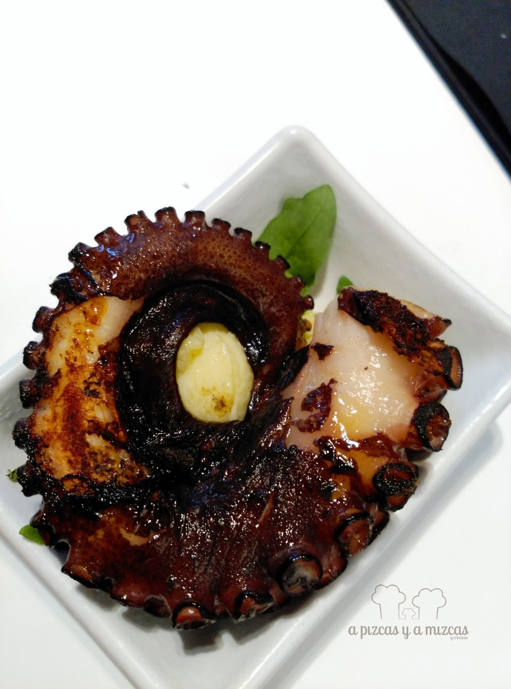

Como algunos de vosootros sabréis, este verano hemos estado disfrutando de la Costa Blanca alicantina. Lo pasamos genial y lo contaremos en otra entrada, pero también encontramos lugares maravillosos para comer. Uno de ellos es [el Pòsit, en Villajoyosa](http://www.tavernaelposit.es/) (La Vila Joiosa), gracias a la recomendación de nuestros amigos Mar Milá y Lluís Ruiz Soler, de [Gastronostrum](http://www.gastronostrum.com/). ¿Quieres conocer este gastrobar en primera línea de playa?

Una de las claves de El Pòsit en Villajoyosa es su filosofía, basada en el producto y en la cercanía, tanto de los proveedores, como en el servicio, todo ello con las vistas del mar en todo momento. Se encuentra en Avenida del Puerto, 23 de Villajoyosa (966 851 519). El local es encantador (ha sido remodelado recientmente), moderno, acogedor... nos gustó mucho. El responsable de la cocina es Antoni Mayor. Cierra los martes.

## Nuestra cena en El Pòsit

Acudimos a cenar con Trizcas (tienen un menú infantil).

- **Comida**: ⭐⭐⭐⭐⭐
- **Local**: ⭐⭐⭐⭐
- **Servicio**: ⭐⭐⭐⭐

Nosotros optamos por el menú de surtido de tapas, que incluyó:

- Coca vilera con mojama y higo

Probamos la coca vilera

- Queso callosí con anchoa ahumada y mermelada de albaricoque

Y descubrimos el queso callosí

- Salmorejo

- Coca dulce de almendra con foie y virutas de chocolate

Mmmm... esta nos encantó

- Huevo crujiente con base de berenjena

- Cous cous con cordero y verduritas a baja temperatura

- Boquerón con alioli de miel

- Taco de ternera

- Atún en escabeche con jamón (la pedimos fuera de menú)

- Pulpo a la plancha con alioli (la pedimos fuera de menú)

- Bombón de gamba roja con verduritas y ajo tostado (la pedimos fuera de menú)

Lo acompañamos todo con un vino tinto de Monastrel D.O. Alicante. Se trata de tapas y tapitas muy bien elaboradas, riquísimas, informales y de una calidad de producto insuperable. Sorprende y si tenemos en cuenta que la degustación de ocho tapas cuesta 10 euros, la barbilla se te cae al suelo. Para nosotros El Pòsit en Villajoyosa ya es un fijo.
