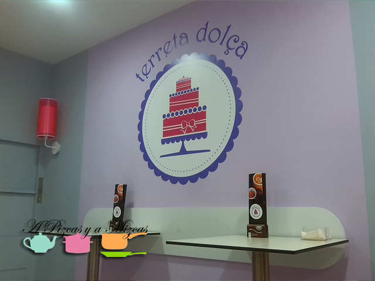
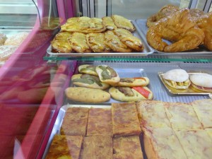
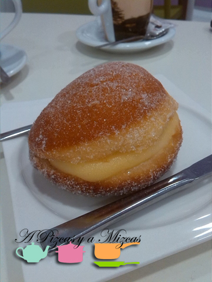
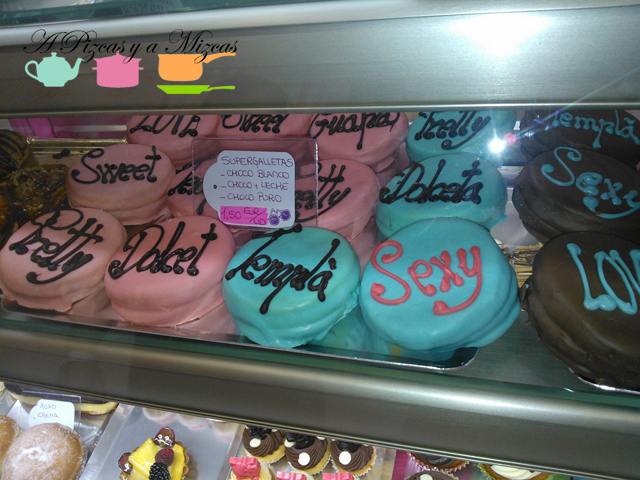
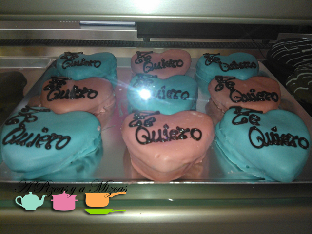
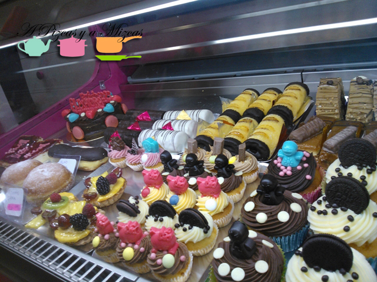

Seguimos descubriendo sitios nuevos y llenos de encanto. Y encantados quedamos cuando entramos en el reino de Terreta Dolça, en [Plaza Tetuán, 2,  Castellón de la Plana](http://bing.com/maps/default.aspx?v=2&pc=FACEBK&mid=8100&where1=Plaza+Tetu%C3%A1n%2C+2%2C+12001+Castell%C3%B3n+de+la+Plana&FORM=FBKPL0&name=Terreta+Dol%C3%A7a&mkt=es-ES)... un reino donde el dulce es el protagonista aunque también hay lugar para lo salado.

Esta es su curiosa forma de describirse... a través de éste cuento:

_"Antes incluso de la palabra escrita, en lugar hasta ahora oculto, se contaba la historia de un rey muy minucioso que gobernaba en el reino de Terreta Dolça._

_Un día llegó un forastero a la ciudad, y exigió ver a la persona más exigente del lugar. Le dijeron que debía ir al palacio a ver al rey, pero que tuviera cuidado porque éste era muy severo._

_El hombre, pastelero de profesión, le dijo al rey que su tarta era la mejor de todo el mundo y le ofreció un trozo. El rey se rió a carcajadas por la seguridad de las palabras del forastero y le propuso un trato:_ _\-Si no es la mejor tarta que he probado jamás, trabajarás para mi como esclavo.- Le dijo._

_El hombre aceptó, pero pidió algo a cambio:_ _\-Su majestad, tal es mi convicción, que aceptaré vuestra propuesta. Pero en el caso que esta tarta sea la mejor que hayáis probado jamás, exijo un lugar dónde vivir y trabajar en su reino y ser tratado como lo que soy, el mejor pastelero del mundo._

_El rey pidió una cuchara, la llenó generosamente y se la metió a la boca. El silencio se hizo en la sala. El rey se alzó, se acercó al forastero y lo rodeó con sus brazos. Lo que el forastero no le dijo al rey es que sus tartas además de ser las mejores del mundo, no eran corrientes. La mezcla de ingredientes podía estremecer el alma de todo aquél que comiera de ellas._ _\- Es el poder de la tarta.- Dijo el hombre.- No hay nada mejor que la tarta para llegar al fondo del corazón más amargo"._

A que dan ganar de probar todo lo que hacen... pues allá vamos!

## El reino de Terreta Dolça

Habíamos quedado con unos amigos en Castellón y paseando nos llamó la atención Terreta Dolça, una pastelería muy especial. Aprovechando que estábamos en la capital de la Plana no podíamos irnos sin probar una [pilota de frare](http://www.turismodecastellon.com/110027_es/Pilotes-de-Frare/ "Pilota de frare, receta"). Un dulce típico que nos trae muy buenos recuerdos de cuando vivíamos allí.

Aunque se nos iban los ojos a todas las cosas buenas que tenían en su mostrador. No nos enrollamos más y os mostramos todo lo que vimos.

Mirad que buena pinta tienen las tortas saladas. Esta foto la hemos cogida prestada del [facebook de Terreta Dolça](https://www.facebook.com/pages/Terreta-Dol%C3%A7a/447750435260070 "Terreta Dolça")

Y ésta fue nuestra merienda...  la famosa pilota de frare...mmmm... Pizcas la acompañó con un café con leche y Mizcas con un té verde.

Y las galletas con mensaje nos encantaron... dolçet, dolçeta, templà, guapa... Ideales para un regalo especial!

Y con tanta cosa buena... uno no sabe que escoger... ufff

Terreta Dolça se ha convertido en visita obligada cuando estemos por Castellón!
