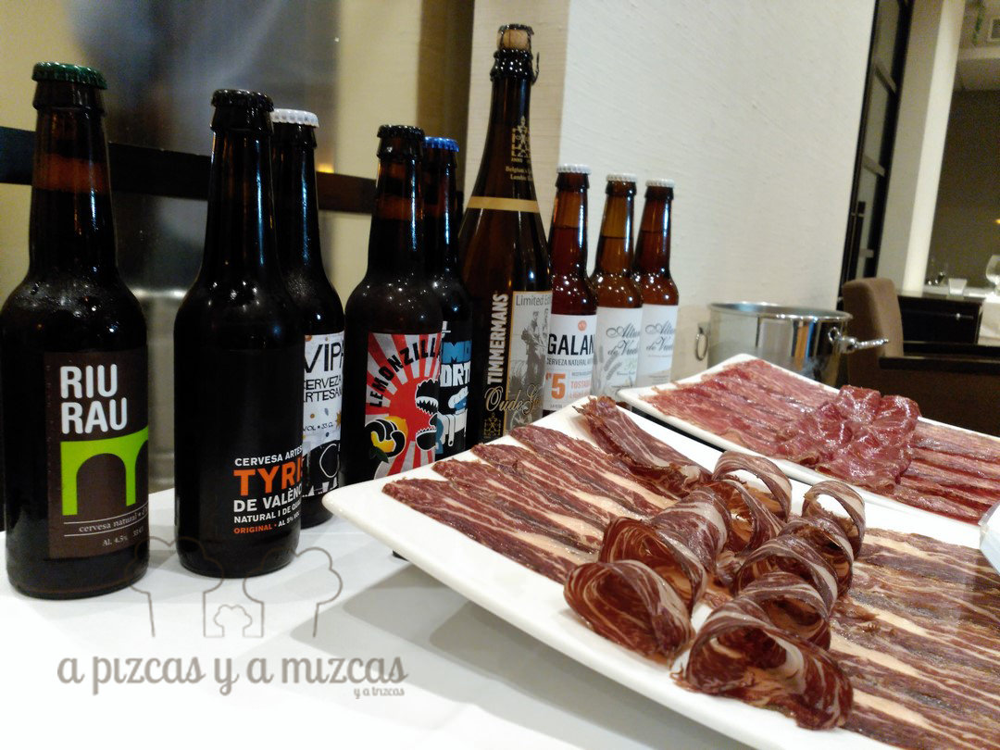
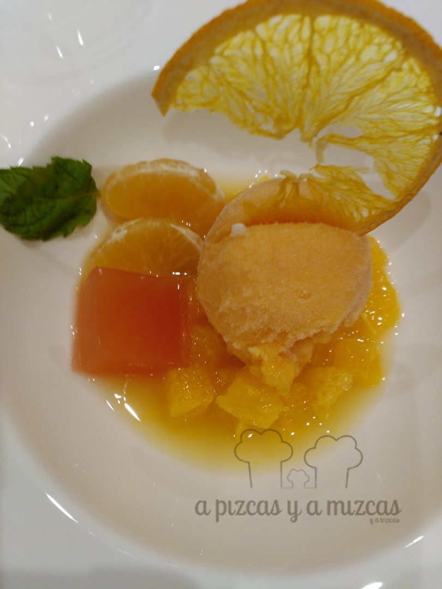

El pasado 6 de octubre, el restaurante del Hotel SH Valencia Palace, volvió a ser el escenario de una nueva reunión del Symposio. Un gastroforo organizado por el hotel [SH Valencia Palace](http://www.hotel-valencia-palace.com/es/index.html) y convocado por el periodista Chema Ferrer, de [Las Provincias](http://www.lasprovincias.es/), en el que tenemos la gran fortuna de participar. Las cervezas artesanas valencianas y sus productores fueron los protagonistas y salimos de allí con una idea clara, estas cervezas y su consumo van mucho más allá del mero entretenimiento, acto social o refresco. Son un producto elaborado, mimado, artesano y que ofrece muchos matices.

La mecánica del Symposio fue la que ya está consolidada. De un lado una representación de productores, que este caso fueron Gonzalo Abia, de [Cervezas Tyris](http://www.cervezatyris.com/); Vicente Solaz y Esperanza Varea, de [Cervezas Galana](http://www.cervezagalana.com/index2.html); Jacobo Fernández, de [Cervezas Fernández Pons](http://www.fernandezpons.es/); y Christian Jardel, director general de [Bierwinkel](http://bierwinkel.es/). Del otro, la prensa y blogueros, que en esta ocasión fuimos Jaime López, del blog [Cocina para Indignados](http://www.cocinaparaindignados.com/); Chema Ferrer, de Las Provincias (entre otros muchos medios más) y Vicent Escamilla, en representación de [La Semana Vitivinícola](http://www.sevi.net), cómo no, de A Pizcas y a Mizcas. Además, contamos con José Rosell, director general de la firma cárnica [Vacum](http://vacum.es/) (luego hablaremos de ella). Todo ello bajo la presidencia de los responsables del Hotel SH Valencia Palace.

## El Symposio. Cervezas valencianas artesanas

Las microcerveceras, responsables de las cervezas artesanas, están en auge, están organizadas y en una fase expansiva. Cuentan con una asociación, en trámites de constituirse legalmente, en la que hay una veintena de firmas de las tres provincias (Castellón, Valencia y Alicante); la mayoría de los productores reunidos en el symposio acababan de ampliar sus instalaciones y su capacidad de producción o tenían proyectos para hacerlo; exportan a varios países... Este sector tiene futuro.

Como en todo, la diferencia entre una cerveza industrial y otra artesanal está en el mimo, el tiempo, la dedicación y la pasión que se le pone al producto. Malta, lúpulo, levadura y agua, son los ingredientes básicos y en su selección está la "gracia" que le da una chispa diferente a cada cerveza (y las diferencias son muchas y notables).

Para los que no conozcáis el proceso de elaboración de la cerveza, os lo resumimos muy brevemente (prometo no reproducir la fábula del pollito que nos contó Jacobo Fernández, jeje). En primer lugar, se selecciona la cebada y el trigo (si procede), se remojan los granos, para que germinen hasta el punto deseado por el maestro cervecero, y se tuestan (este proceso se conoce como el malteado), el resultado se tuesta y se macera en agua, luego se cuece con el/los lúpulos seleccionados, se fermenta (según la temperatura de fermentación el resutado será uno u otro), la cerveza madura en depósitos, se embarrila y se embotella.

Cervezas valencianas

Las cervezas que probamos en El Symposio fueron:

- **Altura de Vuelo**, de Cervezas Fernández Pons, en sus versiones convencional y bio. Fresca, sabrosa, y con unos aromas muy cítricos y ricos tostados.
- **Galana Nº5**, Cerveza Natura Artesana Galana. Una de la que más nos gustó. De color más oscuro que la anterior. Nariz intensa y ligeramente balsámica. Llena la boca, cremosa, con largo recorrrido.
- Gonzalo, de Tyris trajo una amplia representación de sus referencias (una locura de catálogo), nosotros probamos: **Tyris:** De un dorado oscuro agradable, en nariz es cítrica, frutal, pero con un carácter maduro, muy refrescante gracias a un final amargo. **Vipa:** Nos encantó esta IPA (India Pale Ale), intensa, seca, contundente, pero muy agradable. De color ambar, intenso. La nariz presenta muchos matices, donde el amargor del lúpulo es claramente identificable, junto con un perfil cítrico y ligeramente floral. Muy rica. **Smoky Porter:** Una cerveza negra muy interesante, para tomar en calma y disfrutarla. En nariz enseguida sale el café tostado, balsámicos como el regaliz dulce, y un paso por boca amplio y cremoso. **Lemonzilla!**: fermentada con limones enteros, una cerveza que no te deja indiferente, o te "encisa" o la odias. También trajo otras referencias como **Au Yeah!** y **Riu Rau.**
- **Timmermans Oude Gueuze Limited Edition**, que trajo Christian, de Bierwinkel. Una cerveza tipo lambic (por fermentación espontánea). Una delicia belga que nos descolocó. Solo un dato, en su etiqueta indica que su fecha de consumo preferente es 2030!!! De color amarillo subido, en nariz es una mezcla entre un vino blanco muy ácido y una sidra artesanal (del estilo vasco). Cítrica y ahumada, profunda, compleja... Luego en boca es muy refrescante, con una acidez intensa, pero frutal y refrescante. Un ligero amargo al final la hace muy larga. Una joya.

Todo ello se maridó con un menú elaborado por Alejandro del Toro (al que en esta ocasión no pudimos abrazar, pues no pudo estar presente) y que constó de: cucuruchos de tartar de salmón y de crema de parmesano, coca con escalivada y sardina ahumada, fiambres Ibérico Beef Vacum (una cecina de ternera con alta infiltración de grasa, de vacas de más de ocho años, con dos años de curación y un ahumado con roble; y un lomo de vaca curado, minihamburguesa de ternera, steaktartare y entrecot de vaca vieja de raza Casina. De postre, sorbete cítrico con cerveza Altura de Vuelo.

Os recomendamos que sigáis de cerca a la firma Vacum (empresa de capital valenciano), que apuesta por la selección y comercialización de las mejores carnes españolas. Una delicia.

La sobremesa se alargó, debatiendo sobre la necesidad de contar con una marca paraguas para las cervezas artesanales valencianas, con servicios de distribución conjuntos y sobre la existencia o no de la cultura cervecera valenciana y española... Descubrimos algunos entresijos del sector y aprendimos muchísimo.

Si ves una cerveza artesana valenciana, pruébala, disfrutarás de una cosa muy seria.
