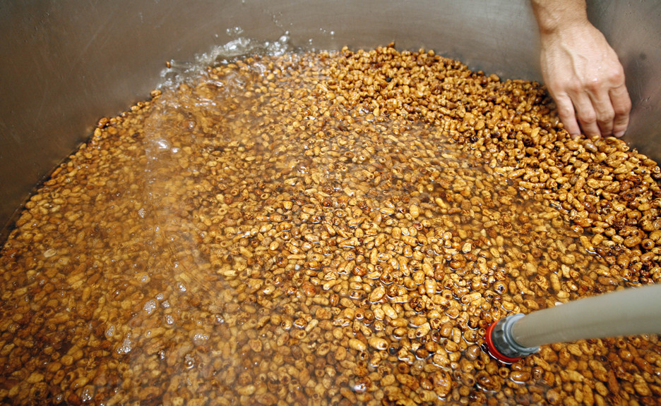
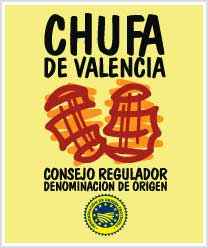
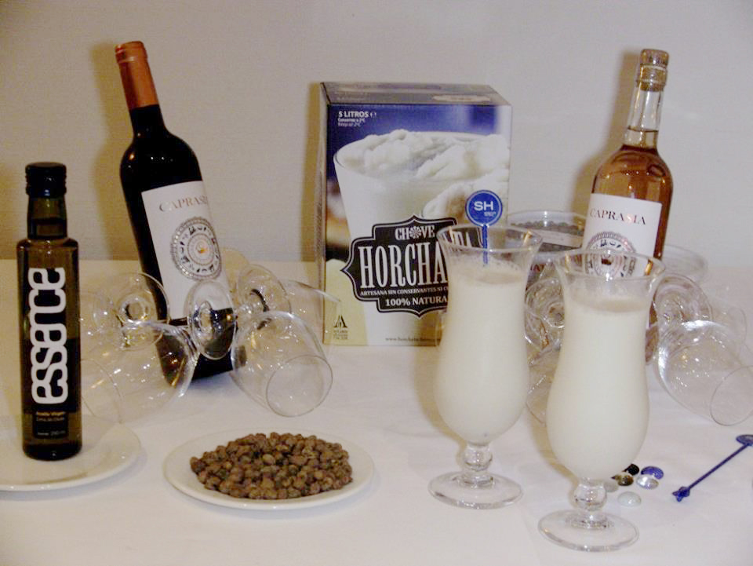
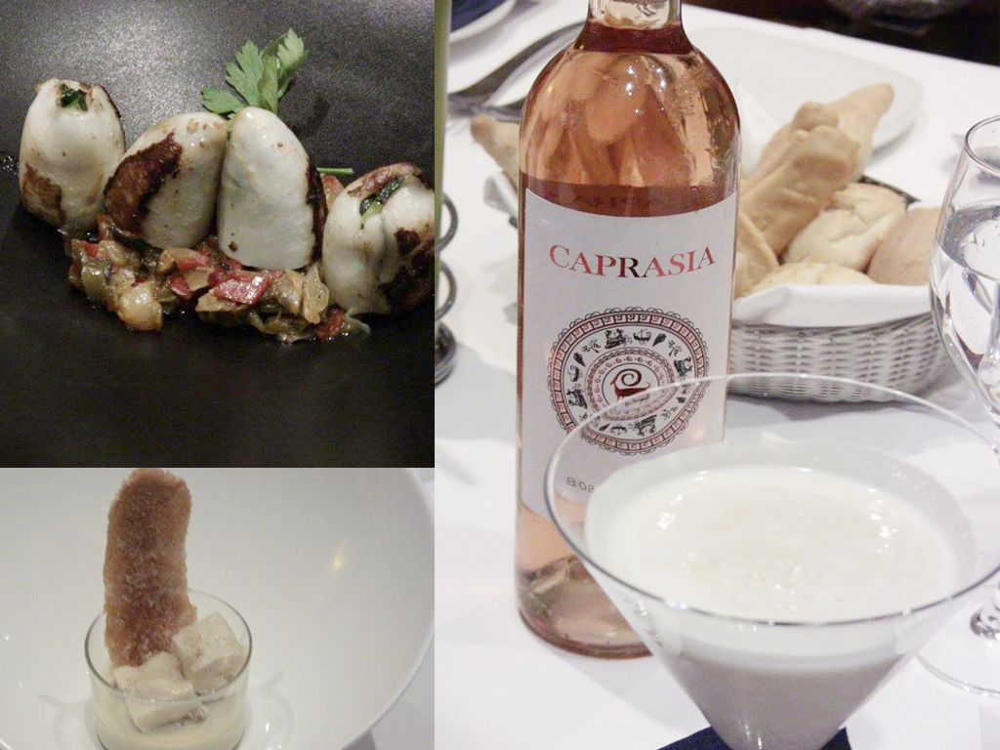

Cuando se une en un acto generosidad, información, formación y bonhomía el resultado solo puede ser uno: el éxito. El pasado 6 de julio vivimos uno de esos momentos en que pudimos aprender y disfrutar de la gastronomía, que es lo que más nos gusta. Estamos hablando de la tercera entrega de El Symposio, el gastroforo organizado por el hotel [SH Valencia Palace](http://www.hotel-valencia-palace.com/es/index.html) y convocado por el periodista Chema Ferrer, de [Las Provincias](http://www.lasprovincias.es/). En esta ocasión la protagonista de El Symposio fue la chufa y más en concreto la [D.O. Chufa de Valencia](http://www.chufadevalencia.org/), bajo el título “Horchata y chufa, nuevos retos”.

El formato del gastroforo parece que se ha consolidado. De un lado los productores y del otro la prensa especializada y comunicadores gastronómicos, junto con el chef [Alejandro del Toro](http://restaurantealejandrodeltoro.com/), asesor gastronómico de SH, y responsable del menú elaborado a base de chufa que luego describiremos. En El Symposio del pasado 6 de julio participaron Francisco de Borja Espinosa, agricultor y presidente de la D.O. Chufa de Valencia; Cristóbal Martí, de [Horchatas Chove](http://www.horchatachove.com/index.html) y [Horchatería Subies](http://www.subies.com/); el agricultor y vocal de la D.O. Antonio José Gimeno (productor de chufa ecológica) y José Ramón Panach, de [Horchatas Panach](http://www.horchatapanach.com/), por el lado productor. Como comunicadores nos sentamos [Jaime López (Cocina para indignados)](http://www.cocinaparaindignados.com/), [Vicky Ortiz (Sucreart)](http://sucreart.lasprovincias.es/), Nieves Argente, Chema Ferrer y Pizcas. El encuentro lo presidió Francisco Corredor, director del hotel y el chef Alejandro del Toro.

¿Cuáles son esos nuevos retos a los que se enfrenta la chufa? Pues, según quedó patente, el básico sigue siendo la rentabilidad del cultivo (el precio de la chufa no ha variado en los últimos 20 años).

Antes de poner sobre la mesa algunos de los caminos que deberían llevar a esa rentabilidad, demos algunas cifras: actualmente, la superficie plantada de chufa con D.O. es de 500 ha, concentrada en básicamente cuatro municipios de l’Horta Nord (el reglamento de la D.O. reconoce hasta 28 municipios). Se trata de un cultivo rotatorio, pues consume muchos nutrientes del suelo y es necesario alternarlo con otros productos. Anualmente se elaboran unos 7 millones de chufa en tierno, que tras el proceso de secado quedan en unos 4 millones. El principal uso de la chufa es su elaboración como horchata (12 millones de litros de horchata natural artesana y 60 millones de litros de horchata ‘industrial’).

Ahora sí, ¿qué caminos puede seguir la chufa para ganar en rentabilidad? En el Symposio se expuso la necesidad de un mayor compromiso de las autoridades públicas, no sólo en forma de subvención, sino con apoyo a la investigación sobre el producto. Otra vía muy interesante es el cultivo ecológico (la chufa ecológica llega a doblar el precio de la convencional) y, fundamentalmente la exportación.

Para su comercio exterior lo ideal es exportar la chufa en seco y para ello es necesario contar con plantas elaboradoras y/o envasadoras en destino.

La chufa se reveló como un producto con gran futuro. Al ser un tubérculo no presenta alérgenos propios de los frutos secos y por tanto, la horchata puede llegar a ser una solución para los alérgicos y también a intolerantes a la lactosa. Los productores también reclamaron un cambio en la reglamentación para, por ejemplo, poder elaborar horchata sin azúcar.

Lo cierto es que la chufa, un cultivo con más de 12 siglos de arraigo en Valencia: está íntimamente ligada a la horchata, pero en el Symposio se demostró que de este producto se pueden obtener productos derivados sorprendentes, como harinas, aceites o jabones.

Ahora, la D.O. tiene por delante el trabajo de dar a conocer el valor añadido que el sello de calidad y origen D.O. Chufa de Valencia ofrece al consumidor, al tiempo de desestacionalizar el consumo de horchata (muy vinculado a la merienda) y acercarlo a la alta gastronomía.

A nosotros nos queda claro que si vemos el logo de la D.O. Chufa de Valencia estamos ante un producto de calidad garantizada.

D.O. Chufa de Valencia

**El menú basado en chufa valenciana**

Ahora llega el turno a la magia, que puso Alejandro del Toro en forma de platos. Abrió con un fantástico Ajoblanco de horchata y almendra rallada, sutil, fresco y con una gran capacidad de transportarnos a la esencia del producto. A continuación unos espléndidos calamares rellenos de tallarines de calabacín con un suave allioli elaborado con aceite de chufa. Luego presentó un secreto ibérico a baja temperatura y a la plancha sobre salsa cremosa de horchata y un espectacular flan de horchata con gelé de horchata y crujiente de fartón.

Durante toda la cena se sirvieron los vinos de Vegalfaro de la gama Caprasia. Un tinto y un rosado. El tinto está elaborado con uva Bobal y su característica más destacada es que parte de su crianza se elabora en ánforas de barro. Esta crianza mixta (roble y barro) hace que el vino sea fresco y algo desconcertante. Muy agradable. Por su parte, el elegante rosado (Bobal y Merlot) aúna la frescura y acidez más propia del vino blanco, con aromas cercanos a un tinto. También aquí el vino pasa por barrica de roble de tostado ligero y usada previamente por vinos blancos.

Acabamos, cómo no podía ser de otra forma, con un buen vaso de horchata, cortesía de Chove, en formato Bag in box, muy cómodo.

**Tipos de horchata**

En el gastroforo nos explicaron que horchata hay más de una:

La horchata ‘industrial’: dentro de ellas encontramos la horchata pasteurizada (**con la misma** composición y características organolépticas y fisicoquímicas que las de la horchata natural), la horchata esterilizada y la horchata ultrapasteurizada (UHT).

La horchata natural: Horchata de Chufa de Valencia natural se preparará con la proporción adecuada de chufa, agua y azúcar. Tanto el almidón como las grasas procederán exclusivamente de los tubérculos utilizados en la preparación de la horchata. Y a vosotros, ¿cómo os gusta más líquida, granizada o mixta?

PS: Mizcas dice que me ha quedado una entrada muy seria, pero es que le tengo mucho respeto a la chufa y a su gente ;)
