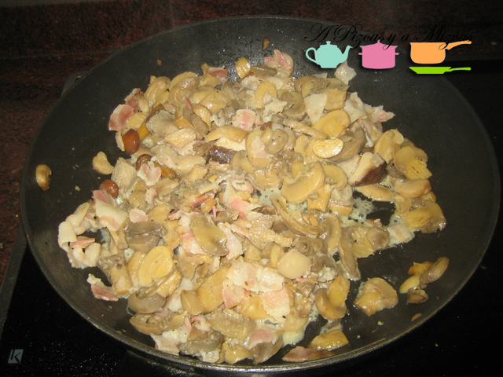
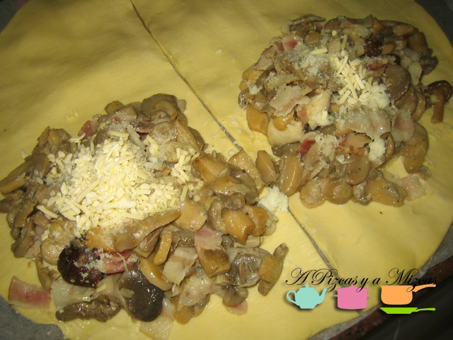
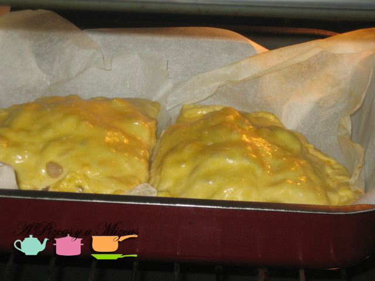
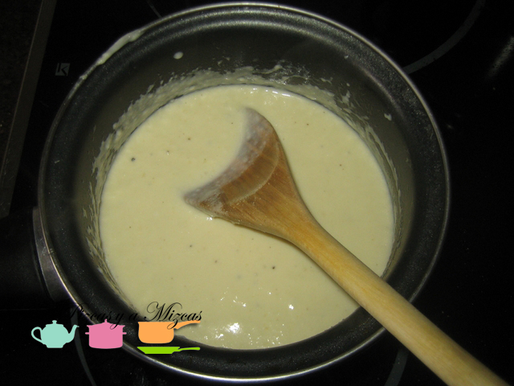
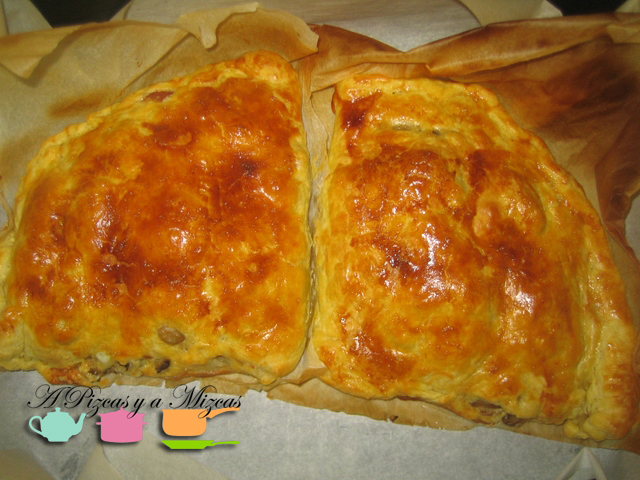
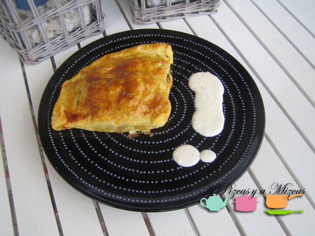
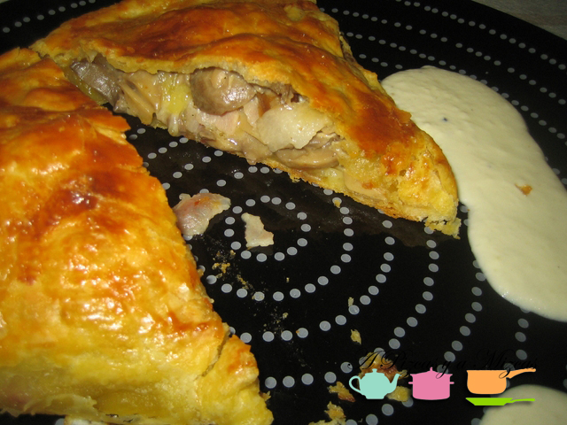

Hay recetas que son fruto de la necesidad. Esta empanada de setas y bacon es una de ellas. Teníamos el domingo planificado, nos íbamos a casa de unos amigos, Pizcas, Mizcas y Trizcas, cuando de buena mañana nos llamaron para decir que un virus estomacal se nos había adelantado y que era más recomendable no acercarnos. Nos quedamos compuestos y sin plan y además no teníamos nada preparado, en domingo! Echamos mano de Internet y descubrimos el blog de [Efrén](http://www.thechefather.net "El blog de Efrén, Masterchef"), de [Masterchef](http://www.rtve.es/television/masterchef "Masterchef") y vimos una receta que podíamos adaptar con lo que teníamos en casa. Os dejamos nuestra interpretación libre de esta empanada de setas y bacon que servimos con salsa de grana padano.

## Ingredientes para la empanada de setas y bacon (cuatro raciones)

- Una lámina refrigerada de pasta brisa
- Dos latas de champiñones laminados (400 gramos en total)
- Setas congeladas (unos 100 gramos)
- Cuatro lonchas de bacon
- Cuatro cucharadas soperas de queso grana padano rallado
- Dos cucharadas de queso emmental rallado
- Un brick de 200 ml de nata para cocinar
- Sal y pimienta
- Un huevo

Para preparar la empanada de setas y bacon, comenzamos con el relleno. En una sartén colocamos dos cucharadas de aceite de oliva virgen extra y rehogamos las setas congeladas y los champiñones laminados. Es importante que no generen mucho caldo durante su cocción, si veis que se genera, retiradlo con ayuda de un colador. Tras unos siete minutos a fuego medio, añadimos el bacon picado y lo cocinamos unos tres minutos más. Pasado este tiempo, incorporamos una cucharada sopera de nata para cocinar y dejamos que reduzca el conjunto de nuestro relleno para la empanada de setas y bacon. Probamos de sal, salamos si es necesario y molemos un poco de pimienta.

Mientras, precalentamos el horno a 210 grados por arriba y por abajo y ponemos a temperatura ambiente durante 10 minutos. Así damos tiempo a que el relleno se atempere. Una vez transcurrido este tiempo, extendemos la masa. En nuestro caso era redonda, por lo que la cortamos por la mitad y preparamos dos empanadas triangulares. Colocamos el relleno de nuestra empanada de setas y bacon en un extremo de la masa, teniendo la precaución de dejar un borde sin relleno para poder cerrarla. Espolvoreamos en cada una de las empanadas una cucharada de queso grana padano rallado y otra de queso emmental rallado. Cerramos la masa y con ayuda de un tenedor la sellamos bien.

Batimos un huevo y pincelamos la empanada de setas y bacon. Reservamos el huevo que sobre. 

Llevamos al horno y mantenemos durante unos 20 minutos.

Mientras, vamos a preparar la salsa de grana padano. En A Pizcas y a Mizcas no tiramos nada, así la salsa la elaboramos con la nata sobrante. En un cazo vertemos la nata y lo calentamos a fuego medio. Cuando tenga temperatura, añadimos el huevo batido sobrante de antes, y removemos. Incorporamos a la salsa dos cucharadas soperas de grana padano, una pizca de sal y pimienta molida. Removemos hasta que coja el cuerpo que deseemos.

Sacamos la empanada de setas y bacon y la dejamos reposar sobre una rejilla durante unos cinco minutos. Servimos con la salsa al lado. Quedó muy rico, crujiente y el acompañamiento de la salsa le va muy bien.

