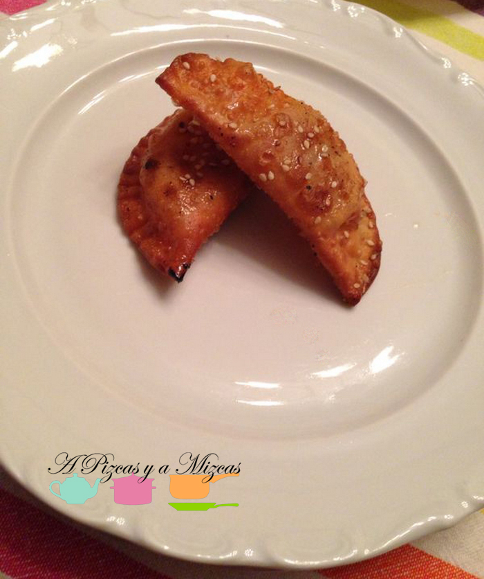
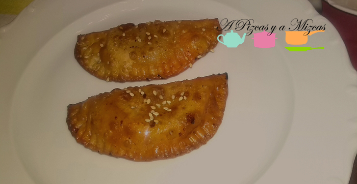

Las empanadillas son el ejemplo perfecto de diseño funcional. Su exterior crujiente nos permite comerlas con las manos y en dos bocaditos nos las ventilamos. Hace poco aprovechamos un rato que teníamos libre para probar una receta de empanadilla diferente y que llevámamos en la cabeza desde hace algún tiempo, unas ricas empanadillas de sobrasada, manzana y miel, luego las aderezamos con un poquito de semillas de sésamo. Son muy entretenidas y divertidas de hacer y si queréis prácticar la cocina con niños os pueden ayudar en varias fases de esta receta. Animaos a probar las empanadillas de sobrasada de a Pizcas y a Mizcas.

## Ingredientes para las empanadillas de sobrasada, manzana y miel:

- Obleas para empanadillas
- Crema de sobrasada (una cucharadita por empanadilla)
- Miel
- Manzana (un par de daditos por empanadilla)
- Sésamo

La elaboración de las empanadillas de sobrasada es muy sencilla. Es importante que tengamos a temperatura ambiente tanto la crema de sobrasada, como las obleas. Además, es conveniente tener más o menos dispuestos los ingredientes para que cuando empecemos a montar las empanadillas de sobrasada "en serie" sea todo más fácil y mecánico. Así pues, disponemos las obleas, la sobrasada, la miel (si es con dosificador o en envase antigoteo, mejor), la manzana pelada y cortada en dados por ese orden.

Vamos con la cadena de montaje: Tomamos una oblea, la colocamos sobre un plato llano con su papel separador y todo, añadimos en una de las mitades una cucharada de crema de sobrasada, luego echamos una pequeña cantidad de miel (como media cucharadita), agregamos la manzana. Ahora, doblamos la masa en forma de media luna, con la ayuda del pape separador, presionamos en los extremos y con un tenedor vamos apretando y sellando cada empanadilla de sobrasada.

Cuando las tengamos todas tenemos dos opciones, freírlas o hacerlas al horno. Nosotros probamos las dos y hubo división de opiniones. Así que vosotros mismos. Si optáis por freirlas no tenéis más que hacerlo en aceite bien caliente un minuto por cada lado o hasta que veáis que ya están doradas. Las retiráis sobre papel de cocina para eliminar el exceso de aceite. Luego, cuando las tengáis todas listas, echáis un choro de miel sobre las empanadillas de sobrasada y espolvoreáis el sésamo. Si preferís hacerlas al horno, tenéis que colocarlas sobre una bandeja y pincelarlas con huevo batido, las lleváis al horno precalentado a 180 grados, hasta que veáis que ya están doradas (seguid el tiempo aproximado que marca el envase de las obleas), luego procedéis igual que antes, miel y sésamo.

Podéis tomar las empanadillas de sobrasada, manzana y miel calientes o frías- Un aperitivo que no deja indiferente.

