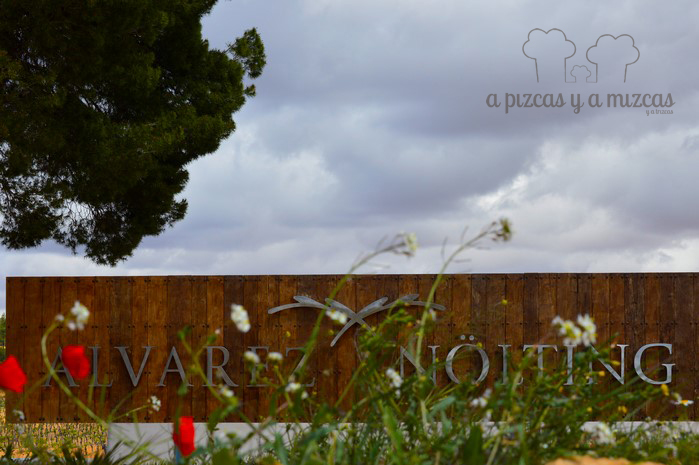
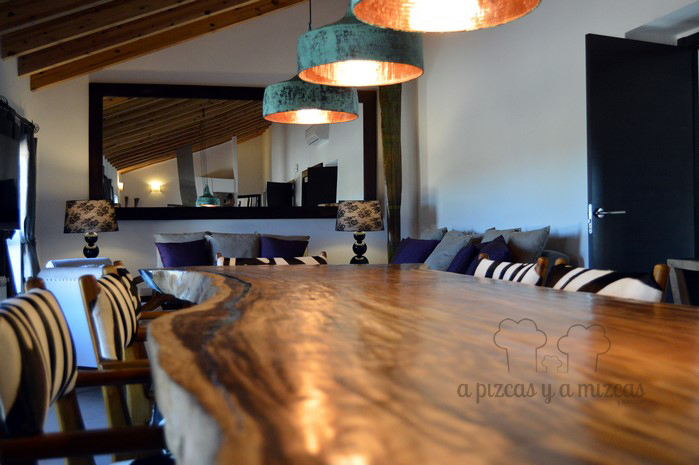
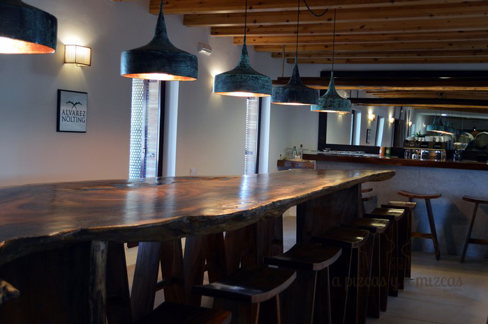
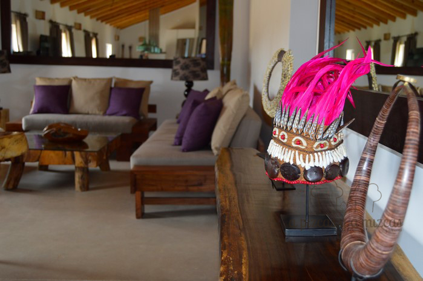
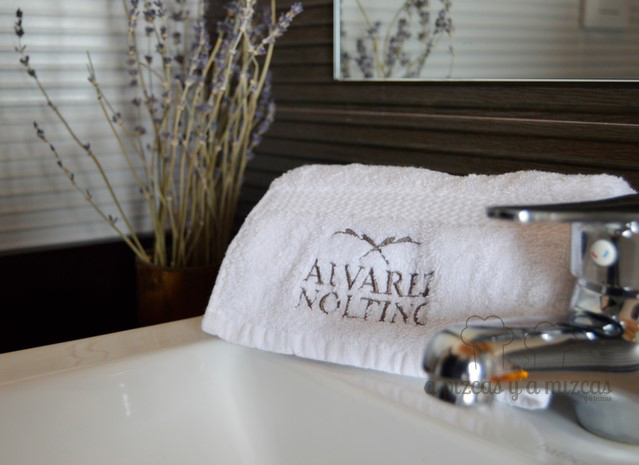
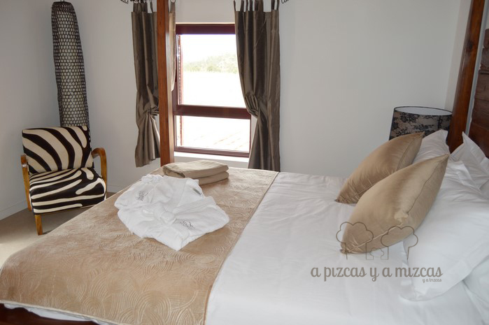
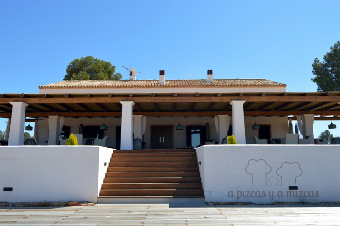
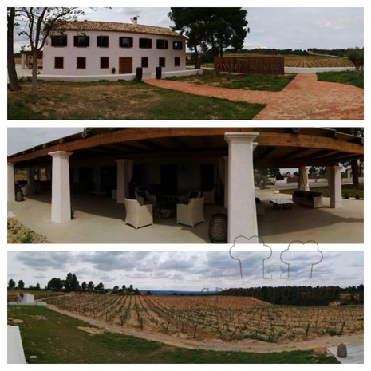
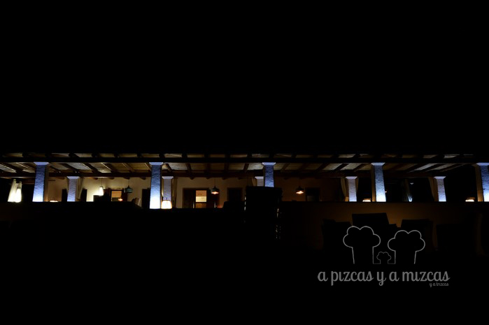
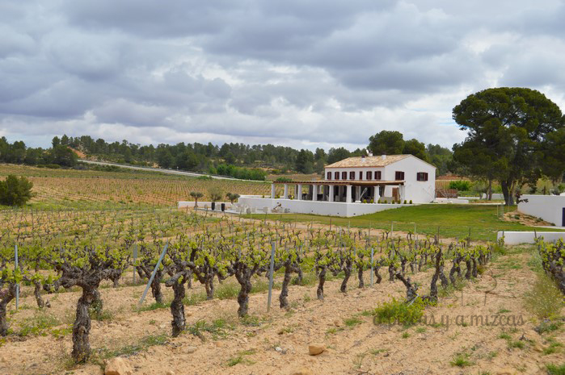

Junto a la carretera N-322 (en el kilómetro 431) encontramos las nuevas instalaciones de Bodegas Alvarez Nolting, en la pedanía de Los Isidros, de Requena. Un pequeño paraíso para el enoturismo, en pleno Parque Natural de las Hoces del Cabriel. Allí pasamos un fin de semana delicioso, disfrutando de la gastronomía de la zona, de unas vistas maravillosas y de unos grandes vinos. ¿Nos acompañas?

Una antigua casa de aperos agrícola ha sido totalmente acondicionada y transformada en un coqueto alojamiento rural. Llegar hasta aquí es muy cómodo y sencillo. Desde Valencia tan solo hay que seguir la autovía de Madrid A-3 hasta la salida 291 (Requena). Ahí seguimos las indicaciones de la N-322 hacia Albacete. Esta carretera es preciosa, rodeada de viñedos y salpicada de innumerables bodegas. Solo recorrerla ya vale la pena. Tras una curva en el kilómetro 431 aparece la finca de Bodegas Alvarez Nolting.

La entrada de Bodegas Alvarez Nolting

Nos recibió Silvia, la responsable de enoturismo de Bodegas Alvarez Nolting, que fue una anfitriona perfecta. Se desvivió por que estuvieramos a gusto... y lo consiguió desde el primer minuto.

Nada más entrar por la puerta llama la atención la cuidada decoración de la vivienda. Para ello, el equipo de Bodegas Alvarez Nolting ha contado con el asesoramiento de una firma de decoración con experiencia en hoteles de Ibiza y para esta pequeña joya del enoturismo en la D.O. Utiel-Requena han apostado por el ambiente balinés.

El salón comedor

Zona de bar

Impresionan las mesas de madera con incrustaciones de vidrio, las lámparas de bronce, los abalorios, los retablos... Muy cuidado y, además, consigue la cuadratura del círculo al conseguir que todos tuviéramos la sensación de estar como en casa.

La decoración nos enamoró

Detalles que marcan la diferencia

Habitaciones impresionantemente cómodas y bonitas

La vivienda tiene una capacidad para seis personas, con tres habitaciones dobles (dos de ellas con cama doble y otra con dos camas individuales). Nosotros fuimos con Trizcas y con otra pareja y su peque. Solo podemos decir que estuvimos de maravilla.

Nos enamoraron las dos terrazas chill out de la parte trasera de la vivienda. Con cómodos asientos, tumbonas y sillones con vistas a las cuidadísimas hileras de vides, que ondulan por las colinas y que son el marco por donde se pone el sol. Así que, no os perdáis esta puesta de sol. Si además lo haces con una copa de buen vino y en buena compañía estás cerca, cerquita, del paraíso.

La terraza es lo más

Y las vistas impresionantes

Mucho encanto por la noche

Unas instalaciones que también sirven para articular las visitas a la bodega (sábados y domingos a las 12.00 horas, con cita previa).

La bodega en su entorno

La historia de la bodega es también una loa a la amistad. En febrero de 2001, Juanma Álvarez Nölting, un joven enólogo, propuso a sus amigos crear una bodega para elaborar un vino único. Juanma pensaba que uniendo sus conocimientos y experiencia, se podría llevar a cabo su proyecto. Pero nadie llegó a confiar en su idea. Unos meses más tarde Juanma falleció repentinamente, y fue entonces cuando surgió la idea de elaborar un vino con el objetivo de realizar su sueño. Decidieron llamar “Alvarez Nölting” a aquel primer vino como un homenaje a quien un día pensó que se podrían elaborar grandes vinos en nuestra tierra y que, sobre todo, fue una referencia como persona. En septiembre de 2004 salían a la venta las primeras 2.200 botellas de Alvarez Nölting 2002, elaboradas en instalaciones ajenas, que se agotaron en pocas semanas.

Para más información sobre la bodega [www.alvareznolting.com](http://www.alvareznolting.com)

Para reservas y visitas [enoturismo@alvareznolting.com](mailto:enoturismo@alvareznolting.com)
