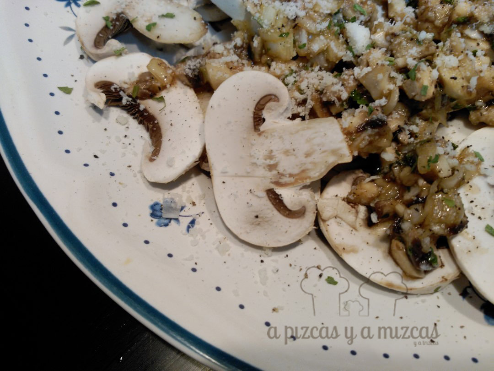
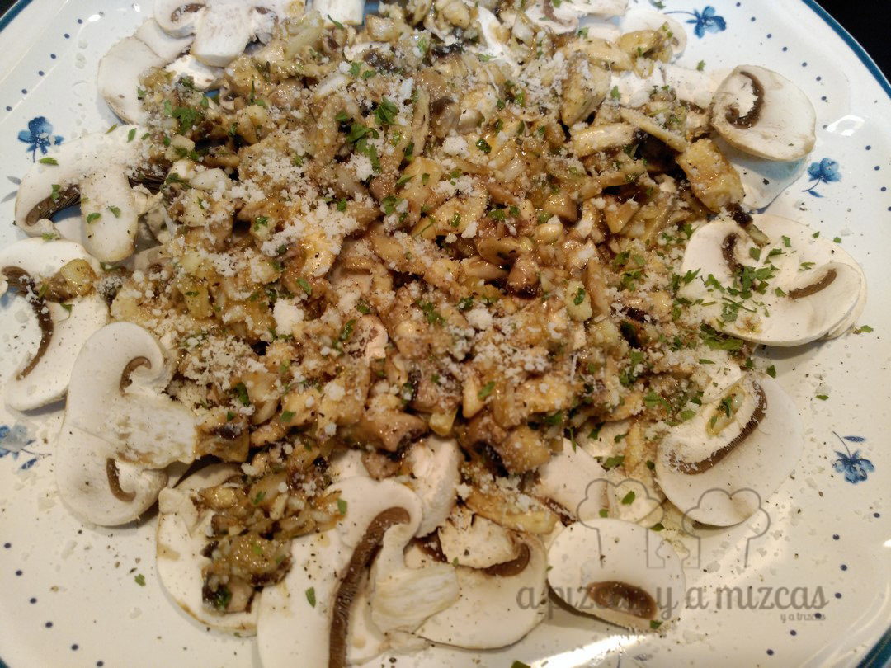

Con la vuelta a la rutina los únicos días que tenemos más tiempo libre para estar entre fogones son los fines de semana. Y entre semana recurrimos a platos rápidos de preparar a la hora de la cena. Y la ensalada de champiñones es uno de ellos...

## Ingredientes para preparar la ensalada de champiñones (para dos personas)

- 300 gramos de champiñones
- 100 de queso parmesano
- 3 cucharadas de aceite de oliva virgen extra
- 1 cucharada de vinagre
- 1 cebolleta
- 2 cucharadas de salsa de soja
- perejil picado
- pimienta

Vimos la receta en el libro de "Las recetas de mi casa" de Andoni Luis Aduriz. Y es una cena que se prepara en un pis pas y muy sana.

También podéis comprar una bandeja de champiñones laminados por eso de ganar algo de tiempo...Y si lo hacéis como nosotros pues primero limpiamos los champiñones. Separamos los tallos y los picamos y lo mismo con la cebolleta.

En un bol mezclamos los tallos de los champiñones picados con el aceite de oliva, el vinagre, la salsa de soja y el perejil picado.

A continuación, laminamos los sombreros de los champiñones y los añadimos al bol junto al queso rallado. Sazonamos con un poquito de pimienta y a la mesa a cenar.

Ensalada de champiñones

Cena lista en un pis pas

Y ya está....la ensalada de champiñones  una cena muy rápida de preparar, sana y rica!
