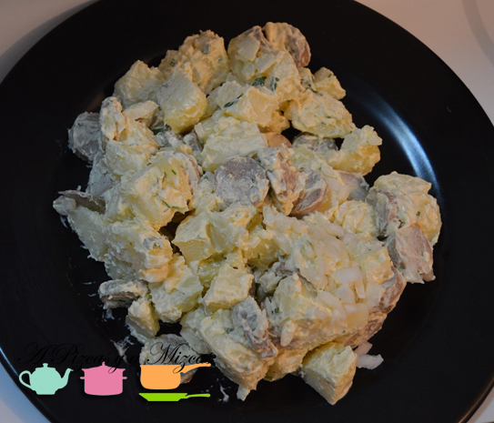
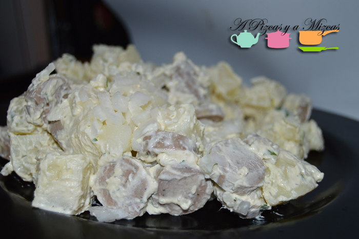
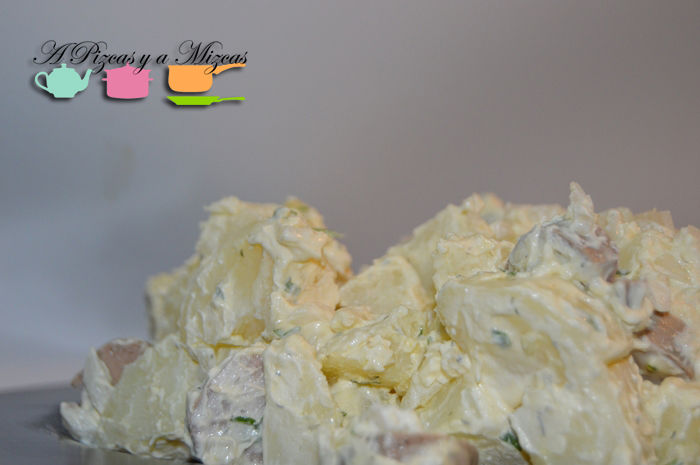

Estos días de verano apetece muy poquito estar metidos en la cocina... queremos ir a la playa, jugar en la arena con nuestra peque Trizcas y aprovechar todas las horas de sol. Pero queremos comer bien....y para eso inventaron la ensaladas de verano. Hoy hemos preparado una ensalada de patata, nosotros la preparamos el día de antes y así cuando llegamos de la playa la podemos disfrutar. En un periquete la teneis preparada....¿a ver qué os parece?

Esta es una versión de la típica ensalada alemana de patata y salchichas ([Kartoffelsalat](http://es.wikipedia.org/wiki/Kartoffelsalat "Ensalada alemana. Kartoffelsalat")), que lleva según quien lo prepare más ingredientes. Así que podeís inspiraros y añadir el ingrediente que más os apetezca... esperamos vuestras sugerencias

## Ingredientes para preparar la ensalada de patata

- tres patatas
- 2 huevos cocidos
- 3 salchichas blancas alemanas
- eneldo
- cebolla fresca
- 3 cucharadas de mayonesa
- una cucharadita de mostaza
- una cucharada de queso estilo philadelphia

En primer lugar cocemos las pataras y los huevos. Y los dejaremos en en un bol para que se enfríen. Mientras herviremos las salchichas alemanas (aunque no es necesario). Cuando estén listas cortaremos en rodajitas y reservaremos. Nosotros compramos las salchichas en Mercadona, van en un paquete de tres, pero podeís poner las que más os gusten.

Ahora prepararemos la salsa. En un bol añadimos las tres cucharadas de mayonesa, una cucharada de queso estilo philadelphia y una cucharadita de mostaza. Removemos bien hasta que se queden bien integrados todos los ingredientes.

En un bol grande ponemos la patata troceada a daditos, los huevos y la cebolla picada y las salchichas alemanas. Agregamos la salsa y removemos hasta que quede todo bien mezclado, por último añadimos el eneldo y a la nevera a enfriar. Mejor servirla bien fresquita. Y a disfrutar del verano!

