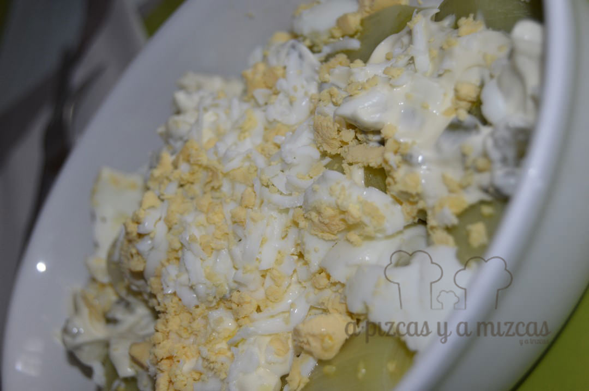

A veces se nos acaba la inspiración a la hora de preparar ensaladas y nos toca buscar inspiración. Uno de los primeros sitios que recurrimos es el blog [El Comidista](http://elcomidista.elpais.com/) nos encanta su peculiar forma de contarnos las cosas y explicarnos las recetas. Y fue así como descubrimos esta ensalada de puerros con salsa tártara.

## Ingredientes para preparar la ensalada de puerros con salsa tártara (para dos personas)

- 4 puerros
- 100 gramos de mayonesa
- 30 gramos de pepinillos
- 30 gramos de alcaparras
- 1 cebolla pequeñña
- 1 cucharadita de mostaza
- 1 huevo
- sal
- pimienta negra
- aceite de oliva virgen extra

Limpiamos los puerros, les quitamos la capa exterior, la parte verde y la raíz de los puerros. Los cortamos en dos o tres trozos. Y los haremos al vapor en una vaporera durante 15 minutos. Si no tenéís vaporera podéis coger un colador de acero inoxidable y ponerlo encima de una cacerola con agua.

Hervimos el huevo al mismo tiempo que se hacen los puerros y así daremos tiempo a que se enfríen mientras preparamos lo demás.

Mientras picamos la cebolla, las alcaparras y los pepinillos.

Antes de servir poner la mayonesa y mezclarla con los pepinillos, alcaparras y la cebolla, el huevo duro rallado y la mostaza.

Servimos los puerros con un poquito de aceite de oliva virgen extra por encima, sal, pimienta y dos cucharadas de salsa tártara. Y de la cocina a la mesa y a disfrutar del plato.

 

Ensalada de puerros con salsa tártara
