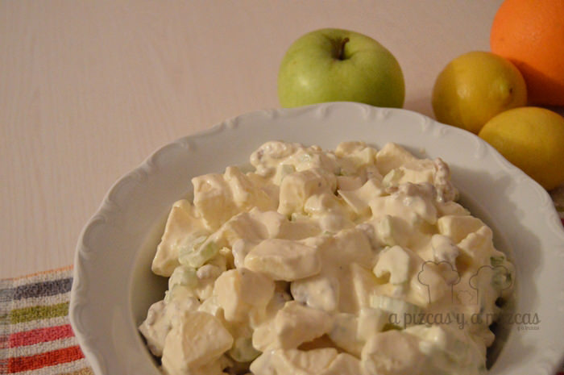
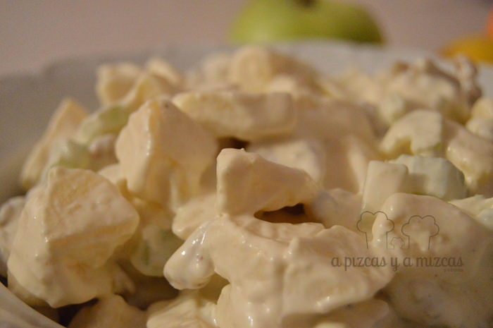

Hoy os mostramos cómo preparamos la ensalada Waldorf, una ensalada con nombre propio. Es una ensalada que se prepara con muy pocos ingredientes y muy rápido.

_La ensalada Waldorf debe su nombre a un hotel neoyorquino, el antecesor del afamado [Hotel Waldorf-Astoria](http://www.waldorfnewyork.com/languages/spanish/ "Hotel Waldorf-Astoria") que fuera inaugurado en 1931. Resulta que en 1893 el maître del hotel, a quien se le adjudica el invento de la receta, presentó por primera vez esta receta. Por aquel entonces Oscar Tschirky, maître, trabajaba en el Hotel Waldorf y sorprendía con la creación de excéntricos platos. La discusión sobre el creador de la ensalada y otros platos ha llegado hasta el día de hoy, pero todo parece indicar que fue Tschirky el innovador en crearla, quien también dijo haber inventado los Huevos Benedicto._

_Tres años después de haber servida por primera vez, la ensalada es presentada en el libro de cocina "The Cook Book by 'Oscar of the Waldorf'", en 1896. La ensalada no tardó en convertirse en un plato típico del jet set y su nombre comenzó un largo peregrinaje alrededor del mundo. ([Historia y receta original](http://www.escueladecocina.net/recetas/historia-y-receta-de-la-ensalada-waldorf.php "Historia y receta original de la ensalada Waldorf"))_

## Ingredientes para preparar la ensalada Waldorf (para dos personas)

- dos ramitas de apio
- una manzana golden
- 60 gramos de nata
- una cucharada de zumo de limón
- un puñadito de nueces peladas
- una cucharada de mostaza
- sal
- pimienta

Vamos al lío! Limpiamos el apio y quitamos las hojas. Pelamos con la ayuda de un pelados las fibras y cortamos en rodajitas. Cortamos las nueces por la mitad y exprimimos el limón.

Ahora vamos a preparar la salsa. Mezclamos la mayonesa, la mostaza, la nata y el chorrito de zumo de limón. Añadimos sal y pimienta. Pelamos y cortamos la manzana en daditos. Justo antes de servir mezclamos en un bol el apio, la manzana y las nueces. Incorporamos la salsa poco a poco para que se quede todo bien integrado. Añadimos si hiciera falta un pelín de sal y pimienta.... y a disfrutar!

