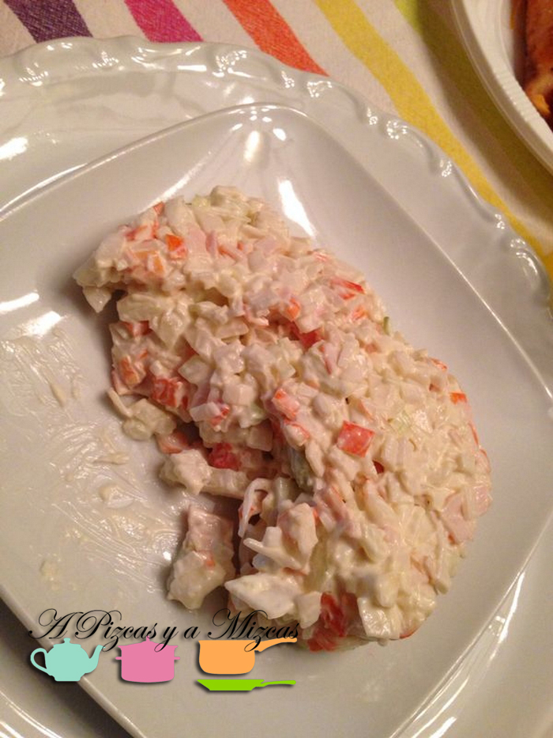

Un aperitivo rápido de preparar que nos gusta comer en casa de Pizcas y Mizcas es la ensaladilla de cangrejo. Muchas veces la compramos en el supermercado pero realmente cuando la hacemos en casa no tiene color frente a las preparadas.... es que lo que se hace en casa sabe mejor.

## Ingredientes para preparar la ensaladilla de cangrejo (para dos personas)

- 6 palitos de surimi
- media cebolla tierna
- medio ajo picado
- mayonesa

La preparación de la ensaladilla de cangrejo es muy sencilla y super rápida.  Troceamos los palitos de surimi y reservamos. Si no os ha dado tiempo a descongelar los palitos de surimi los introducís en un recipiente con agua tibia y en unos minutos los tendréis listos para trocear. A continuación picamos la cebolla tierna y el ajo.

En un bol mezclamos los palitos de surimi, la cebolla y el ajo picado y añadimos la mayonesa o salsa rosa (según gusto). Removemos todos los ingredientes y dejamos reposar un ratito en la nevera.

Hay gente que no entiende esta ensaladilla sin piña... si os gusta de esta forma... sólo tendréis que incorporar un trozo de piña partido a daditos pequeños.

Otra opción para enriquecer un poco más la ensaladilla de cangrejo es añadirle un puñadito de gambas peladas congeladas o frescas (sin es una ocasión especial)... seguro que no queda nada para el día siguiente.

Nosotros también utilizamos esta ensaladilla como relleno de sandwiches o para rellenar tartaletas. Por ejemplo, pasamos por el rodillo las rebanadas de pan sandwich sin corteza las cortamos en cuatros partes iguales y las pasamos por la plancha caliente (hasta que se tuesten) colocamos una cucharadita de nuestra ensaladilla de cangrejo en cada una de las tostas y espolvoreamos perejil picado por encima. Es una opción socorrida cuando se presentan invitados imprevistos a la hora de la cena.

Esperamos que os gusta esta versión de ensaladilla de cangrejo... a nosotros nos encanta!
