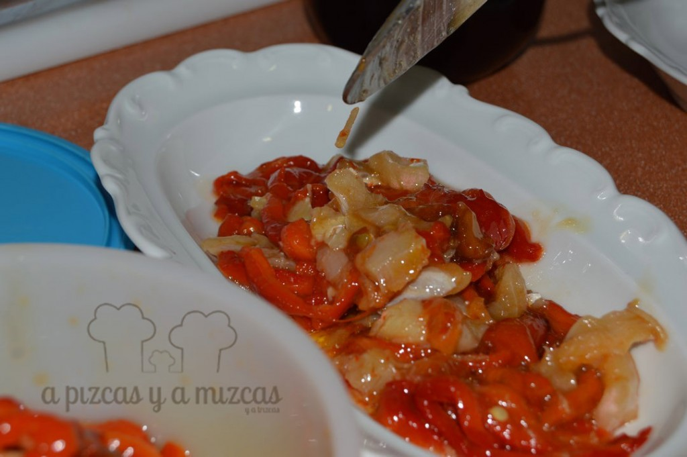
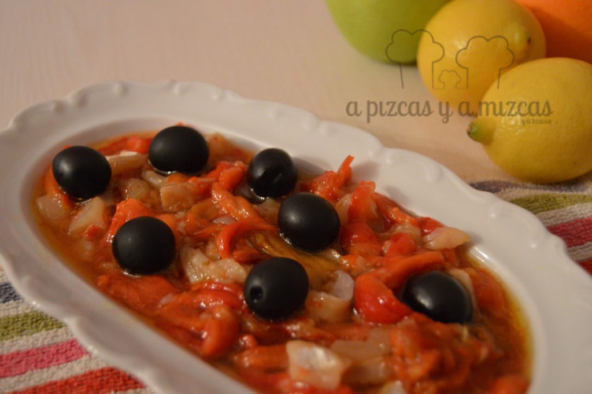

El esgarraet es una ensalada hecha con pimiento rojo asado y bacalao en salazón. Es una de las tapas típicas en Valencia. Es muy fácil de preparar y hoy os enseñamos cómo prepararlo. Para los que no conocéis este plato típico valenciano... seguro que os sorprende.

## Ingredientes para preparar el esgarraet

- dos pimientos rojos grandes
- 100 gramos de migas bacalao en salazón
- ajo
- aceite de oliva virgen extra
- sal

En primer lugar asamos los pimientos. Precalentamos el horno a 200º C. Lavamos bien los pimientos, los secaremos y los untaremos con aceite de oliva virgen extra. Salamos. Metemos al horno y horneamos durante 50 minutos a 180º C. En mitad del horneado, daremos la vuelta a los pimientos. Estaremos pendientes y cuando veamos que están dorados y con la piel arrugada... los sacaremos! Sacamos del horno y los cubriremos con papel de aluminio unos minutitos para que sea más fácil quitarle la piel a los pimientos.

Dejaremos que pierdan calor, les quitamos la piel y los cortaremos en tiras. Picamos los dientes de ajo y desmigamos el bacalao.

A continuación, mezclamos los ingredientes en un cuenco y agregamos aceite de oliva virgen extra. Removemos y dejaremos que repose durante varias horas (lo puedes preparar de un día para otro, aguanta varios días en la nevera). Lo podeis acompañar de aceitunas negras.

 Esgarraet

Acordaros de acompañar el esgarraet con pan... porque no hay quien se resista!

 Preparad el pan...
