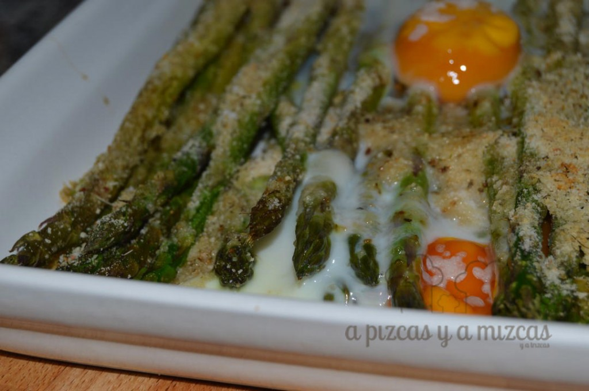
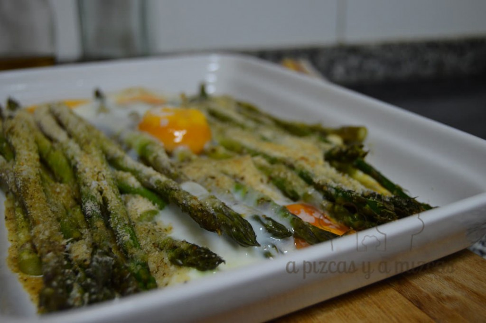

Hay semanas en las que no tenemos tiempo ni de planificar los menús semanales y vamos improvisando sobre la marcha. Y eso es lo que nos pasó el otro día... cuando fuímos a hacer la compra vimos los espárragos verdes muy bien de precio... así que sin pensarlo dos veces los metimos al carrito. Y Pizcas nos sorprendió con estos espárragos gratinados...

Actualmente podemos encontrar los espárragos verdes durante todo el año gracias a los cultivos en invernadero. Aunque su mejor época es la que transcurre durante los meses de abril y mayo.

Para conservar los espárragos frescos han de envolverse con un paño húmero y se conservan en la nevera hasta tres semanas. También admiten ser congelados. Hay que lavarlos y ordenarlos según su tamaño. Se corta la base y se escaldan durante dos o cuatro minutos según su tamalo. Luego los sumergimos en agua muy fría durante unos cinco minutos y los ponemos en bolsas de congelación sin que queden espacios entre los espárragos. De esta forma, se pueden mantener hasta un año.

## Ingredientes para preparar los espárragos gratinados

- dos manojos de espárragos trigueros
- dos huevos
- pan rallado
- queso parmesano
- sal
- pimienta

En primer lugar limpiamos los espárragos, les quitamos la parte más dura y los colocamos en una fuente para gratinar en el horno.

Salpimentamos los espárragos y a continuación espolvoreamos con el pan rallado y el queso parmesano. Por último dejamos caer los huevos y al horno! Dejaremos durante unos 20 minutos con el horno a 200ºC o hasta que el queso esté bien dorado.

 Cenas preparadas en un pis pas

Muy fácil y rápido de preparar, mientras Trizcas estaba en su momento del baño, Pizcas nos sorprendión con este plato de espárragos gratinados bien rica.... y otra cena pizcas que la tendréis preparada en un periquete!
