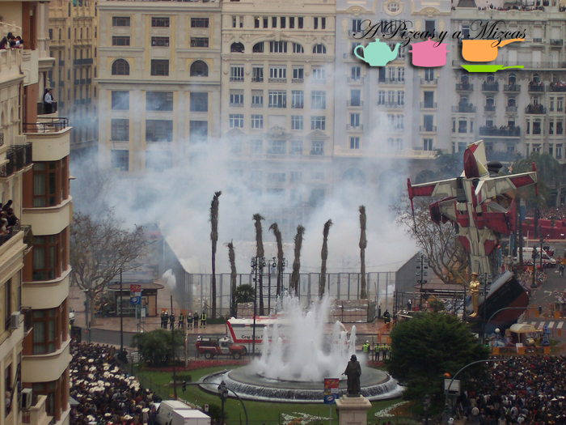
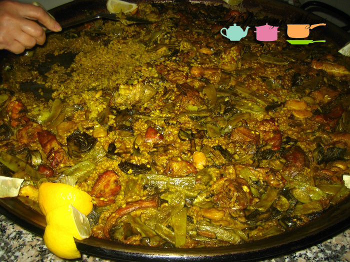
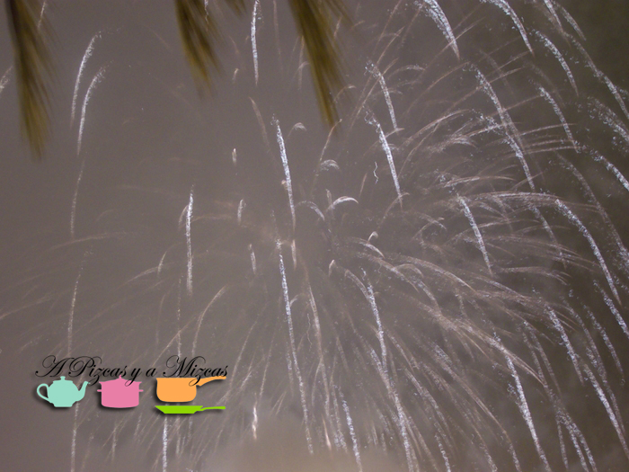
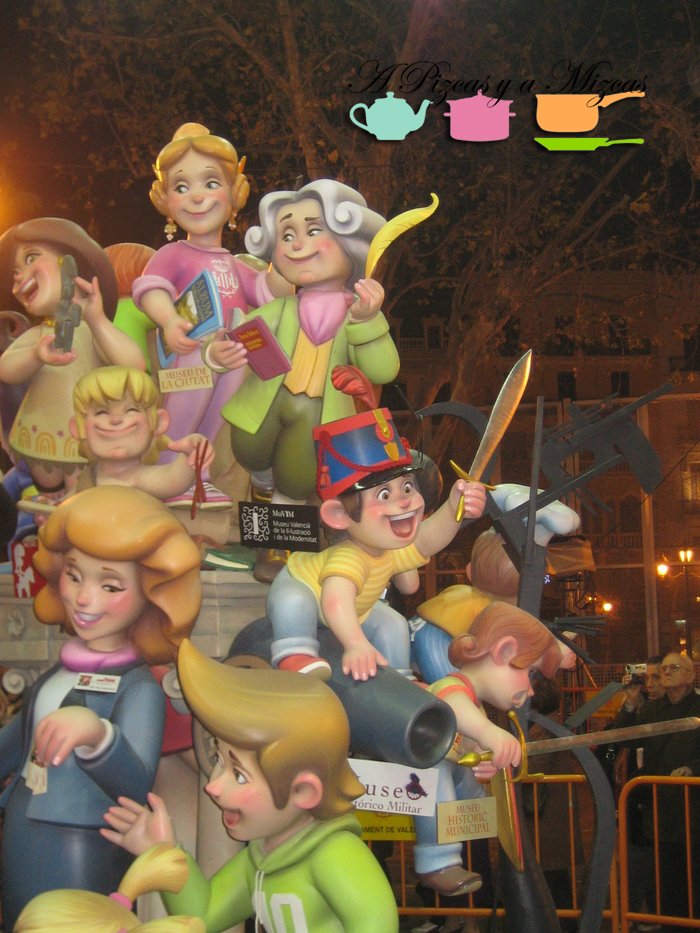
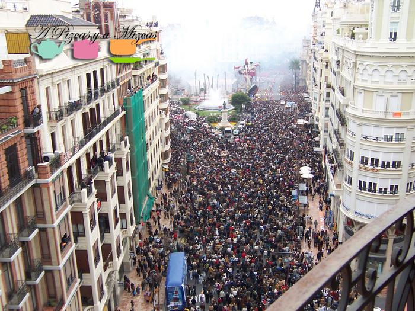
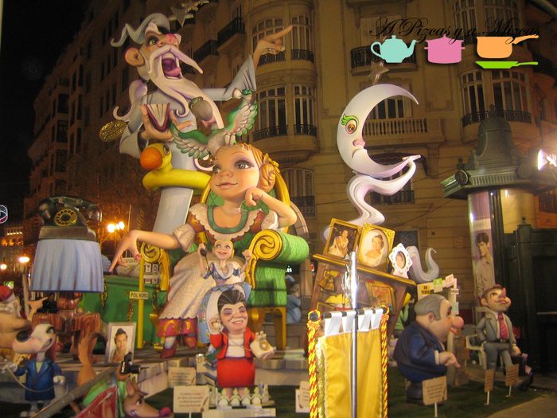
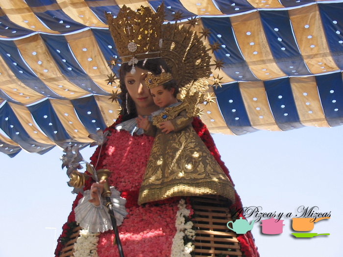
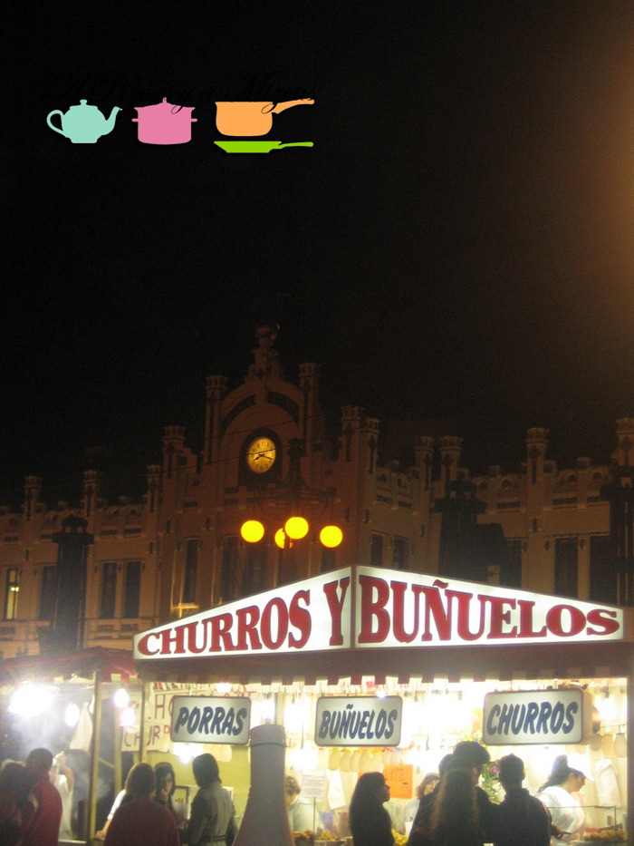
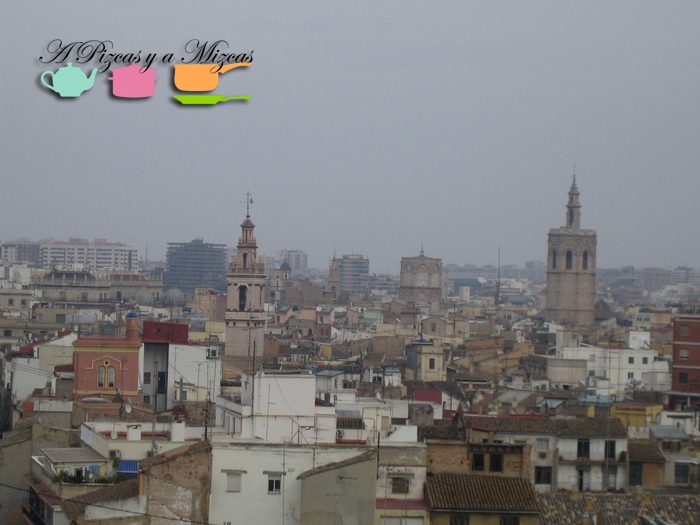

Este año no queremos que os perdáis nada de las fallas... La fiesta ya está en la calle y hay actos en cada rincón... así que hemos seleccionado los más importantes de cada día (los que no te deberías perder), aunque sólo con salir a la calle la diversión está garantizada.

Por otra parte, hemos hecho una selección de los actos gastronómicos que más nos han llamado la atención que las comisiones realizan estos días de fiesta. Muchos de estos actos son reservados para los falleros pero es fácil conocer a alguien en la comisión o sino echarle un poco de cara al asunto.

A disfrutar de las fallas.

## Guía para aprovechar las fallas

### **Viernes 14 de Marzo**

Actos que no te puedes perder

14:00 Mascletà. Piroctecnia Élite

Gastronomía

13:00 Paella gigante para 300 personas. Reina- Paz

Todo el día. Feria de la Tapa. Linterna - Na Robella

### Sábado 15 de Marzo

Actos que no te puedes perder

08:00 Plantà de todas las Fallas Infantiles

14:00 Mascletà. Piroctecnia Hermanos Caballer

17:00 Lectura premios infantiles

00:00 Castillo en la Alameda. Pirotecnia Europla

Gastronomía

12:30 Concurso Master Chef Junior. Joaquín Costa - Conde Altea

14:30 Arròs amb fesols i naps. S. Vicente - Periodista Azzati

Feria de la Tapa. Todo el día. Linterna - Na Robella

### Domingo 16 de Marzo

Actos que no te puedes perder

08:00 Plantà de las Fallas

14:oo Mascletà. Pirotecnia Europla

16:30 Reparto de premios. Plaza del Ayuntamiento

1:00 Castillo de fuegos artificiales en el paseo de la Alameda. Pirotecnia: Pirofantasía Carlos Caballer

Gastronomía

14:00 Fideuà. Manuel Melià y Fuster - Carlos Cortina

19:00 Sardinà Antonio Molle - Gregorio Gea

20:00 Feria de la Tapa. Plaza de Jesús

21:00 Concurso de tortilla de patata hechas a leña. Francisco Climent - Uruguay

\*\*

### Lunes 17 de Marzo

Actos que no te puedes perder

09:30 Reparto de premios de fallas. Plaza del Ayuntamiento

14:00 Mascletà a cargo de Pirofantasía Carlos Caballer

15:30 Ofrenda. Plaza de la Virgen

1:00 Castillo de fuegos artificiales en la Alameda. Pirotecnia Valenciana

Gastronomía

14:00 Arròs amb fesols i naps. Plaza de la Morería

22:00 Torrà de hamburguesas. Burjassot- Carretera de Paterna

### Martes 18 de Marzo

Actos que no te puedes perder

14:00 Mascletà. Piroctecnia Valenciana

15:30 Ofrenda. Plaza de la Virgen

1:30 Nit del foc en la Alameda. Pirotecnia Ricardo Caballer

Gastronomía

24:00 Buñolada, reparto de más de 5000 buñuelos. L´Eliana - Cid

10:00 All i pebre para falleros e invitados del barrio. Gloria - Felicidad - Tremolar

14:30 Arròs al forn sense forn. Manuel Melià y Fuster - Carlos

### Miércoles 19 de Marzo

Actos que no te puedes perder

14:00 Mascletà. Pirotecnia Caballer

19:00 Cabalgata del Fuego. Itinerario: [Ruzafa](/tag/ruzafa/ "Ruzafa"), Colón, Porta de la Mar

22:00 Cremà de las fallas Infantiles

22:300 Cremà de la falla infantil que haya obtenido el primer premio de la Sección Especial

23:00 Cremà Falla Infantil del Ayuntamiento

00:00 Cremà de todas las fallas de Valencia

00:30 Cremà de la falla que haya obtenido el primer premio de la Sección Especial

1:00 Cremà de la falla municipal

Gastronomía:

10:00 Almuerzo popular. Carretera Escrivá- Coop. S. Fernando

15:00 Arròs amb fesols i naps para toda la comisión y otras 230 personas

Espero que os guste la selección que hemos realizado y disfrutéis de estos días de fallas!

Todos los horarios los hemos obtenido del extra de Fallas-2014 del periódico [Levante- EMV](http://www.levante-emv.com/)
