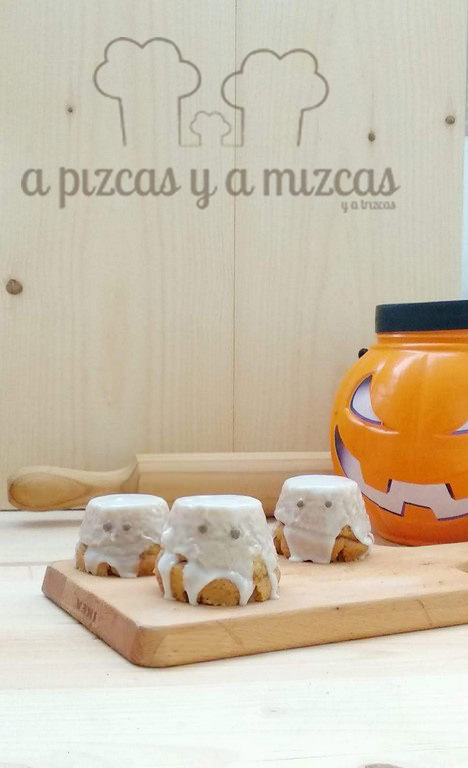
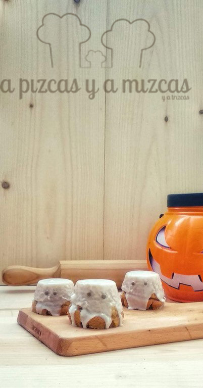

Cuánto tiempo sin pasarnos por aquí...pero con el día a día se nos complica pasarnos por aquí para contaros nuestras nuevas recetas. Pero hemos pensado que hoy es un buen día y que con esta receta vais a estar entretenidos mayores y pequeños. ¿Os atrevéis a preparar estos fantasmas de bizcocho de manzana?

## Ingredientes para preparar los fantasmas de bizcocho de manzana

- 250 gramos de manzana asada
- 200 gramos de azúcar
- 2 huevos medianos
- 140 gramos de aceite de girasol
- 200 gramos de harina
- 1 pellizco de sal
- Levadura (un sobre de 15 gramos)
- 1 cucharadita de canela molida

## Ingredientes para preparar el glaseado:

- 100 gramos de azúcar
- un limón
- 125 ml de nata líquida

Echamos en un bol el azúcar y los dos huevos y batimos  hasta que empiece a blanquear. A continuación, añadiremos la manzana asada y el aceite de girasol y batiremos hasta que esté todo bien mezclado. Después agregamos la harina (acordaros de tamizarla con la ayuda de un colador, así evitaremos grumitos), la sal y la levadura y lo mezclamos todo.

Engrasamos los moldes (nosotros utilizamos flaneras pequeñitas) aptos para el horno y agregamos la masa del bizcocho de manzana. Metemos los moldes individuales  en el horno y espolvoreamos con un poquito canela. Dejaremos hornear entre 20 minutos a 180º. Es aconsejable que vayáis pinchando el bizcocho con un cuchillo o varilla para comprobar que sale totalmente limpio. Si sale con restos de la mezcla del bizcocho, dejad 5 minutos más y volved a comprobar.

Cuando se enfríe cortamos la base de los mini fantasmas de bizcocho de manzana  para igualarlos en tamaño y prepararemos el glaseado.

Ahora preparamos el glaseado para los fantasmas de bizcocho de manzana:

Ponemos en el vaso de la batidora azúcar, la ralladura y el zumo del limón, la nata liquida y batiremos hasta que la mezcla esté fina y homogénea. Dejamos caer sobre los fantasmas de bizcocho de manzana. Dejamos que se enfríe un poco y listos para disfrutar la noche de Halloween.

¿Y tú qué vas a hacer esta noche tan terrorífica?

