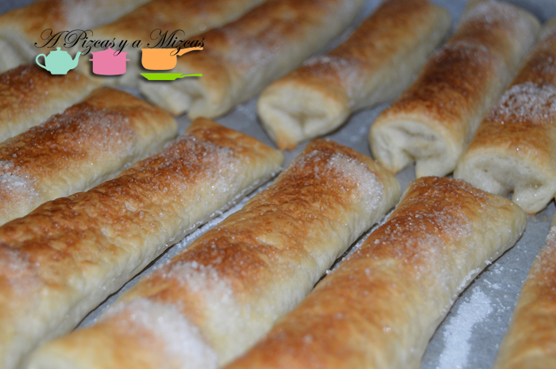
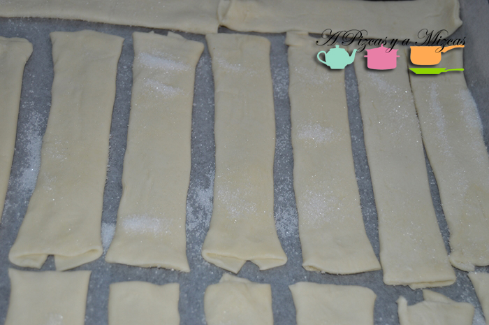
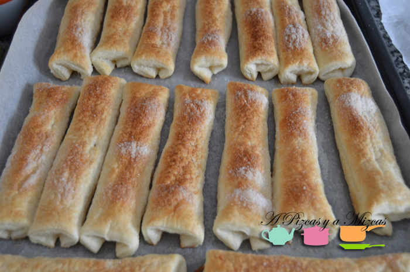
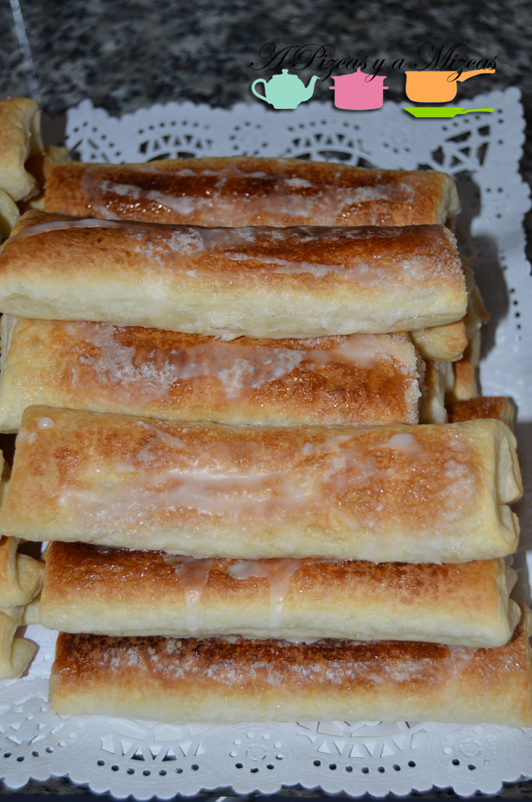
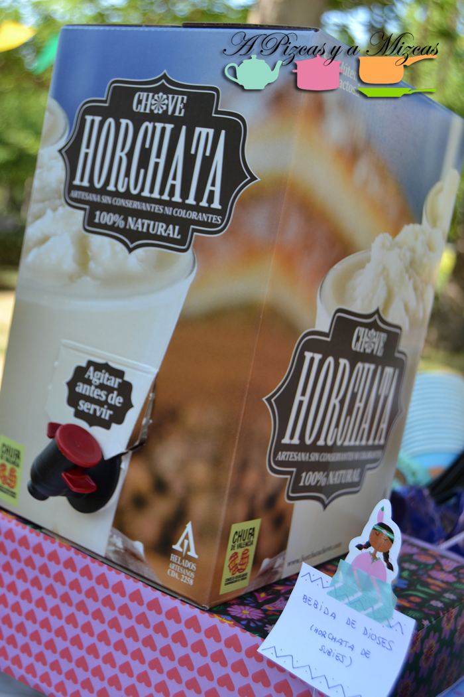

Aunque la horchata está fantástica a solas, líquida o granizada. Sin duda, acompañada se eleva a la enésima potencia de la gastronomía. Las opciones son muchas: coca de llanda, magdalenas, rosquilletas… pero la pareja por excelencia de una buena horchata son los fartons. Nuestros favoritos son los que preparan en la Horchatería Subíes, en Almàssera. Tienen nombre propio (Amparitos), son hojaldrados, pero absorben perfectamente la horchata. Para el segundo cumpleaños de Trizcas nos animamos a prepararlos nosotros nuestros fartons hojaldrados caseros en casa y nos salieron muy buenos (la prueba es que no sobró ni uno).

## Ingredientes para preparar los fartons hojaldrados caseros (para ocho unidades)

- Una lámina de hojaldre (a poder ser rectangular)
- Azúcar
- Azúcar glasé
- Agua mineral
- Limón

Como podéis ver los ingredientes son súper sencillos y la preparación es facilísima. El resultado de los fartons hojaldrados caseros os sorprenderá y seguro que los prepararéis en múltiples ocasiones.

Indicamos que la lámina de hojaldre sea rectangular porque así es más fácil que nos salgan más o menos regulares, pero si es circular no pasa nada.

El primer paso es extender la lámina de hojaldre y dejarla a temperatura ambiente durante unos 10 minutos. En ese tiempo precalentaremos el horno, a unos 250 grados (luego lo bajaremos).

Cuando el hojaldre esté atemperado, lo cortamos en cuatro secciones verticales con ayuda de un cortapizzas. Espolvoreamos un poco de azúcar convencional por encima del hojaldre. Cada una de las secciones la doblamos sobre sí misma y las cortamos por la mitad. Así tendremos ocho fartons hojaldrados caseros. Volvemos a espolvorear azúcar por la parte superior de los fartons.

Los colocamos en la bandeja del horno sobre un papel de hornear y los introducimos al horno, por arriba y por abajo. Ahora es cuando bajamos la temperatura a 200 grados. Los mantendremos unos 12 minutos. Luego dejaremos sólo el grill durante 3 minutos más. En todo caso, debéis observar cómo evolucionan los fartons hojaldrados caseros, para que no se tuesten demasiado (deben quedar crujientes por fuera, pero tiernos por dentro, para que absorban la horchata adecuadamente).

Mientras se hornean, vamos a prepara el glaseado. Cojemos el azúcar glasé (unas seis cucharadas soperas colmadas) y añadimos poco a poco 20 ml de agua mineral. Lo removemos muy bien, cuidando que no queden grumos. Si vemos que necesita más agua, añadimos un poco más, con cuidado. Y lo mismo si la mezcla requiere más azúcar. Cuando tengamos el glaseado, añadimos un par de gotas de zumo de limón y esencia de su corteza (cortando un trozo de corteza y retorciéndola sobre el glaseado).

Una vez los fartons hojaldrados caseros estén listos, los dejamos reposar unos minutos fuera del horno y con una cuchara repartimos el glaseado por encima y los metemos en la nevera unos 10 minutos hasta que el glaseado coja cuerpo (lo tocaréis con la punta de los dedos y no se os quedará pegado).

Ya tenéis los fartons hojaldrados caseros listos. Nosotros os recomendamos la horchata de [Subíes](http://www.horchatachove.com/ "Horchata Subíes"). Si no podéis tomarla directamente allí, la podéis encargar en un práctico Bag-in-box de 5 litros, que conocimos en la última edición de la [Feria Gastrónoma en Valencia](/un-paseo-por-gastronoma/ "Feria Gastrónoma").

http://www.youtube.com/watch?v=sSkLYjMfW0M

