Después de varias semanas de trabajo e imaginación, por fín, recientemente celebramos el segundo cumpleaños de Trizcas. En su [primer cumpleaños](/fiesta-de-primer-cumpleanos/ "Primer cumpleaños de Trizcas") ya nos habíamos puesto el listón muy alto y este año queríamos sorprenderla con algo especial. Así que decidimos montarle una fiesta de cumpleaños de indios, ya que su cuento favorito es "Hoy soy una apache". Dicho y hecho, nos pusimos las pinturas de guerra y montamos el campamento apache para reunir a familiares y amigos y que Trizcas soplara las dos velitas. Os contamos cómo lo hicimos nosotros, por si os sirve de ayuda.

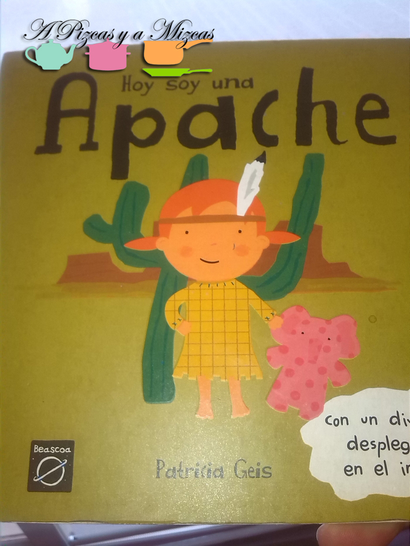

##  Así fue nuestra fiesta de cumpleaños de indios

Lo que teníamos claro, desde el principio es que no podía faltar un tipi indio auténtico, para que toda la fiesta girara en torno a él. Para ello, engañamos a la abuela Mizcas, que nos echó una mano (unas puntadas) y que nos confeccionó el escondite perfecto para Trizcas y sus amiguitos. En este [enlace](/tipi-indio/ "Como hacer un tipi indio") os explicamos cómo montamos nuestro tipi indio.

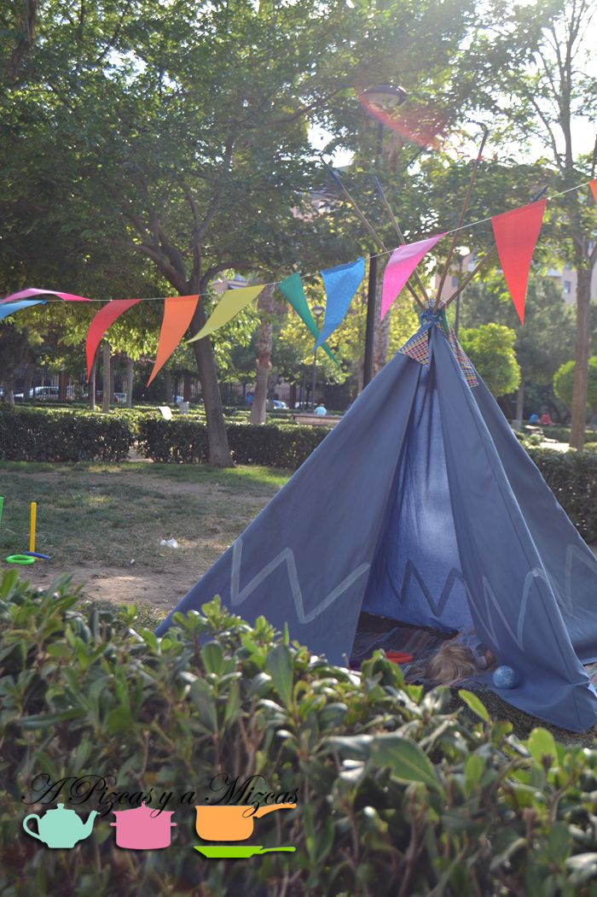](/wp-content/uploads/DSC_0077-pizcas.jpg) [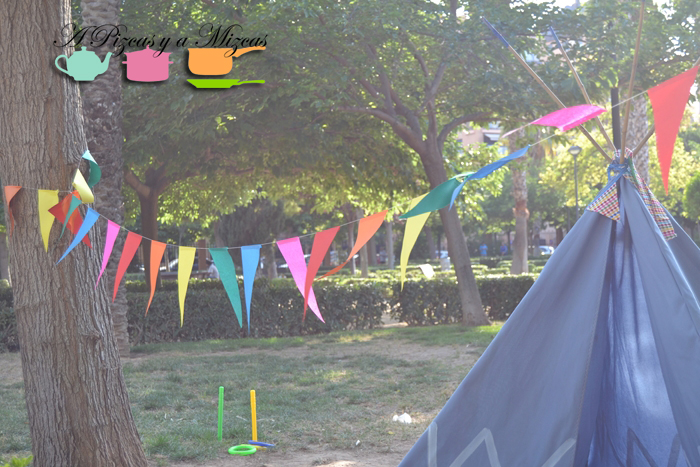

Elegimos celebrar nuestra fiesta de cumpleaños de indios en un parque público que tenemos cerca de casa y, aunque un día antes la predicción del tiempo casi nos arruina los planes, la verdad es que salió todo perfecto. Ésta fue la invitación que enviamos.

Con el hogar indio listo, había que montar actividades para los pequeños guerreros del poblado. Tenían que quemar sus inagotables energías. Optamos por dos juegos de habilidad en el que pudieran participar varios niños. Por un lado, montamos un juego de puntería con bolas, en el que los niños debían tumbar a enemigos chiwokees con las pelotas. Para ello, utilizamos botes de cerveza/refresco forrados con goma eva de colores y decorados con motivos indios. Las pelotas las compramos decoradas con estrellas, pero también pueden servir las pelotas de tenis clásicas, o las que tengáis en casa.

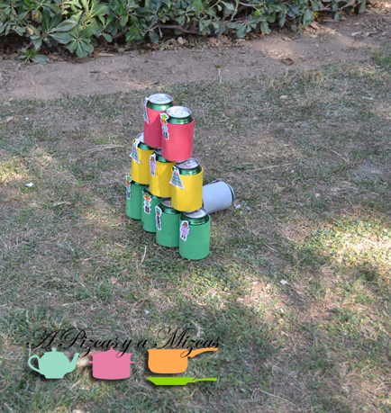

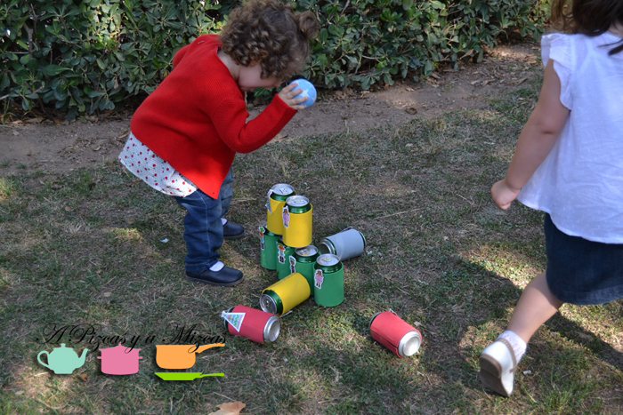

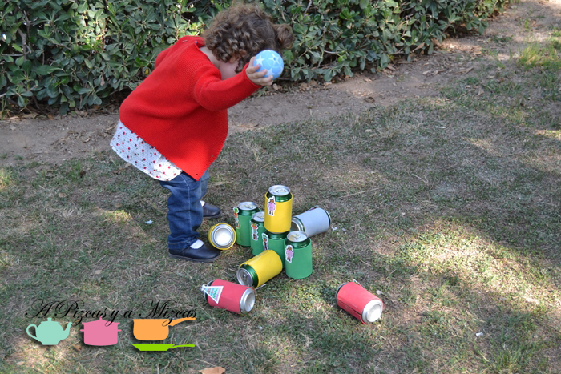

El segundo juego fue el clásico juego de ensartar anillas en palos, que colocamos a diferentes distancias. Al final Trizcas acabó "apaelando" a su nina con los palos, ejeje, le quería arrancar la cabellera.

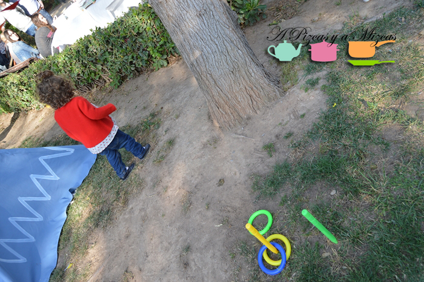

Dejando la llanura, en el campamento montamos la mesa de nuestra fiesta de cumpleaños de indios. Utilizamos nuestra mesa plegable (cuánto uso le hemos dado!), y como menaje optamos por los platos, vasos y servilletas de indios que vimos en [Tiger](http://www.tiger-stores.es/ "Tiger"), de esta tienda también compramos los palillos con motivos indios que utilizamos en múltiples casos (en los botes del juego, en los toppers de la comida...).

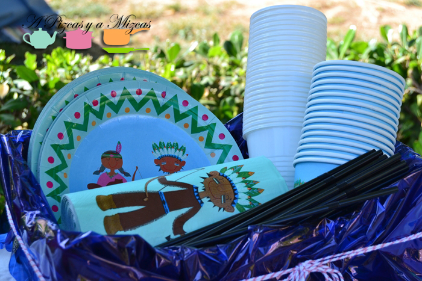

La merienda se centró en la [horchata](http://www.horchatachove.com/ "Horchata Subíes") con fartons, clásica de Valencia; y la [coca de tomate](/coca-de-tomate-empanada-rapida/ "Coca de tomate"), junto con nuestra [limonada de naranja y fresa](/limonada-de-fresa/ "Limonada de fresa"). Pero claro, teníamos que bautiizarlos en apache, así que nuestra mesa se llenó de: Bebida de dioses (horchata), Sangre de bisonte (limonada de fresa y naranja), Coca Chiwokee (coca de tomate), Lanzas guerreras ([fartons hojaldrados artesanos](/fartons-hojaldrados-caseros/ "Fartons hojaldrados caseros")), Gusanos de la llanura (gusanitos), Señales de humo (palomitas dulces) y las flechas dulces que hicimos con palos de brocheta y plumas de goma eva, llenas de chuches.

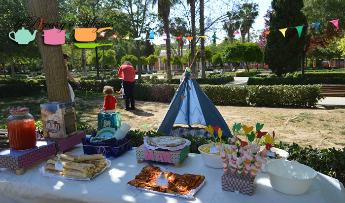

Para colocar las bebidas y la tarta, utilizamos cajitas de fresas de madera vacías, que forramos con papel de regalo. Quedan de lo más animadas.

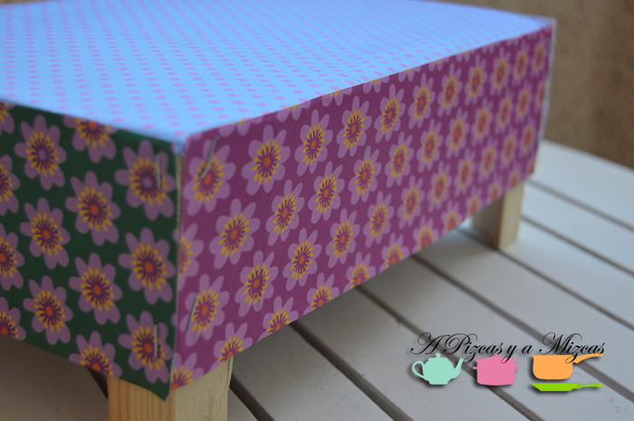

Para que la tarta no fuera demasiado empalagosa, hicimos una [coca de manzana](/bizcocho-jugoso-de-manzana/ "Coca de manzana"), con un dibujo de indio en azúcar glasé. Así se podía acompañar con la horchata.

A cada uno de los niños que vino se le repartió una [pluma apache para la cabeza](/corona-india/ "Cintas con plumas apaches") y al marcharse, se llevaron de recuerdo unos divertidos broches en forma de carita de indio que nos preparó [Les Ninetes](https://www.facebook.com/les.ninetes?fref=ts "Facebook de Les Ninetes"), quedaron de lo más auténticos y cada uno con el color de pelo y de ojo de su futuro propietario.

A Trizcas le pusimos el penacho de jefa apache (le duró tres segundos en la cabeza). [Aquí](/corona-india/ "Corona india") os contamos cómo los hicimos.

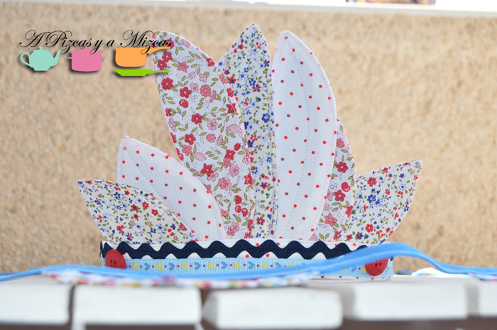

El poblado indio estuvo de lo más animado y ya empezamos a maquinar la fiesta para el próximo año.

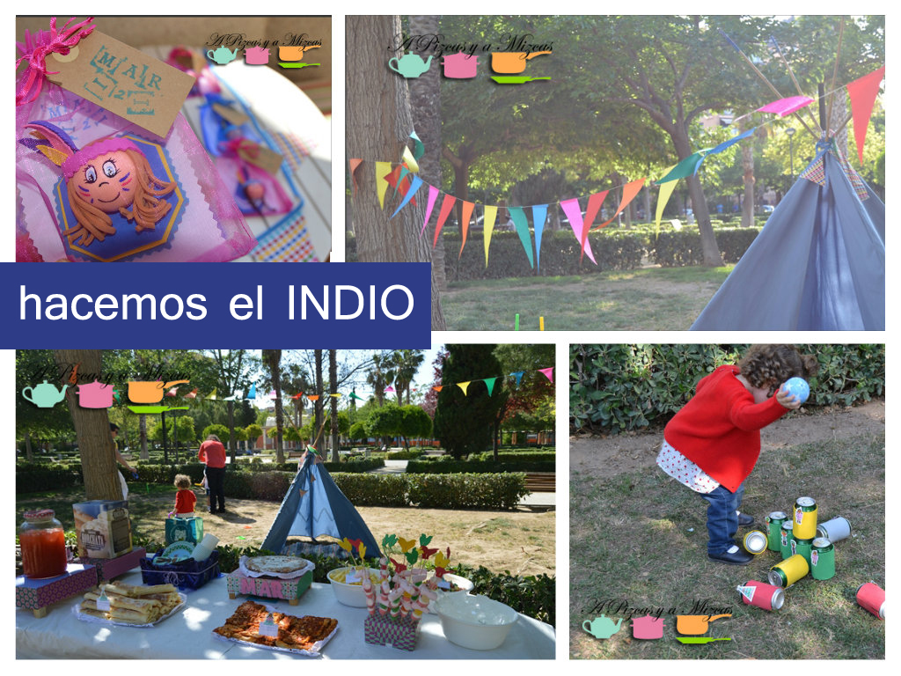

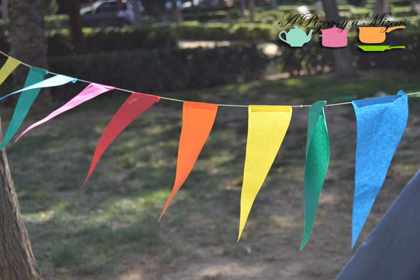
