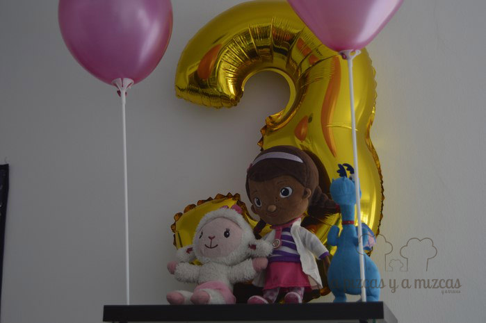
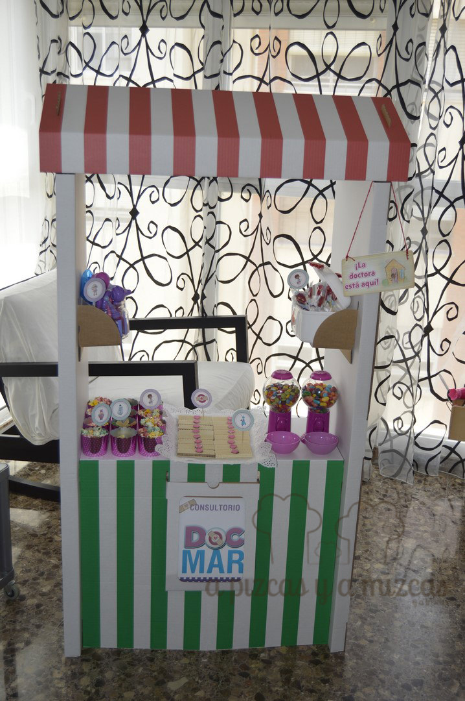
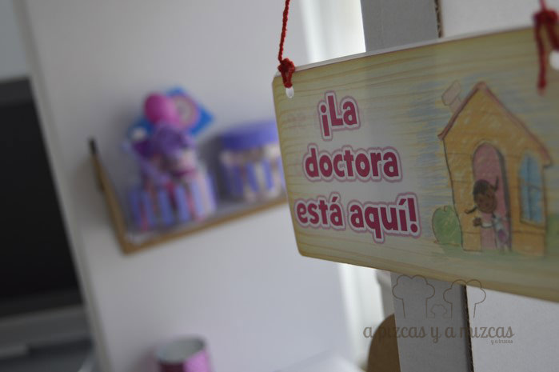
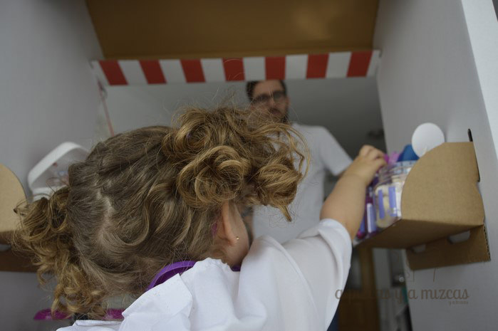
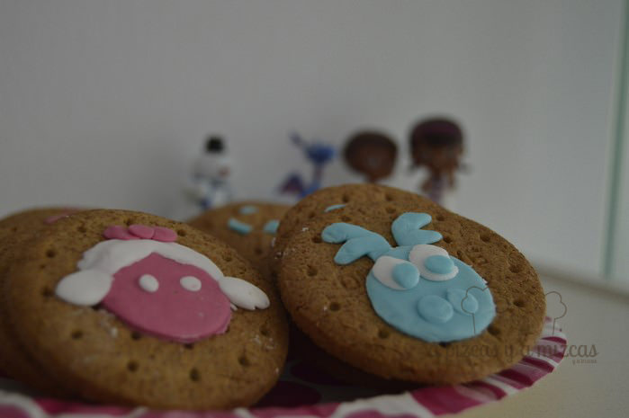
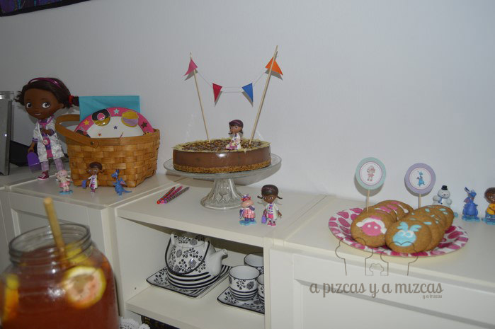
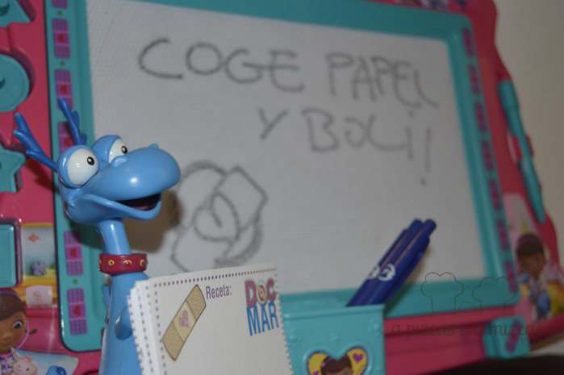
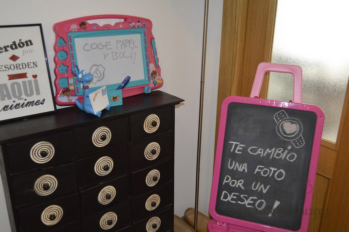

Hace unas semanas que preparamos la fiesta de cumpleaños Doctora Juguetes. Trizcas cumlió tres años y  quería un cumpleaños de Doctora Juguetes y nosotros nos pusimos manos a la obra y creo que lo conseguimos. Otros años la temática de cumpleaños hemos tenido total libertad y preparamos la [fiesta de los indios](/fiesta-de-cumpleanos-de-indios/) y el [primer cumple de Trizcas](/fiesta-de-primer-cumpleanos/) pero este año teníamos que hacer caso a la protagonista de la fiesta. Esta vez preparamos la fiesta de cumpleaños de Trizcas en casa con la familia donde nuestra peque fue la protagonista de toda la fiesta. Le pusimos el disfraz de Doctora Juguetes y pudo hacer chequeos a toda la familia.

Trizcas cumple tres años y le acompañan sus amigos de sus dibujos preferidos de la Doctora Juguetes

Queríamos algo sencillo y sin demasiadas complicaciones pero que sorprendiera a Trizcas. Para la merienda preparamos unos mini croissants rellenos de jamón york y queso manchego y otros de lechuga, atún y mayonesa, tortilla de patata y una coca de tomate que preparó la iaia Pizcas. Y para beber preparamos la [limonada refrescante](/limonada-refrescante/) que fue todo un éxito.

La parte dulce la montamos en la [tienda de cartón de Ikea](http://www.ikea.com/es/es/catalog/products/30245727/) que lo convertimos en el "consultorio de Doc Trizcas" preparamos unas galletas de barquillo con un corazón de fondant que se convirtieron en nuestras "tiritas", dos dispensadores de caramelos (con lacasitos y caramelos blandos) las medicinas que a grandes y mayores nos encantan, en un tarro pusimos nubes, un maletín de primeros auxilios con piruletas y vasitos llenos de chuches y palomitas de colores. Por último en otro tarro pusimos todo el instrumental médico de la Doctora Juguetes para que Trizcas pudiera hacer una revisión médica a todos los que quisieran.

El consultorio de Doc Trizcas fue uno de los protagonistas de la fiesta

En nuestro improvisado "consultorio Doc Trizcas" no podía faltar el cartelito "La Doctora está aquí/ La Doctora se ha marchado un momento" que lo buscamos en [Disney Junior- Doctora Juguetes](http://www.disney.es/cms_res/disney-junior/images/pdf/es_dms_door-hanger.pdf)

La Doctora está aquí

Trizcas se lo pasó genial recetando chuches y sonrisas a todos los invitados... ji ji  ji

Doc Trizcas atendió a todos sus pacientes y no paró de recetar dulces... ji ji ji

Junto a la tarta de cumpleaños que ya os la enseñaremos en otra entrada... papá Pizcas hizo unas galletas de los mejores amigos de la Doctora Juguetes: Lanitas y Valentín. Es que papá Pizcas es un artista con el fondant!

Los más dulces de la fiesta: Lanitas y Valentín

En la tarta no podía faltar la Dotora Juguetes

Por último, a la entrada de la fiesta colgamos fotos de Trizcas con cada uno de nuestros invitados. Les regalamos las fotos dedicadas a cambio de un mensajito para Trizcas. Así cuando la pequeña Doctora crezca tendrá un bonito recuerdo de su fiesta.

Un recuerdo para Trizcas

Y así de bien nos lo pasamos en la fiesta de cumpleaños Doctora Juguetes!
