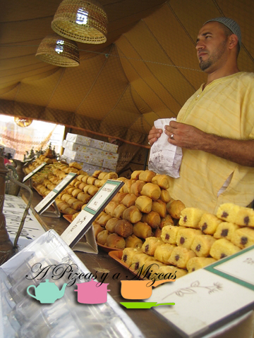

Hace unas semanas unos amigos nos invitaron a las fiestas de Gandía que se han celebrado esté pasado fin de semana... y nosotros que nos apuntamos a un bombardeo aceptamos encantados la invitación. Trizcas nos ayudó a madrugar así que prontito estábamos en Gandía... tan pronto que aún no estaba en funcionamiento la feria...

## Fira i festes de Gandia 2013

La Fira i Festes de Gandia son las fiestas patronales de la ciudad en honor a San Francisco de Borja. Estas celebraciones tienen lugar del 27 al 30 de septiembre.

El origen de la feria se remonta al año 1310, cuando Jaume II otorgó a la ciudad el privilegio de celebrar un mercado anual.

Actualmente se recrea este mercado medieval por todo el casco antiguo de la ciudad donde se pueden encontrar actividades y juegos tradicionales, actuaciones musicales, teatros y animaciones de calle para todos los públicos y todas las edades.

Además, todas estas actividades están apoyadas por la feria, situada en el recinto ferial y donde la diversión está garantizada con las atracciones más novedosas y populares que harán las delicias de grandes y pequeños.

El personaje protagonista de la Fira i Festes es el Tio de la Porra, un personaje que parodia a los soldados franceses, que saca a los niños de los colegios a ritmo de los tambores marcando el inicio de estas fiestas.

Esta información la hemos obtenido de [www.visitgandia.com](http://www.visitgandia.com "Origen Fira i festes de Gandia 2013")

Ahora que ya os hemos explicado un poquito la historia de las fiestas os contamos nuestra visión. Después del paseo por la feria estuvimos por el centro histórico que estaba todo engalanado como si estuviéramos en la edad media. Y nada más entrar algo llamó nuestra atención "Tarta de Gandía", prenguntamos a nuestros amigos y nos contaron que este año la pastelería de Raúl Segura habían preparado un dulce inspirado en la época. Compramos una tarta por 6€ y nos indicaron que estaba echa a base de turrón y que era muy "suave". La tomamos con el café y nuestra descripción es una tarta con base de almendra y turrón y una cobertura de azúcar quemado. En nuestra opinión demasiado pesada para los calores del "veranillo de San Miguel" sería más indicada por la textura y sabor para la época navideña.

Continuamos callejeando por el mercado medieval y nos llamó la atención un puesto en el que preparaban cochinillo, pulpo o carne a la brasa..... mmmmmmmmm..... Después los puestos de pastelitos árabes...

Después de tanto callejear nos fuimos a comer.... como siempre buenísimo todo lo que nos prepara Lliscas (la hemos rebautizado... ja ja ja) Esta vez nos preparó para el postre un flan de coco que estaba buenísimo

Fue un día muy agradable que esperamos repetir muy pronto.
