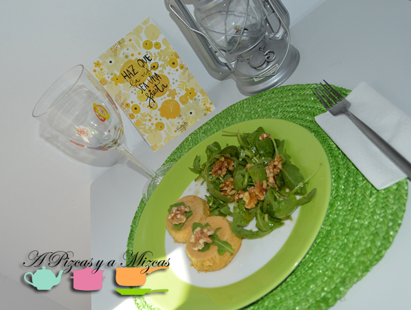
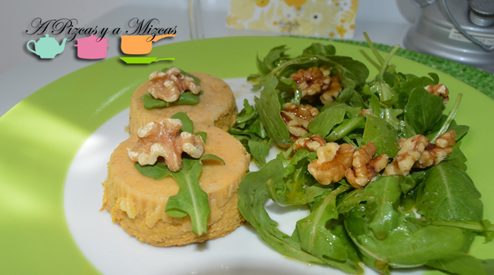
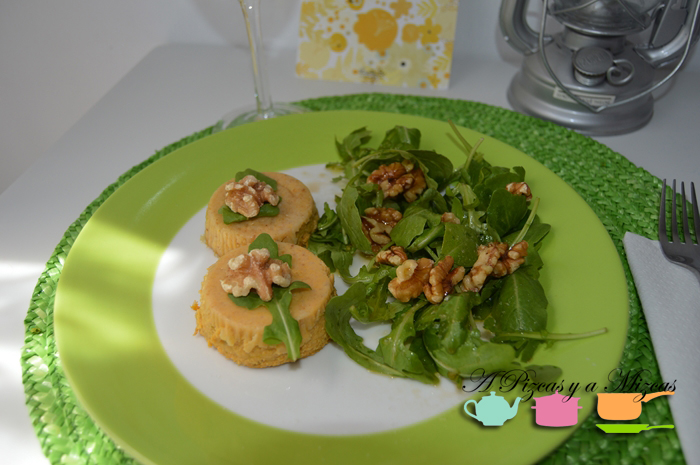

El verano pasa rápido rápido... ya estamos a mitad de julio y dentro de nada llegarán las vacaciones y nuestro momento de disfrutar a tope del verano! Hasta que llegue la fecha esperada seguimos preparando recetas veraniegas para soportar estos calores. Hoy os mostramos una receta muy facilita de flanes de espárragos y queso. Ya sabeís facil y rápido de preparar!

## Ingredientes para preparar flanes de espárragos y queso

- un manojo de espárragos verdes
- un vaso y medio de leche
- dos cucharadas de mantequilla
- dos cucharadas de harina
- 2 huevos
- 1 cebolla
- queso rallado grana padano
- un bote pequeño de pimiento asado
- sal y pimienta
- aceite de oliva virgen extra
- pan rallado

Picamos la cebolla y la rehogamos. Troceamos los espárragos y los añadimos. Agregamos un dedo de agua. Salpimentamos, tapamos y coceremos durante 10 minutos aproximadamente.

Ahora vamos a preparar una bechamel ligera. Añadimos en una sartén la mantequilla y tostamos la harina. Agregamos la leche y removemos. Salpimentamos y cocemos hasta que espese.

En un bol amplio batimos los huevos y añadimos los espárragos, el pimiento asado troceado y el queso rallado. Batimos para que quede más fino.

Ahota engrasamos las flaneritas con aceite y pan rallado. Repartimos la mezcla en las flaneritas y cuajaremos en el horno al baño maría durante 40 minutos.

Dejaremos que se enfríen y los serviremos acompañados de una ensalada de rúcula y nueces o simplemente con un poquito de mayonesa.

A disfrutar de las recetas veraniegas, del verano y de las vacaciones y haz que la vida sea una fiesta (nos encanta esta lámina de Lucía Be)
