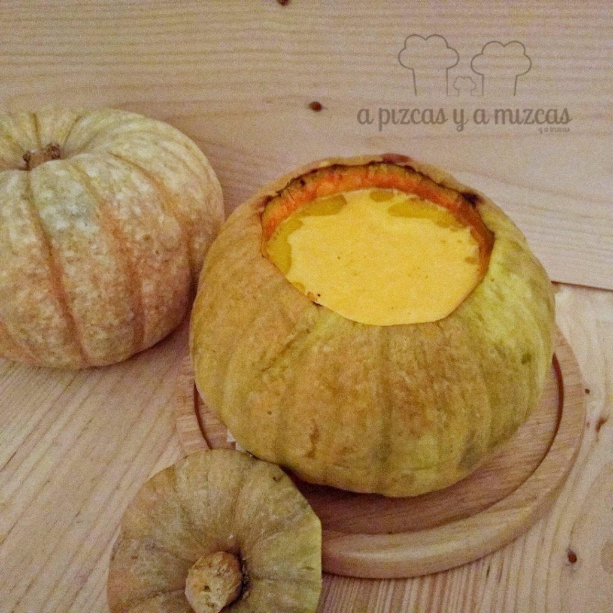

Ya hemos perdido la cuenta de todas las recetas que hemos preparado con [calabaza](/?s=calabaza). Y es que, como ya sabéis, desde que empiezan a aparecer en el mercado se convierten en un básico de nuestra compra semanal. Preparar esta receta nos sirvió de excusa para invitar a los tíos a cenar y la fondue de calabaza y queso la sacamos como único plato de la cena y fue todo un éxito.

## Ingredientes para preparar la fondue de calabaza y queso (para cuatro personas)

- una calabaza entera pequeña
- 80 gramos de mantequilla
- 400 gramos de queso Gruyére
- 200 gramos de queso Cheddar
- 250 ml de vino blanco
- pimienta negra molida
- nuez moscada
- sal

Ponemos el horno a precalentar a 200ºC . A continuación lavamos y cortamos la parte superior de la calabaza. Vacíamos ligeramente la calabaza y troceamos. Tapamos de nuevo la calabaza y la envolvemos en papel de aluminio. Horneamos la calabaza durante al menos 20 minutos. Destapamos la calabaza y seguimos horneando destapada durante otros 10 minutos. De esta manera nos aseguraremos de que no se quede sabor a calabaza cruda.

En un cazo, agregamos la mantequilla y la calabaza troceada. Doramos y añadimos el vino. Sazonamos y agregamos la nuez moscada. Tapamos y cocinamos la calabaza hasta que esté blanda.

Trituramos la calabaza (se tiene que quedar una textura fina), calentamos a fuego bajo y añadimos los quesos a trocitos pequeños. Removeremos hasta que se fundan los quesos. Rectificamos de sal si hiciera falta.

Ponemos la mezcla de queso y calabaza dentro de la calabaza y espolvoreamos con pimienta negra y nuez moscada.

Nosotros acompañamos la fondue de calabaza y queso con pan, salchichas de frankfurt, patatas a gajos y jamón york.

Y recordar...al que se le caiga el acompañamiento dentro de la calabaza... invita. Esperamos que os guste la fondue de calabaza y queso tanto como a nosotros.

