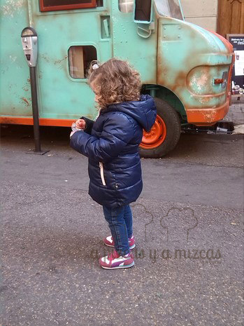

Durante los días de fallas puedes hacer mil planes... pero este año uno que teníamos claro que no nos lo  íbamos a perder era el "Foodtruck Fest" de la [Falla Almirante Cadarso -Conde Altea.](https://www.facebook.com/pages/Almirant-Cadarso-Comte-dAltea/168788219808320 "Facebook Falla Almirante Cadarso Conde Altea") Estuvimos ayer mismo (17 de marzo) y lo queríamos colgar cuanto antes en el blog, pues aún tenéis un par de días para pasar y probar esta divertida experiencia de los food trucks.

El concepto de los food trucks viene de los Estados Unidos, donde son auténticos restaurantes sobre ruedas, con camionetas adaptadas para ir de un lado a otro de los EE.UU. y que arrastran una gran legión de seguidores.

En la Falla Almirante Cadarso-Conde Altea han querido recrear esta idea con cuatro camionetas ambientadas y que ofrecen, básicamente, fastfood. Pero es curioso y no es de lo peor que puedes comer en Valencia durante las fallas.

Funciona mediante un sistema de tiquets. Cambias dinero por fichas de plástico (one token) y con ellas pagas lo que consumas (comida y bebida). Luego, a la salida, si te han sobrado fichas te las recompran. Es bastante cómodo.

La oferta es bastante variada (cada una de las furgonetas ofrece entre dos y seis platos). Después de echar un vistazo, esto es lo que comimos nosotros (básicamente nos centramos en dos de las furgonetas, la segunda y la tercera) y lo que os recomendamos sin duda:

## Nuestra experiencia en el food truck

- Bocadillo cubano (carne de cerdo asada al horno con especias, salsa de quesos, pepinillo, mostaza y jamón york, salsa picante, en pan especial).

- Bocadillo barbe-q (carne picada con salsa barbacoa, patata asada, salsa de queso y queso rallado).

- Finguers de pollo.
- Brownie

Salimos muy contentos del food truck, porque íbamos sin muchas expectativas. Además, aprovechamos la hora de la mascletà para evitar aglomeraciones y lo conseguimos. Comimos en un ambiente muy tranquilo, Trizcas pudo corretear de aquí para allí tirando bombetas y ¡hasta le regalaron una cookie más grande que ella!

Si tenéis ocasión de pasar por esta falla, aprovechad para probar.

La falla es una chulada. Toda relacionada con la gastronomía (su lema es bon appetit) y cuenta con el ninot indultat de 2015 (se ha salvado por votación popular de se quemado el 19 de marzo).  La figura indultada tiene que ver con el tema general de la falla, dedicada al mundo de la cocina. Una abuela juega con su nieto, al que ha estado engañando dándole fabada de bote.

