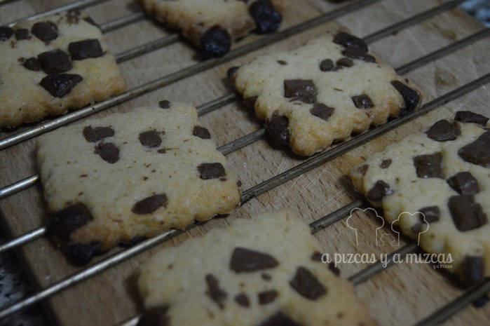
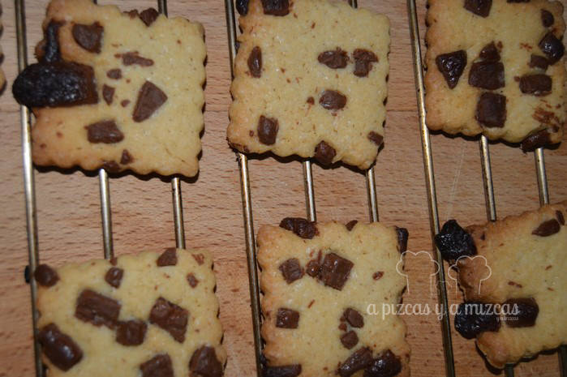

Estas pasadas navidades preparamos unos [regalitos](/regalo-dulce-personalizado/ "Regalos dulces personalizados") con un tarrito de [mermelada de caqui](/mermelada-de-caqui-persimon/ "Mermelada de caqui"), otro de [mermelada de mandarina](/mermelada-de-mandarina/ "Mermelada de mandarina") y unas galletas. En algunos de ellos pusimos galletas con chocolate y en otro la galletas eran con un poco de canela. Está mal que lo digamos nosotros pero todo nos dijeron que las galletas estaban buenísimas.

Lo de preparar galletas era una de nuestras asignaturas pendiente porque no habíamos encontrado aún la receta que nos acoplara. Un día viendo el blog de La Chica de la Casa Caramelo vimos una entrada que preparaba unas [galletas de ositos con almendras y M&M´s](http://www.lachicadelacasadecaramelo.com/2014/12/galletas-de-ositos-con-almendras.html "La Chica de la Casa Caramelo") nos gustó mucho porque eran muy fácil de preparar. Hicimos algunas modificaciones en la receta y preparamos nuestras galletas con chocolate. Os eneseñamos cómo las preparamos.

## Ingredientes para preparar las galletas con chocolate

- 125 gramos de mantequilla sin sal
- 100 gramos de azúcar
- 1 huevo y una yema
- 250 gramos de harina
- 100 gramos de chocolate con leche

En un bol ponemos la harina y hacemos hueco en el centro y vamos agregando el resto de ingredientes: el azúcar, el huevo, la yama y la mantequilla a temperatura ambiente en cubos pequeños. Troceamos el chocolate y con la ayuda de un rodillo haremos trocitos pequeños. Incorporamos la mitad del chocolate troceados en la masa y el resto lo reservamos. Mezclamos todos y formamos una bola con la masa. Dividimos la masa en dos partes, y las envolvemos con papel film y las ponemos a reposar en la nevera media hora.

Transcurrido el tiempo, ponemos una de las mitades de la masa sobre una superfice con harina, la extendemos con la ayuda del rodillo y cortaremos con ayuda de un cortapastas cuadrado nuestras galletas de chocolate.

Con los trocitos de chocolates que nos habíamos guardado acabamos de decorar las galletas. Colocamos las galletas con chocolate en la bandeja del horno sobre una hoja de papel para horno.

Precalentamos el horno a 200º durante unos 10 minutos aproximadamente y después los bajaremos a 170º e introducimos las galletas.

Las mantendremos en el horno durante 15 minutos y, transcurrido ese tiempo, las sacamos y dejaremos que enfríen sobre una rejilla.

La masa restante la podéis dejar en la nevera un par de días y podeís disfrutar de galletas de chocolate recién hechas en cualquier momento.

